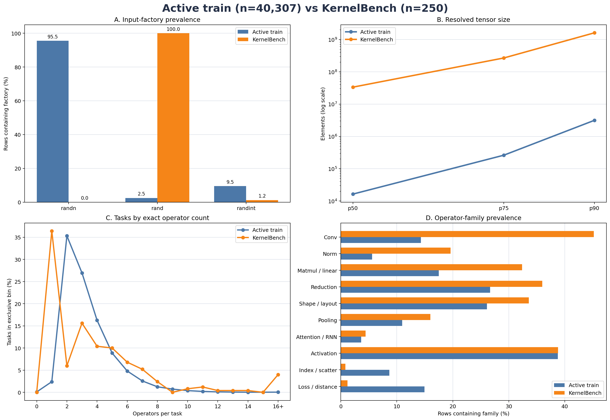

# 数据合成与 prompt_tvm_v4 总览

本文只保留数据合成的总体设计、当前正式产物和权威文档入口。各扩增方法的实现、漏斗统计、GPU 记录、人工样例、产物 SHA 和复现命令均由对应专题 handoff 维护，不在这里重复

## 当前正式数据

正式训练文件为 `Data/prompt_tvm_v4/release/train.parquet`，包含 39,636 条内部去重后的任务，SHA-256 为 `189da56dca3acbb03b5532b360ec1eb9adde75c173952149a8515dcebfb08f79`

数据由两部分组成：

| 部分 | 上游候选 | 构造方式 |
| --- | ---: | --- |
| 清洗后 canonical 数据的串行扩增 | 38,181 | 从 64,315 个 canonical parent 中选择扩增 terminal row，并对未覆盖 parent 采样 canonical fallback |
| 高复杂度 CSP-DAG | 4,946 | 每个独立 DAG root 从 `base/shape/dtype` 可用题型中确定性选择一道题 |

两部分合并得到 43,127 条候选。统一 exact/source-near gate 删除 3,491 条，最终保留 39,636 条。逐行来源、选择概率、KernelBench 对比、去重决策和正式文件清单见 [`training_data_release.md`](training_data_release.md)

产物元数据仍记录 `training_approved=false`，但用户已于 2026-08-15 明确授权正式 launcher 使用该 release。版本身份、内部审计状态和训练使用授权是三个分别记录的事实

## 数据与在线解题的边界

训练 parquet 保存的是题目：PyTorch `Model`、初始化参数、输入生成器和参考计算。CUDA/TVM-FFI 解答由当前 policy 在 RL rollout 中在线生成，数据合成阶段不预先提供 CUDA 答案

PyTorch reference 的 GPU 自一致性通过只证明题目可执行、证据闭合且干预满足声明；它不等价于生成过正确 CUDA kernel，也不证明该数据能提升训练效果。CUDA correctness、性能和奖励仍由训练或评测时的 KernelGym 负责

KernelBench Level 1/2/3 共 250 道官方题只用于评测、分布参照和去污染，不进入训练数据

## 为什么扩增

活动 DrKernel 基线与 KernelBench 存在稳定的参考分布差异：

- 静态可解析 tensor 的中位元素数为 16,384 对 33,554,432，相差 2,048 倍
- 95.6% 的活动训练题出现 `randn`，而 250 道 KernelBench 题均出现 `rand`
- 活动训练题集中于短合成程序，KernelBench 的单算子和长结构尾部更重
- convolution、normalization、matmul/linear 在活动训练集中的相对覆盖明显偏低

这些测量支持“需要扩展覆盖”的诊断，不证明分布差异就是正确率差距的唯一原因，也不把 KernelBench 直方图当作训练目标。完整口径、图表和已知未知项见 [`train_eval_diff.md`](train_eval_diff.md)

## 构建路线

### 清洗后的 canonical 根

`prompt_tvm_v4` canonical union 有 64,315 个 parent，来自统一审计后的 DrKernel 45,505、CUDA-Agent 4,995、KernelBook 11,814 和 Oubo-generated 2,001 条数据。它包含 mode-same 和经过审计保留的 mode-variant 分区，不是未经清洗的 DrKernel 原始数据

来源清洗、GPU runtime、mode 划分、人工复核、许可和使用边界见 [`handoff_drkernel_and_accepted_v5_cleanup_20260729.md`](../cleaning/handoff_drkernel_and_accepted_v5_cleanup_20260729.md)

### Parent-preserving 串行扩增

扩增链按 `shape → random-value → dtype → layout` 串行执行。某层没有可接受 child 时保留上一层 row；最终每个 canonical parent 最多进入一道题，避免同一 lineage 的 parent 和多个 child 重复增加训练权重

| Lane | 主要结果 | 权威文档 |
| --- | --- | --- |
| Shape | 13 条互斥 lane 产生 63,979 个 H20-safe child，覆盖 45,833 个 parent；下游选择 31,648 个 parent | [`shape_expansion.md`](shape_expansion.md) |
| Random value | 改变已证明安全的输入值分布，use-site 语义过滤后保留 22,908 个 child | [`random_distribution_augmentation.md`](random_distribution_augmentation.md) |
| Dtype | 同步转换输入和 compatible registered state，保留 7,249 个 child | [`serial_dtype_layout_augmentation.md`](serial_dtype_layout_augmentation.md) |
| Layout | 验证 storage layout 到达语义 consumer，保留 7,682 个 child | [`serial_dtype_layout_augmentation.md`](serial_dtype_layout_augmentation.md) |

完整串行选择、fallback 策略、shape/dtype 联合概率和最终 38,181-row 候选均见 [`training_data_release.md`](training_data_release.md)

### 独立高复杂度任务

高复杂度任务不伪造 canonical parent lineage。low-level typed CSP-DAG 独立生成 base，再沿 `base → shape → dtype` 构造 sibling；每个 root 最终只选择一道题。正式高复杂度候选包含 4,946 个 root

生成方法、typed graph、near-dedup、H20 验证、人工/Kimi 审查和遗留的 multi-class、layout、effective-complexity 问题见 [`operator_structure_augmentation.md`](operator_structure_augmentation.md)。其他 semantic/frontier canary 的范围和结论见 [`operator_structure_canary.md`](operator_structure_canary.md)

## 共同证据合同

- canonical parent 不被原地改写；mutation child 必须绑定直接 parent、source row、reference/AST identity 和唯一 primary intervention
- 独立生成任务绑定 generator、模板/约束、source revision、license 和 decontamination roots，不借用不存在的 parent UUID
- parquet、manifest、summary 和 runtime records 必须逐行互绑，机器间同名路径不能代替 SHA 校验
- CPU/static、GPU reference、intervention liveness 和训练收益是不同层级的证据，不相互替代
- UUID、reference SHA、normalized-AST 和统一 source-near 去重在正式合并时重新执行，不能只信各 lane 的局部唯一性
- 所有统计必须声明 denominator；row、parent、tensor occurrence、logical slot 和 operator occurrence 不混用

## 主要入口

| 内容 | 入口 |
| --- | --- |
| 正式数据和中间产物目录 | [`Data/prompt_tvm_v4/README.md`](../../../Data/prompt_tvm_v4/README.md) |
| 正式发版、抽样和内部去重 | [`training_data_release.md`](training_data_release.md) |
| Shape 扩增 | [`shape_expansion.md`](shape_expansion.md) |
| 随机值、dtype、layout | [`random_distribution_augmentation.md`](random_distribution_augmentation.md)、[`serial_dtype_layout_augmentation.md`](serial_dtype_layout_augmentation.md) |
| 高复杂度与 operator canary | [`operator_structure_augmentation.md`](operator_structure_augmentation.md)、[`operator_structure_canary.md`](operator_structure_canary.md) |
| 清洗后的上游来源 | [`handoff_drkernel_and_accepted_v5_cleanup_20260729.md`](../cleaning/handoff_drkernel_and_accepted_v5_cleanup_20260729.md) |
| 数据构建代码 | [`tools/data/synthesize/`](../../../tools/data/synthesize/) |
| 正式 release | [`Data/prompt_tvm_v4/release/`](../../../Data/prompt_tvm_v4/release/) |
| 可复验中间产物 | [`Data/prompt_tvm_v4/intermediate_artifacts/`](../../../Data/prompt_tvm_v4/intermediate_artifacts/) |

## 当前边界

- KernelBook 的许可与 repository-grouped split、Oubo-generated 的上游 provenance 仍需按使用场景单独批准
- 高复杂度数据仍缺真实 multi-class、完整 layout 和训练收益证据；模板化与 effective-complexity 风险不能用源码行数或 DAG node 数代替审查
- 正式 release 已完成当前两部分内部的 exact/source-near 去重；以后加入新数据时必须重新执行 cross-dataset gate
- 数据配比需要等 token-budget ablation 和 KernelBench 分层结果决定，候选池大小不直接决定采样权重
