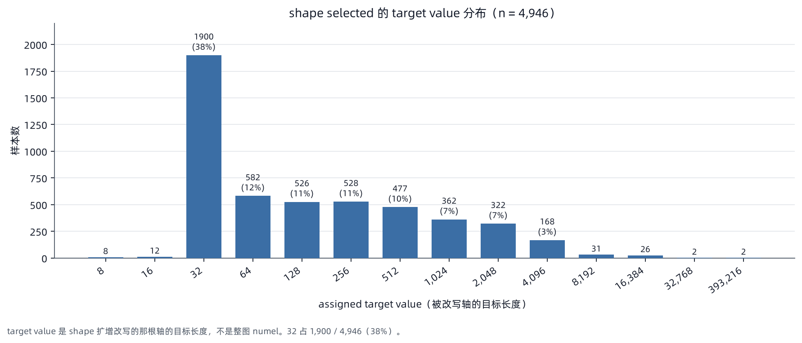

# KernelBench low-level 高复杂度算子合成

# 摘要

kernel 任务可以分两层:
- low-level：conv、activation、reduction 这类单个标准算子；
- high-level composition 是由多个模块搭成的完整网络结构。

本次合成的数据集只覆盖 KernelBench 的 low-level 一层，不覆盖 high-level，避免数据污染。用开放 DAG(有向无环图)合成 5，000 条 PyTorch 程序，严格 near-dedup 后保留 4，946 条。生成目标是覆盖 KernelBench 已出现的 low-level family 和形式桶，同时把重心放在长代码、高 operator count、fan-in 和 fan-out 上

直接生成的程序称为 base，是后续 shape/dtype 扩增的根。base 已通过静态/CPU/GPU 验证。扩增按 shape → dtype 顺序逐层进行。
<!-- 数据集标记为 `review_only=true`、`training_approved=false`，不能直接进入训练 -->

<!-- 未覆盖的边界:high-level composition、多个独立外部输入、tuple/multi-output、动态控制流和训练收益 -->

# 覆盖范围

| 维度 | 当前覆盖 | 遗留问题 |
| --- | --- | --- |
| operator | 10 个 KernelBench low-level family | high-level composition、family 内全部 API 与参数化 |
| 图结构 | unary/binary/ternary、任意历史前驱、fan-in、fan-out、唯一 live sink | 多个独立外部 Tensor、multi-output、动态控制流、stateful/alias mutation |
| shape | `ndim=2–5`、轴相等与整除约束、整图 shape witness | reshape/broadcast、不同 `ndim` 分支汇合、联合 shape/dtype 求解、layout 扩增 |
| 源码形式 | code-only 五档、single-class | 真实 semantic multi-class、工程命名(`v{i}`/`op_{i:03d}` 机械编号，与真实命名相差甚远)、helper 结构与控制流多样性 |
| 验证 | source/graph binding、strict near-dedup、CPU/GPU | 梯度、input sensitivity、KernelGym 与训练 ablation |

# 合成方法

## Operator schema catalog

operator schema(可放入图中的算子规格)由人工维护，定义合法 `ndim`、输入数、shape 关系和 PyTorch lowering(把 DAG 中的 node 写成具体 PyTorch API 调用，也就是生成源码的一步)。
schema 映射得到 family(覆盖统计用的粗粒度算子类别，例如 `conv`、`pooling`)；其中对应 KernelBench 已有类别的称为 tracked family，是 palette 采样和覆盖审计的统计单位。concrete variant 是 schema 的具体实现分支(例如 `conv` 与 `conv_transpose`)，决定实际 API 和部分参数。
当前 catalog 有 10 个 tracked family、11 个 schema 和 34 个 concrete variant；第 11 个 schema `elementwise` 不映射任何 tracked family，承担通用逐点和连接计算

| operator schema | tracked family | concrete variant 示例 | shape 处理 |
| --- | --- | --- | --- |
| `activation` | `activation` | `relu`、`gelu`、`silu`、`sigmoid`、`tanh` | 逐元素，保持 shape |
| `conv` | `conv` | `conv`、`conv_transpose` | `Conv{1，2，3}d`，channel 不变 |
| `indexing` | `indexing_scatter` | `gather`、`scatter` | 末轴合法 index，scatter 每个外层 row 只有一个写位置 |
| `loss` | `loss_distance` | `smooth_l1`、`mse`、`l1` | 只作 terminal，输出标量 |
| `linear` | `matmul_linear` | `linear` | 末维输入输出同宽 |
| `normalization` | `normalization` | `layer_norm`、`group_norm` | normalized width 或 channel 不变 |
| `pool` | `pooling` | `avg`、`max` | kernel 3、stride 1、padding 1 |
| `reduction` | `reduction` | `mean_center`、`sum_scale`、`amax_gate` | `keepdim=True` 或等价恢复 shape |
| `layout` | `shape_layout` | `transpose`、`chunk_cat`、`binary_cat` | `binary_cat` lowering 为 `stack+sum`，最终恢复输入 shape |
| `sdpa` | `scaled_dot_product_attention` | `sdpa` | Q、K、V shape 相容，`dropout_p=0` |
| `elementwise` | 无 | `sin`、`cos`、`square`、`affine`、`add`、`mul`、`mix` | 一元、二元或三元，保持 shape |

<!-- 相关工作:NNSmith 依赖人工 operator specification，NeuRI 还从真实 operator 执行中推断约束；本方法没有实现 NNSmith 的增量插入或 NeuRI 的约束推断，只维护一个小型 catalog，方便审计 low-level 覆盖、shape 合法性和运行时证据，代价是 API、shape 和 topology 空间小于完整 PyTorch。
[DRTriton v2](https://arxiv.org/html/2603.21465#S3) 逐步生成多前驱、多元 operator DAG，再为 tensor edge 建 shape 变量，用 CP-SAT(constraint programming with a SAT backend，约束规划求解器)联合搜索可行 shape；论文列出 61 个计算算子和 3 个零输入 `OpCreate`，未报告 near-dedup、重复率或与真实程序分布的相似度。
本方法借鉴其开放 DAG 加约束求解的方向，先抽一个整图共用的 input shape witness，再用 shape-preserving edge consistency 约束 DAG；这样能稳定生成长图并覆盖 KernelBench 的形式桶，代价是无法为每条 edge 联合搜索异形 shape，也暂不支持 reshape、broadcast 和多个独立输入 -->

## Family palette、shape 与复杂度

每条程序先采 family palette(本图必须至少出现一次的 tracked family 集合)。例如 `{activation， conv， reduction}` 要求这三类 schema 各出现至少一次，剩余 node 从 palette 或 `elementwise` 中随机采样。正常样本有 10% 取 1 个 family、15% 取 2 个、75% 从 3–6 个中按 `2:4:3:1` 加权采样
在完成正常采样后，还会做rare-family oversampling 和高复杂度修补，追加 `indexing_scatter`、`loss_distance`、`scaled_dot_product_attention`、`reduction` 或 `shape_layout`等
<!-- 。retained 集的 palette 大小分布如下；该字段是必须出现的下限，不限制 lowering 附带产生的其他 family -->

<!-- | `requested_family_palette` 大小 | 1 | 2 | 3 | 4 | 5 | 6 | 7 | 8 |
| --- | ---: | ---: | ---: | ---: | ---: | ---: | ---: | ---: |
| retained 样本数 | 376 | 697 | 802 | 1，419 | 1，214 | 410 | 27 | 1 | -->

`ndim` 由 palette 的合法域决定:SDPA 使用 `ndim=4`，conv/pooling 使用 `ndim∈{3，4，5}`，其他组合使用 `ndim∈{2，3，4}`。batch 从 1–4 采样，其余轴从 `{4，8，12，16，20，24}` 采样；Z3 检查轴 bounds、4 的整除性和随机轴相等关系，采样成功后得到整图共用的 shape witness(一组满足上述约束的具体轴长，作为全图唯一的输入 shape)

生成偏向高复杂度，只为低复杂度 operator bucket 保留少量样本，同时覆盖 1、2–4、5–9、10–15、≥16 五档。代码量用 code-only physical lines(非空且非纯注释行)计量，长代码只能来自可达 DAG assignment 或 module definition。
各样本仅生成一次，没有额外的 overgenerate-then-select 候选池或 MILP(mixed-integer linear programming，混合整数线性规划)
<!-- ，family 的样本内采样仍保留前述 rare-family 偏置 -->

## 开放 DAG 与 shape CSP

拓扑序第 `i` 个 node 的输出记为 `v{i}`。它的每个输入从原始输入 `x` 或任意历史输出 `v0…v{i-1}` 随机抽取，不强制读取 `v{i-1}`。多元 node 的历史值不足时会复用 `x`，其余 predecessor 不放回抽样。一个输出可被多个后继使用形成 fan-out，一个 node 可读取多个前驱形成 fan-in，因此 schema 的顺序、位置和 edge 都会变化

把图想成数据的流向:source 是边流出去的起点(这里是外部输入 `x`)，sink 是边最终流入、无法再往外走的终点。随机连边可能产生多个 sink。为此，使用 binary `add` 或 ternary `mix` 合并多余的 sink，直到只剩一个 sink，它就是最终的返回值，此时每个 node 都影响这个唯一返回值。若 palette 含 `loss`，最后在这个值上再挂一个 loss node，与同 shape 的 target 算距离并输出标量，此时 loss node 成为全图最后一个 sink。merge node 不超过整图的 40%

举例:随机连边长出 5 个 node

```python
v0 = relu(x)
v1 = conv(v0)
v2 = gelu(v0)
v3 = add(v1， v2)
v4 = conv(v0)
```

`v0` 被 v1/v2/v4 使用，`v1`、`v2` 被 v3 使用，而 `v3`、`v4` 无人使用，是两个 sink；此时无论返回哪一个，另一个都是dead code。因此可以合并生成 `v5 = v3 + v4`，`v3`、`v4` 被消费，只剩 `v5` 一个 sink，`forward` 返回 `v5`

<!-- `node_count≥16` 的图要求至少 `max(3， ceil(0.15×node_count))` 个 non-pointwise node，未达标的图把部分 unary activation/elementwise node 确定性替换为 `reduction` 或 `layout`，无可替换 node 时重采。该 guard 覆盖约 4，000 条 retained 程序，其中 79 条实际发生替换；它能排除 pointwise soup，也会带来确定性的 diversity bias -->

<!-- shape-preserving edge consistency CSP(constraint satisfaction problem，约束满足问题)固定已采样的 input shape，再检查 shape-preserving node 与主输入逐轴一致、binary/ternary 前驱逐轴相等、loss prediction 与 target 同 shape，不联合搜索每条 edge 的 operator-specific shape。只有 `sat` 的图进入 lowering，manifest(每条样本落盘的 JSON 元数据记录)保存 clause、node output witness、typed graph(算子图的结构记录:每个 node 的 schema、variant、predecessor 和全部 edge，是 lowering 的输入)和 hash -->

## Lowering 与 class 结构

lowering 将 typed graph 写成完整 PyTorch 源码。有参数的 Conv、Linear、Norm 写入 `Model.__init__`，拓扑序第 `i` 个 node 写成 `forward` 中的 `v{i}`；该 node 有 registered module 时，module 名为 `self.op_{i:03d}`
<!-- 。固定变量名让源码、typed graph 与 runtime record 可以逐 node 绑定 -->

数据使用 single-class lowering：每条程序的模块顶层恰好一个 class，名字必须是 `Model`，没有 helper class
<!-- 。独立 AST gate 解析源码，要求顶层 `ClassDef` 名字列表为 `['Model']`，并禁止 `TensorBridge`/`form_bridge`。它分别扫描 raw 5，000、retained base 4，946、shape selected 4，946 和 dtype candidates 4，946，合计 19，838 行，全部通过。这是四份 parquet 的行数加总，不是 19，838 条互不重复的程序；raw 含后来被 near-dedup 删除的 54 条，shape/dtype 是同一批 root 的扩增副本 -->

<!-- semantic multi-class 留作后续实现。helper class 必须承载至少一个 tracked typed DAG node，优先抽取 connected、single-exit 子图；helper 参数精确对应子图外部入边，内部 registered module 归 helper 所有，输出精确对应唯一出边。把 helper 内联后必须恢复同一 typed DAG、operator lowering 和边界关系，manifest 还要保存 helper node indices、boundary edges、module ownership 与 inlining hash。找不到合法子图时保留 single-class。实现完成后需通过静态 source binding、dispatcher liveness、input sensitivity、CPU/H20 和 shape→dtype lineage 验证 -->

input mode 从 `contiguous`、`positive`、`offset`、`strided`、`movedim` 采样。每条 base 程序只有一个主要外部 Tensor，loss 额外接收同 shape target。lowering 后重提 operator signature、family、complexity、class 数和 normalized AST，检查 palette、返回值可达性
<!-- 和禁用 high-level composite API -->

# Near-dedup 与 KernelBench 覆盖

near-dedup 的目标是找出实质重复的程序对，聚成簇，每簇只保留一条。判定用三个独立检测器，任一认定相似就把这两条程序记为一个重复对(即建一条"重复"边，最后按这些边的连通分量聚簇):

- **源码边(文本相似)**：先要求两条程序所包含的operator完全相同作为预筛，再计算去注释 token Jaccard 与 `Model` entry-point AST similarity，`>0.8` 或 `>0.9` 任一过线即建边
- **精确语义图边(结构相同)**：用 typed graph 构图，忽略具体维度、input mode 和 node 编号，两图精确同构才建边
- **identity-normalized 图边(只差恒等 node)**：先把 `layout:transpose`、`layout:chunk_cat` 短路，再对短路后的两图做精确同构比较，同构才记为重复对
<!-- - 。比较图还显式区分重复 argument slot(同一前驱被二元 node 读一次和读两次是不同结构)，把 `layout:binary_cat` 的两个输入视为可交换；维度无关算子可跨 rank 比较，Conv/Pool 仍保留 rank 以区分实际 callable -->

strict near-dedup 对三类边取并集，连通分量即重复簇；每簇保留 graph node 最多、operator 最多、源码最长、family 最广的一条，其余删除。raw 5，000 共命中 38 簇，删除 54 条(1.08%)
<!-- ；对 retained 4，946 重跑同一流程，三类检测器的 pair 数均为 0，即 strict duplicate rate 为 0 -->

<!-- approximate graph score 是两条程序图结构相似度的连续打分(0–1)，用来检查 strict 规则是否漏掉了"很像但不完全同构"的近重复；它只作敏感性审计，不自动删除:先要求 exact family set 相同且 node-count ratio `≥0.75`，再按 schema:variant multiset(多重集，重复元素计出现次数)0.18、相邻 node bigram 0.14、operator token 0.18、带标签 edge 0.18、edge span 0.09、arity 0.04、shape contract 0.09、node-count ratio 0.10 计算分数。source 侧 0.8 token Jaccard 和 0.9 entry-point AST threshold 沿用 repo 既有 dedup 默认值，并加上 exact operator-set gate；0.75–0.90 graph score 仅是未人工标定的敏感性 sweep，不触发删除 -->

<!-- raw 删除与 retained 复检是两轮独立审计，各自落盘 summary，并由 base 最终汇总同时绑定两份 summary 和两份 strict-retained UUID 序列(文件与 SHA-256 见文末清单)；生成阶段 summary 里的 raw-scope 计数不能替代 retained 结果。补充语义审计覆盖 identity/involution/idempotence、gather/scatter cancellation、pure-op CSE、terminal loss-head removal 和跨 rank 对照，并结合 Kimi 与 PyTorch 数值复验。唯一忽略 rank 才命中的 ConvTranspose1d/2d pair 被判定为有效的 callable 差异；retained 集审计结论为 `PASS`、P0/P1=0 -->

<!-- | strict 指标 | raw 5，000 | retained 4，946 |
| --- | ---: | ---: |
| source-gate pairs | 69 | 0 |
| exact semantic-graph pairs | 11 | 0 |
| identity-normalized semantic-graph pairs | 39 | 0 |
| union pairs / clusters | 81 / 38 | 0 / 0 |
| effective rows | 4，946 | 4，946 |
| duplicate removals / rate | 54 / 1.08% | 0 / 0% | -->

<!-- 下表的 pairs 是各 threshold 下累计满足 `score≥threshold` 的 approximate pair，clusters 和 effective rows 按 `strict ∪ approximate` 合并计算

| approximate threshold | pairs | clusters | effective rows |
| ---: | ---: | ---: | ---: |
| 0.75 | 9 | 8 | 4，937 |
| 0.80 | 2 | 2 | 4，944 |
| 0.85 | 0 | 0 | 4，946 |
| 0.90 | 0 | 0 | 4，946 | -->

<!-- KernelBench 比较只审计 low-level 覆盖，不拟合其频率。family 使用 effective `Model.forward` AST 中的规范 token、受限 provider 和 exact basename allowlist 分类，不使用 substring 或 regex 映射。所有 10 个 family，以及 KernelBench 已占用的 code-only 行数、operator signature、forward AST depth 和 registered module count bucket 均有覆盖。KernelBench 的 14 个 multi-class reference 全部来自 Level 3 architecture/helper composition，在本轮只作描述项，不设 coverage gate -->

# Base 结果与验证

| low-level family | KernelBench 250 | retained 4，946 |
| --- | ---: | ---: |
| `activation` | 103 | 2，063 |
| `conv` | 113 | 2，032 |
| `indexing_scatter` | 5 | 2，167 |
| `loss_distance` | 3 | 2，172 |
| `matmul_linear` | 80 | 1，936 |
| `normalization` | 49 | 1，965 |
| `pooling` | 40 | 2，028 |
| `reduction` | 56 | 2，994 |
| `shape_layout` | 39 | 2，042 |
| `scaled_dot_product_attention` | 1 | 130 |

| code-only 行数 | KernelBench | retained |
| --- | ---: | ---: |
| `<20` | 4 | 65 |
| `20–34` | 147 | 921 |
| `35–49` | 69 | 442 |
| `50–74` | 20 | 1，203 |
| `≥75` | 10 | 2，315 |

| operator signature 数 | KernelBench | retained |
| --- | ---: | ---: |
| `1` | 91 | 11 |
| `2–4` | 80 | 30 |
| `5–9` | 61 | 25 |
| `10–15` | 8 | 82 |
| `≥16` | 10 | 4，798 |

| 结构指标 | retained 样本数 |
| --- | ---: |
| graph node `≥16` | 4，035 |
| graph node `≥16`(剔除 `elementwise`) | 3，687 |
| operator signature `≥10` | 4，880 |
| code-only lines `≥50` | 3，518 |
| nonlocal edge | 4，913 |
| fan-in / fan-out | 4，915 / 4，915 |
| single `Model` class | 4，946 |

<!-- 静态 validator 逐条重算 UUID、source/AST hash、typed graph、shape witness、operator signature、family、complexity 与 code metrics，并将每个 `v{i}` expression 绑定到 schema、variant 和前驱。运行时检查 `get_inputs()`、`Model.eval()`、Tensor 输出、finite 输出与 dispatcher trace -->

repeatability validator 对同一 model 和输入运行 3 次，递归比较输出结构、shape、dtype 与原始字节 hash，并检查输入和 model state 未变化。CUDA 作用域使用 `cudnn.benchmark=false`、`cudnn.deterministic=true`，结束后恢复原状态。ConvTranspose 的 deterministic cuDNN 配置下全量通过

| 检查 | 结果 |
| --- | ---: |
| static quality gate | 4，946/4，946 |
| CPU runtime | 4，946/4，946 |
| GPU runtime | 4，946/4，946 |
| GPU exact-byte repeatability，3 trials | 1，237+1，237+1，236+1，236，合计 4，946/4，946 |
| unsafe / unproven scatter | 0 / 0 |

<!-- base 语义抽查覆盖 60 条 Codex xhigh 与 22 条 Kimi K3，无 P0/P1。非阻断意见集中在长图中的重复 pool/linear、identity-layout 与固定 affine closing，它们可能使表面复杂度高于有效语义复杂度 -->

# Shape、dtype 扩增

base 是独立生成的开放 DAG 根，shape、dtype 是两个串行逐层继承的扩增 lane。扩增顺序为 shape → dtype。
shape 根据 CSP 轴等价组选择不破坏 Conv channel、Linear/Norm 末维语义的轴，逻辑输入不超过 4M elements，且 `logical_input_elements × graph_node_count` 不超过 64M。
<!-- shape child 的 `Model.forward` 文本与拓扑都和 parent 精确相同；`get_inputs` 会重渲染，`Model.__init__` 只允许由新 witness 决定的 Conv、Linear、Norm 构造参数变化。dtype 将 accepted shape child 分配给 FP16 或 BF16，输入先在 FP32 产生，再在形成 view 前 cast storage，registered parameter 和 buffer 同步转换 -->

dtype 的 paired validator 覆盖 parameter-free 与 module-state 两类程序，要求所有 logical `vN` 和最终浮点输出为目标 dtype
<!-- ，complex output 直接拒绝。每条记录绑定三次 trial、canonical `v0…vN` 序列、目标 dtype、module state、parent-cast output，以及 validator、launcher 和 4 个直接 helper 的 path 与 SHA；selection 只接受完整且可重算的 contract 与源码绑定 -->

<!-- layout 不纳入本次扩增。其正确性契约必须按 PyTorch 语义忽略 size-1 维的 stride:对 `[1，N]` 一类输入，transpose 可能仍为 contiguous，slice 也可能在产生 storage offset 后保持 contiguous。后续重新启用时，候选 family 必须先证明目标 layout 已实现，manifest 的 stride、offset 与 contiguity 必须由同一 singleton-aware 规则重算，再完成独立静态审计和 H20 验证 -->

<!-- 普通 random sibling 不在当前 catalog。base 的 `contiguous`、`offset`、`strided`、`movedim` 使用标准正态值，`positive` 使用正均匀值，重复增加同分布 `randn` sibling 对本轮结构与形式覆盖的收益较低。更广的 random-distribution/value-domain 扩增不在本轮范围，极值、NaN/Inf、adversarial value 和 input sensitivity 仍是独立遗留项 -->

<!-- 最终 Kimi packet 覆盖 base、shape、dtype、family、代码量、operator count、同 root sibling 和跨 root near pair。Kimi response 逐条回显 assignment ID 与 UUID，并与 prompt、raw output 和 SHA-256 绑定；verify-only gate 遇到 `FAIL`、`P0` 或 `P1` 时阻断，`CONDITIONAL/P2` 保留为非阻断审计项 -->

## 扩增结果

shape 与 dtype 的正式计数如下。unsupported 是 dtype compatibility proof 无法成立时的fail close，不属于 runtime failure，也不进入 selected

| lane | candidates | pre-selection passed | unsupported | selected |
| --- | ---: | ---: | ---: | ---: |
| shape | 4，946 | 4，946 | 0 | 4，946 |
| dtype | 4，946 | 4，421 | 525 | 4，421 |

<!-- dtype candidates 为 BF16 2，434、FP16 2，512；selected 为 BF16 1，963、FP16 2，458。525 条 unsupported 包含 522 条 `cast_equivalent_output_mismatch` 和 3 条 `non_finite_traced_output`，failed、timeout 与 protocol error 均为 0 -->

shape selected 的 target value 分布:



<!-- additive 总计 14，313 条:base 4，946、shape 4，946、dtype 4，421。UUID、reference SHA 和 normalized-AST SHA 均为 14，313 个唯一值，cross-root 与 repeated-lane AST collision 为 0 -->

<!--
KernelBench 的 `ndim` 通过实际执行 `get_inputs()` 取输入 tensor 的最大维度获得，250 条中 2 条执行超时未计入；additive 列为每条样本主输入的 `ndim`

以下维度 KernelBench 没有对应口径，只列 additive:

| dtype | FP32 | FP16 | BF16 |
| --- | ---: | ---: | ---: |
| 样本数 | 9，892 | 2，458 | 1，963 |

| graph node 数 | 1 | 2–4 | 5–9 | 10–15 | ≥16 |
| --- | ---: | ---: | ---: | ---: | ---: |
| 样本数 | 48 | 111 | 170 | 2，389 | 11，595 |

独立终审通过且 P1=0。Kimi verify-only 绑定 28/28 条原始回答，结果为 7 PASS、21 CONDITIONAL/P2、0 FAIL、0 P0/P1；Codex 与三个独立 subagent 另读 19 条实际代码并复核 authority、duplicate 和语义风险，同样为 P0/P1=0。P2 主要指单程序内部重复计算、identity layout、零索引 gather/scatter 和固定系数 sink-closing，属于有效复杂度与模板多样性风险。唯一显式跨 root near pair 的 Linear 宽度、节点数、非线性与依赖接线均不同，判为 `NEAR_VARIANT`，没有新增应删除的语义重复 -->

# 已知边界

1. KernelBench high-level composition 明确未覆盖，真实 semantic multi-class 仍是遗留项
2. operator schema catalog 小且人工维护，family 覆盖不等于具体 API、属性、dtype 与参数化覆盖
3. shape 求解主要服务 shape-preserving schema，缺少 reshape、broadcast 和不同 `ndim` 分支
4. 每条程序只有一个主要外部 Tensor，loss 追加同 shape target，多独立输入与 multi-output 未建模
5. sink closing、重复 pool/linear 与 identity-layout 会机械抬高部分长图复杂度
6. palette、complexity 和 filler 概率是 coverage-first 启发式，不代表真实 kernel 的自然联合分布
7. schema、变量名和 module 名固定为 `v{i}` 与 `self.op_{i:03d}`，按拓扑序号机械编号，与真实工程命名相差甚远；真实 helper class 尚未实现，源码风格多样性有限
8. shape、dtype 在 DAG 完成后串行干预，未与 DAG 联合搜索；layout 因 singleton continuity P1 延后
9. approximate near-dedup 尚未人工标定，strict rule 之外的近邻没有删除
10. KernelBench 的具体 API/参数化、大 tensor-numel 长尾、梯度、input sensitivity、KernelGym 和训练收益尚未覆盖
11. active train、review 与该数据集之间缺少跨集合 near-dedup，因此不能直接进入训练

# Artifact 与复现

核心代码:

- `tools/data/synthesize/csp_dag_method/generate_csp_dag.py`:operator schema、DAG 采样、shape CSP 与 lowering
- `tools/data/synthesize/csp_dag_method/build_csp_dag_5k.py`:直接生成 5，000 条并 strict near-dedup
- `tools/data/synthesize/csp_dag_method/audit_csp_dag_near_duplicates.py`:source/semantic graph near-dedup
- `tools/data/synthesize/csp_dag_method/audit_csp_dag_quality.py`:静态质量 gate
- `tools/data/synthesize/csp_dag_method/validate_csp_dag_canary.py`:graph/source/runtime validator
- `tools/data/synthesize/csp_dag_method/validate_csp_dag_repeatability.py`:CPU/GPU exact-byte repeatability
- `tools/data/synthesize/csp_dag_method/audit_kernelbench_low_level_coverage_v2.py`:token-aware KernelBench 覆盖审计
- `tools/data/synthesize/csp_dag_method/build_csp_dag_input_expansions.py`:shape/dtype 构造和 fail-closed selection
- `tools/data/synthesize/csp_dag_method/finalize_shape_dtype_expansion.py`:shape/dtype lineage、layout deferral 与 additive 汇总
- `review_runtime_independent/audit_dtype_v5_runtime.py`:dtype runtime 独立全量审计
- `tools/data/synthesize/review_only/audit_csp_dag_final_v4.py`:shape+dtype 独立终审
- `tools/data/synthesize/review_only/verify_kimi_k3_packet.py`:Kimi 28 条 response verify-only gate

基础数据与证据:

- `local_artifacts/data/synthesize/csp_dag_low_level_5k/run.generated5000.strict_near_dedup.v4/selected.parquet`
- `local_artifacts/data/synthesize/csp_dag_low_level_5k/run.generated5000.strict_near_dedup.v4/selected.manifest.jsonl`
- `local_artifacts/data/synthesize/csp_dag_low_level_5k/run.generated5000.strict_near_dedup.v4/summary.json`
- `local_artifacts/data/synthesize/csp_dag_low_level_5k/run.generated5000.strict_near_dedup.v4/final_summary.json`
- `local_artifacts/data/synthesize/csp_dag_low_level_5k/run.generated5000.strict_near_dedup.v4/quality_audit.json`
- `local_artifacts/data/synthesize/csp_dag_low_level_5k/run.generated5000.strict_near_dedup.v4/review_duplicate_semantics_v2/README.md`

正式扩增根为 `local_artifacts/data/synthesize/csp_dag_low_level_5k/expansion_v3/run.serial_sd.v8/`。shape、dtype、finalizer、独立终审、Kimi verify-only 和 Codex xhigh 的输入与输出都由下表 SHA-256 绑定

主要 base artifact SHA-256:

| artifact | SHA-256 |
| --- | --- |
| `selected.parquet` | `6891c04d2de71d70560daa9bfabd3cb90dd903a17b8d896ee30de1fbeba79ff2` |
| `selected.manifest.jsonl` | `de8b95931ab84f155ea08982f053bee65b8665fec9eceefb3d4506ce3c46e003` |
| `summary.json` | `caafdfab916face351e669fc495d7b499aa30702bc6a7cd3a7142c2d1264a8bf` |
| `final_summary.json` | `9cb70b30622181a70b5ed4313a4fa9a2bd49f2a22d88a815baa0163ce5ee0893` |
| `quality_audit.json` | `43a166455039bf60d14916cb7134191a0b2df1226334bbc1d396677426f7c6f6` |
| `near_dedup/raw5000.summary.json` | `b6ce58b0900a16e4c1fa39b122d80dec2df6210589141b12d42ef3ea1a423197` |
| `near_dedup/retained.summary.json` | `823e1bc465ff38f0b04ee7914b98310bcd3254d449869621322b5be086341603` |
| `review_duplicate_semantics_v2/README.md` | `827c2de965e317a7e69ddfd99c69fa8fb63f5d3223c36722e3d4741e631098b9` |
| `review_duplicate_semantics_v2/approximate_pair_kimi_crosscheck.json` | `9b31fa64eb876a651ba15502182188d5d53250b5bee9eb797444d26a442c5eb5` |
| `review_duplicate_semantics_v2/current_chain_single_model_scan.json` | `7437a58da420fe1a8ca2e14e472c1b1427202ebd8f7e6633849b82bd2db1c661` |

shape 与 dtype artifact SHA-256:

| artifact | SHA-256 |
| --- | --- |
| `run.serial_sd.v8/shape/summary.json` | `e013d8ed6ee86fc804d1916958bac158caca49e0eb6a1b4662e7ad6e8e00e0cc` |
| `run.serial_sd.v8/shape/selection_summary.json` | `c1d3ce89b4c3dc493fc532a132d73b16fd6f2a7141b9d969e1ae25845151bc8e` |
| `run.serial_sd.v8/shape/selected.parquet` | `6eac10b190457a58036e91742822cbe100ed3fff0d166197bdd3d961e5ca4777` |
| `run.serial_sd.v8/shape/selected.manifest.jsonl` | `6e554323558dd556d6deb8dae259f49ef1aa58fd8a14a51ba69447553895a76b` |
| `run.serial_sd.v8/dtype/summary.json` | `c3e1d114ddcc7fda6642061dbfe662b5b1e6b0ccea6a1a33cadb13faf7c7a71b` |
| `run.serial_sd.v8/dtype/selection_summary.json` | `0b9963b1cf989d751fb26c4c309c6e7916b3c26709f120a70cd3d0849a3d5521` |
| `run.serial_sd.v8/dtype/selected.parquet` | `5a42058fefd166b9ce852da309703479a2bf5af10d900ed513f157e7cf0efad3` |
| `run.serial_sd.v8/dtype/selected.parents.parquet` | `553c7ba2522dd85aeec64123a5742e827ad5b79e3e5e41abebb7ad6d721bb1fb` |
| `run.serial_sd.v8/dtype/selected.manifest.jsonl` | `958852b47066197ba5b6f1ce7fff02c2cba21bf7c959b79893a7750b5788b677` |
| `run.serial_sd.v8/dtype/review_runtime_independent/audit.json` | `b41d5f26d756932271be3f3212cfffe7f225d3b4c2aec568d02a0903e5f97b09` |

最终 additive 与审计 artifact SHA-256:

| artifact | SHA-256 |
| --- | --- |
| `run.serial_sd.v8/final_summary.json` | `04fb5a99b76891a820ecb6914f3d04dd356c0094aef13dd9147e9ed7d3b1e3f2` |
| `run.serial_sd.v8/selected.additive.parquet` | `59ec7328909e74924698269b68c55c901ef10fd1f1a3eb5b83d5f3f99081c223` |
| `run.serial_sd.v8/selected.additive.manifest.jsonl` | `f9129a2e19090adf9cf4d4951657ec462febd043646b19b6c63127428bdb8134` |
| `run.serial_sd.v8/accepted_review.md` | `b596b08840bd783e20df2abc905eeaa7e3dd96365d4777afae993661098c5c96` |
| `run.serial_sd.v8/review_final_independent/summary.json` | `e6600bc3b53af964eedd862dfa9061a918f40eb720b467b77fd29b380cac1e93` |
| `run.serial_sd.v8/review_final_independent/stratified_sample.jsonl` | `ca85bd53db5de09368a1c41f80279c4635b58d2f1111dfd0b7bf8600c798aa01` |
| `run.serial_sd.v8/review_final_independent/kimi_k3_packet/assignments.jsonl` | `f03080cda0652583ffedc12702d53747b1f7014bb8885098315966144ca2e5fd` |
| `run.serial_sd.v8/review_final_independent/kimi_k3_packet/kimi_output_hashes.jsonl` | `561a99240678c25889e6005d3f843f717258bb8016d854247bb6ac83ce4260c3` |
| `run.serial_sd.v8/review_kimi_final_verify/kimi_verify_summary.json` | `8f52f391ee0cc6d42abfc11eab9c6f13d27c618692f83c73e4ce1a775f2cdf66` |
| `run.serial_sd.v8/review_codex_xhigh_final/review.md` | `8b864e276a00514bc72a7c3457fc3254781b88ec7a96e35f352f1c1386121883` |
| `run.serial_sd.v8/review_codex_xhigh_final/summary.json` | `d52e08dffe13f2145085b2cc75bf0fe8d1452f1106b11c474e39584132614616` |

源码冻结 SHA-256:

| artifact | files | SHA-256 |
| --- | ---: | --- |
| `expansion_v3/source_sync.v8.files` | 35 | `d04d130af60351bea67524738badff8ab12fb97afc4df1508dffbb51ffd7b99c` |
| `expansion_v3/source.freeze.v8.sha256` | 35 | `3b60848e47558fbdc62d505e6d4d4408ed2e3ce71ede433ced9970687f434c89` |
| `expansion_v3/source_sync.shape_dtype_final.v3.files` | 36 | `91e681adc10135ff7f770583c3abb5350568e3fdc7b5112490fe336ce3dd0d0e` |
| `expansion_v3/source.freeze.shape_dtype_final.v3.sha256` | 36 | `6971af7e6a6d747abe52e7f73eef8ccc13b49898b8d582fd6a88e135e0f9543b` |

layout 遗留问题证据:

| artifact | SHA-256 |
| --- | --- |
| `run.serial_sdl.v5/layout/review_rejected_singleton_contiguity_p1/root_cause.json` | `cb13208ce29cc92b1541bf7dd9776e0945dbab60e2df5826a95309a9d1211cdd` |
| `run.serial_sdl.v5/layout/review_rejected_singleton_contiguity_p1/README.md` | `9478dd1920fe987ac916cb8305238ac1ecac4e87f99a6d6e0381a510b3358e2e` |

复现入口:

```bash
python -m tools.data.synthesize.csp_dag_method.build_csp_dag_5k
python -m tools.data.synthesize.csp_dag_method.audit_csp_dag_quality --help
python -m tools.data.synthesize.csp_dag_method.validate_csp_dag_repeatability --help
python -m tools.data.synthesize.csp_dag_method.audit_kernelbench_low_level_coverage_v2
python -m tools.data.synthesize.csp_dag_method.build_csp_dag_input_expansions --help
python -m tools.data.synthesize.csp_dag_method.finalize_shape_dtype_expansion --help
python -m tools.data.synthesize.review_only.audit_csp_dag_final_v4 --help
python -m tools.data.synthesize.review_only.verify_kimi_k3_packet --help
```
