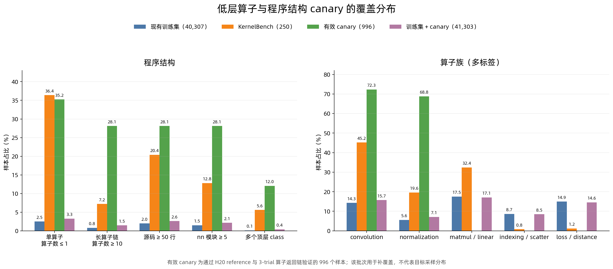

# 算子语义与程序结构 canary

本文统一记录三条互相独立的 parentless canary。三条 lane 都使用封闭、确定性的生成 registry，并通过 source/AST replay、GPU reference 和 declared-op return provenance 验证；它们验证的是不同 coverage cell，不能把 row 数或 family 统计直接相加，也不能静默合并 runtime evidence

| Lane | 目标 | 构造 | GPU | Accepted | 状态 |
| --- | --- | ---: | --- | ---: | --- |
| 低层算子与程序结构 | Conv/Norm/Pool/Layout、长单类、真实可达多 class | 1,000 | H20 | 996 | review-only |
| Semantic/operator | 常见单 Tensor 语义 family、stateful/recurrent 与自然 DAG | 1,000 | A800 | 1,000 | review-only |
| Frontier scenario | Sparse、MoE、SSM、cache、quantization、scientific 等前沿场景 | 1,000 | A800 | 1,000 | review-only |

三条 lane 均为 `training_approved=false`，没有进入 `Data/` 正式 release 或训练 launcher。共同限制是 final output 必须是一个 finite Tensor；structured output、distributed/multi-rank、backward/optimizer、跨 lane 去重与等预算训练 ablation 仍未完成

当前 node64 可直接读取并复核低层/结构 lane 的 accepted、manifest 和 final summary。Semantic 与 frontier 的正式 artifact 路径是生成时记录的 node22 evidence 位置，当前 node64 本地盘没有这两个目录；本文保留其已记录 SHA 和运行结论，但任何后续消费都必须先从 authority 节点同步 artifact，并逐项核 SHA，不能仅凭本文把它们视为本地可用数据

## 低层算子与程序结构

### 摘要

现有训练集与 KernelBench 在程序结构、算子族和输入生成模板上有明显差距。本次用 33 个封闭模板构造 1,000 个 parentless 任务，重点补充低层 convolution、normalization、pooling、layout，以及长单类和多 class 结构。全部任务使用规则生成，没有读取 KernelBench 源码，也没有调用 DSV4F

最终有 996 个样本同时通过静态合同、KernelGym H20 reference 和三次算子返回链验证，有效率为 99.6%。四个 family 都超过 canary 门槛，33 个模板也都保留了有效样本。四条失败均来自 channels-last 非连续输入上的 `torch.flatten`，reference 结果正确，但现有运行时证据无法把底层 `clone -> _unsafe_view` 证明为 flatten 返回链，因此保守拒绝

这批数据证明了规则法可以稳定补充低层算子和结构尾部。它是定向 coverage canary，尚未解决整体分布差距：并入 40,307 个训练样本后，convolution 和 normalization 占比只升到 15.70% 和 7.10%，仍低于 KernelBench 的 45.20% 和 19.60%；本批也没有新增 matmul/linear。产物保持 `review_only` 和 `training_approved=false`

### 背景

训练集集中在短的多算子组合，KernelBench 同时包含较多单算子任务和长模块。训练集的 convolution、normalization 和 matmul/linear 覆盖也明显偏低，`get_inputs()` 则大量复用少数模板

| 差异 | 现有训练集 | KernelBench |
| --- | ---: | ---: |
| 输入相关算子数 ≤ 1 | 2.48% | 36.40% |
| 输入相关算子数 ≥ 10 | 0.81% | 7.20% |
| 源码行数 ≥ 50 | 1.98% | 20.40% |
| 模型拥有的 `nn` 模块 ≥ 5 | 1.50% | 12.80% |
| 多个顶层 class | 0.12% | 5.60% |
| convolution | 14.30% | 45.20% |
| normalization | 5.58% | 19.60% |
| matmul/linear | 17.49% | 32.40% |

严格比较调用标签时，KernelBench 有 19 个训练集未出现的标签。最终有效集只命中其中 1 个：`torch.randn` 在 `forward` 中出现 15 次，`get_inputs()` 未使用该 factory；其余 18 个标签仍为 0。这个集合混有架构名、helper 名、变量名和一个提取误差，不能直接当作低层算子清单

| 标签类型 | 数量 | 本次处理 |
| --- | ---: | --- |
| `torch.randn` | 1 | 在 `forward` 中新增 15 个有效样本，且输入值仍可达输出 |
| `self.hidden.copy_` | 1 | 暂缓，需要独立的 stateful-write 验证合同 |
| `self.cls_token.expand`、`self.hidden.to` | 2 | 接收对象名造成的精确标签差异，不通过伪造变量名补齐 |
| `tensor.sqrt` | 1 | 实际来自 `math.sqrt` 的提取误标，不构造假覆盖 |
| 架构、helper 和外部 wrapper 名 | 14 | 不复制 `InceptionModule`、Transformer、builder/helper 等高层实现 |

因此，本次以算子语义、拓扑和可验证结构为目标，不追求 19 个字符串全部命中

### 方法

#### 封闭模板

生成器固定了四个互斥 family 和 33 个模板。每个模板都声明源码调用、预期 ATen identity、每次 trial 的最少调用次数，以及目标算子必须到达最终单 Tensor 输出的合同

| family | 构造数 | 最终有效数 | 主要覆盖 |
| --- | ---: | ---: | --- |
| `atomic_low_level` | 390 | 386 | Conv/ConvTranspose 1D–3D、Batch/Group/InstanceNorm、3D pooling、div/sub、sigmoid、dropout、flatten、contiguous、unfold、channel permute、forward `randn` |
| `conv_norm_chain` | 330 | 330 | Conv2d→BN2d→pool、depthwise→BN2d→pointwise、Conv3d→BN3d→pool、deconv→norm、Conv1d→BN1d→pool |
| `long_single_class` | 160 | 160 | 50 行以上、至少 5 个 registered module、至少 10 个 forward call 的 1D/2D/3D 长模块 |
| `modular_multiclass` | 120 | 120 | 2–3 个可达顶层 class、至少 5 个 registered module、至少 10 个 forward call |

多 class 和长模块都能由规则稳定表达，静态 reachability 也能完整证明，所以没有部署 DSV4F。模型生成仍可用于规则难以表达的开放结构，但需要单独的生成、去污染、调用图和人工复核合同

#### 输入生成

最终 996 个样本全部以 `torch.rand` 作为 `get_inputs()` 的随机 factory，其中 956 个单输入、40 个双输入。输入构造同时改变 shape、stride、storage offset 或 batch 内数值关系，不使用注释、docstring 和 dead code 制造表面差异

| 输入构造 | 样本数 | 语义 |
| --- | ---: | --- |
| `direct_rand` | 264 | 直接生成连续 tensor，其中 40 个为 div/sub 双输入 |
| `offset_slice` | 188 | 从更大的 tensor 切出非零 storage offset 的连续 view |
| `strided_slice` | 185 | 通过步长切片生成非连续输入 |
| `channel_last_view` | 179 | 末维生成后用 `movedim` 形成非连续 channel-first view |
| `broadcast_repeat` | 180 | 先沿 batch `expand`，再 `clone` 成正 stride 连续 tensor；batch 内数值重复 |

最终输入中没有 zero-stride tensor，364 个输入非连续，188 个输入具有非零 storage offset。完整 `get_inputs()` AST 有 943 种，最大重复组为 3；擦除常量并对局部变量 alpha-renaming 后有 174 种 skeleton，最大重复组为 20

#### 静态检查

静态检查同时约束以下内容

- 重新提取完整算子签名，并核对模板要求的调用 multiset
- 从整个 `Model` class 的构造和调用关系递归解析顶层 helper class，拒绝完全不可达的 helper 定义
- 核对唯一同步 `get_inputs()`、输入数量、factory、rank、返回结构和 input skeleton 配额
- 要求唯一顶层 `Model`、唯一 `forward` 和唯一顶层同步 `get_inputs()`；import 仅允许 `torch`、`torch.nn` 和 `torch.nn.functional`
- 禁止 `from import`、`exec`、`eval`、`__import__`、动态 `getattr` 和 `setattr`
- 要求 1,000 份 reference SHA 和 normalized AST 都唯一
- 对现有训练集、v4 review 集、既有 semantic/frontier canary 和 KernelBench 250 题做 exact reference 与 normalized AST 去污染

#### GPU 验证

GPU 检查分两层。KernelGym H20 reference 在 train mode 下运行五次，保持模型实例，固定 paired execution 的初始化与 RNG，检查编译、单 Tensor 输出、数值、state 和显存合同。三次 liveness 再检查声明的 ATen identity、最少调用次数和返回链 provenance，同时核对 RNG、mode、parameter/buffer、object/storage alias 与禁止的写操作

运行证据固定为 8 个分片，每个分片 125 个样本。finalizer 会重放静态生成，精确连接 reference、allowlist 和 liveness UUID，并绑定 candidate、manifest、8 个分片、launcher summary、scheduler contract 和源码 SHA。缺文件、分片归属错误、路径或 SHA 漂移都会拒绝物化

### 结果与分析

#### 数据漏斗

| 阶段 | 样本数 | 结果 |
| --- | ---: | --- |
| 静态闭合注册表 | 1,000 | 33 个模板和四个 family 配额完整，去污染无碰撞 |
| KernelGym H20 reference | 1,000 | 1,000/1,000 通过，五次 trial 均完成 |
| 三次算子返回链验证 | 1,000 | 996 通过，4 条 flatten provenance 拒绝 |
| 最终有效集 | 996 | 全部 family 超过门槛，33 个模板均有保留 |

| family | 最终有效数 | canary 门槛 | 余量 |
| --- | ---: | ---: | ---: |
| `atomic_low_level` | 386 | 350 | 36 |
| `conv_norm_chain` | 330 | 300 | 30 |
| `long_single_class` | 160 | 140 | 20 |
| `modular_multiclass` | 120 | 105 | 15 |

#### 分布



| 结构条件 | 现有训练集 | KernelBench | 最终有效 canary | 训练集 + canary |
| --- | ---: | ---: | ---: | ---: |
| 输入相关算子数 ≤ 1 | 2.48% | 36.40% | 35.24% | 3.27% |
| 输入相关算子数 ≥ 10 | 0.81% | 7.20% | 28.11% | 1.46% |
| 源码行数 ≥ 50 | 1.98% | 20.40% | 28.11% | 2.61% |
| 模型拥有的 `nn` 模块 ≥ 5 | 1.50% | 12.80% | 28.11% | 2.15% |
| 多个顶层 class | 0.12% | 5.60% | 12.05% | 0.41% |

| 算子族 | 现有训练集 | KernelBench | 最终有效 canary | 训练集 + canary |
| --- | ---: | ---: | ---: | ---: |
| convolution | 14.30% | 45.20% | 72.29% | 15.70% |
| normalization | 5.58% | 19.60% | 68.78% | 7.10% |
| matmul/linear | 17.49% | 32.40% | 0 | 17.07% |
| indexing/scatter | 8.67% | 0.80% | 0 | 8.46% |
| loss/distance | 14.93% | 1.20% | 0 | 14.57% |

canary 自身覆盖了目标结构，且刻意提高 convolution 和 normalization 的密度。合入四万级训练池后变化仍小，说明 1,000 个样本足以验证方法和支持度，不足以完成 distribution matching。扩量时还需要单独增加 matmul/linear 与 sequence-rank cell，不能继续复制现有 conv/norm 模板

#### 手工抽检

抽检覆盖全部 33 个模板，并在四个 family 和五种输入构造之间分层；stateful、非连续输入、重复 batch 和多 class 样本均进入样本池

| 抽样维度 | 规则 | 实际覆盖 |
| --- | --- | ---: |
| 模板 | 每个模板至少 1 个 | 33/33 |
| family | `atomic` 21，其他三个 family 各 8 | 45 个样本 |
| 输入构造 | 五种构造各至少 5 个 | 5/5 |
| 结构与状态 | 覆盖长模块、多 class、stateful 和非连续输入 | 全部命中 |

| 评级 | 样本数 | 含义 |
| --- | ---: | --- |
| A | 38 | 未发现语义问题或明显分布边界 |
| B | 7 | 样本有效，但存在需要记录的输入分布边界 |
| C | 0 | 未发现 child 引入的语义错误 |

六个 B 级样本来自 `broadcast_repeat`，其 batch 内数值完全重复；另一个 B 级 div 样本将分母限制在正数且远离零。两类都能有效测试对应算子，但不覆盖独立 batch、负分母或近零分母。该集合没有 parent，因此 parent 问题不适用；抽检没有证据不足项

### 已知偏差和遗留问题

#### Shape 仍小

本批只做安全 canary，rank 3/4/5 的样本数为 115/611/270。profiler 能静态解析 564/1,036 个 factory 调用，其元素数 p50 和 p90 为 16,384 和 110,592，没有已解析样本达到 1M；KernelBench 对应为 33,554,432、1,610,612,736 和 88.6% 达到 1M。该统计是可解析调用的下界。本方法不承担 shape 扩增，不能用它替代已有 shape lane

#### 值域和模板仍集中

`get_inputs()` 全部使用 `torch.rand`，修正了训练集过度依赖 `randn` 的方向，但值域仍集中在 `[0, 1)`。`broadcast_repeat` 还引入了 180 个 batch 内相关样本。去常量 skeleton 的最大重复组已经限制为 20，但并入训练集后，原有最大重复组仍为 5,038，输入模板集中问题没有消失

#### Flatten 复合路径

四条失败样本都使用下面的核心组合

```python
def forward(self, x):
    return torch.flatten(x, 1)

def get_inputs():
    x = torch.rand(3, 10, 10, 8).movedim(-1, 1)
    return [x]
```

该输入非连续，H20 上的 flatten 走 `aten::clone -> aten::_unsafe_view`。reference 五次执行均通过，但现有 liveness 只把 `aten::view/reshape` 认作 flatten identity，无法证明目标标签到达返回值。当前结果保守拒绝这四条。扩量前可让 AT17 避开 `channel_last_view`，或为复合 materialize/view 路径增加经过审查的 provenance 规则，不能直接放宽 shared runtime core

#### Stateful write 尚未覆盖

`self.hidden.copy_` 会修改 registered buffer，现有 shared liveness 对 tainted in-place write 采用 fail-closed 策略。要补这类样本，需要单独核对 control/trace 最终 state、跨 trial 持久化、alias 和返回值依赖的 stateful-write validator

#### 尚无训练收益结论

最终数据只证明 reference 可运行、声明算子可达返回值和结构合同成立。尚未做采样权重设计、训练合并或 ablation，不能据此判断 KernelBench correctness 的提升幅度

### 产物和复现入口

#### 代码

- 生成器：`tools/data/synthesize/kernelbench_gap_method/generate_kernelbench_gap.py`
- liveness adapter：`tools/data/synthesize/kernelbench_gap_method/validate_kernelbench_gap_liveness.py`
- 8 卡 launcher：`tools/data/synthesize/kernelbench_gap_method/launch_kernelbench_gap_liveness_shards.sh`
- fail-closed finalizer：`tools/data/synthesize/kernelbench_gap_method/analyze_kernelbench_gap_run.py`

#### 最终产物

- 有效样本：`local_artifacts/data/synthesize/kernelbench_gap_canary1000/run.primary.v2/analysis/final/accepted.parquet`，SHA-256 `8c9d5c39a5be9ea4a89031cc7099fb150fc2a9ed0a3503a1ab7c50bbeceb7903`
- 逐样本合同：`local_artifacts/data/synthesize/kernelbench_gap_canary1000/run.primary.v2/analysis/final/accepted.manifest.jsonl`，SHA-256 `e1bfb037e543fc74ec56b15e387e4bb7f2b8830dd6923ec9b0c4f1c33b93c71e`
- 最终汇总：`local_artifacts/data/synthesize/kernelbench_gap_canary1000/run.primary.v2/analysis/final/final_summary.json`，SHA-256 `23da9c8e62d3a97a5ce7a0563f5047fb6e623037df1f7498566069c49eb6b451`
- 失败审计：`local_artifacts/data/synthesize/kernelbench_gap_canary1000/run.primary.v2/analysis/final/failure_audit.jsonl`
- 同口径分布：`local_artifacts/data/synthesize/kernelbench_gap_canary1000/run.primary.v2/analysis/final/accepted_distribution_profile.json`
- 手工抽检：`local_artifacts/kernelbench_gap_canary_review_20260811/manual_semantic_audit.md`

#### 证据绑定

- candidate SHA-256：`c9e631c0bd2c8c78b9c95d69e9e7b8b5d27ca92baaa269ef78492668b36f352d`
- generator commit：`4fe1c02c700ce110aeec40c5aa3afaf55d9ef341`
- generator SHA-256：`6d2cae2d3d78f72b55093fc8fe8796e00e3605e397cade152a3129249df22ca4`
- reference runtime：H20，PyTorch 2.11.0+cu129，CUDA 12.9，KernelGym commit `26255057463a77b23abac0f3e5eafeeebf2ebbb5`
- reference contract fingerprint：`0265b2a03abd4a9b984d90ec68d7049dd8664e5d815a60f213f6c0f22e5c04dd`

## Semantic/operator single-Tensor canary

### 范围与生成合同

本 lane 不调用 LLM。1,000 条 standalone task 来自 33 个封闭 Python template，由 registry 按固定 quota 和 variant 完整枚举；每个 declared op 必须由静态直线 dependency proof 连接到 return。dead op、仅增加源码长度或无法归因的动态调用不会进入 manifest

| Primary family | Rows | Templates | 代表 cell |
| --- | ---: | ---: | --- |
| `attention_recurrent_stateful` | 180 | AR01–AR06 | fused SDPA、softmax attention、embedding、GRU、LSTM、stateful BN+GRU |
| `conv_norm` | 180 | CN01–CN06 | conv/transpose conv、batch/instance/group/layer norm、activation/pool |
| `heterogeneous_natural_dag` | 160 | HD01–HD05 | conv classifier、embedding attention、residual branch、index/reduction DAG |
| `matmul_reduction` | 180 | MR01–MR06 | mm/matmul/bmm、sum/mean/max/norm/clamp |
| `pool_index` | 150 | PI01–PI05 | pooling、gather/scatter/topk/index-select |
| `shape_branch` | 150 | SB01–SB05 | split/merge、pool branch、transpose/reshape branch |
| **Total** | **1,000** | **33** | final output 均为一个 Tensor |

Mode 分布为 stateless 758、recurrent-state 60、train-stateful 182。AR01 的 head dimension 固定覆盖 4、8、12，各 10 行；A800 根因探针已证明这些 cell 命中 `_scaled_dot_product_efficient_attention`，并由 liveness fail-closed 验收实际 identity

实现位于 `tools/data/synthesize/semantic_operator_method/`：

- `generate_semantic_operator.py`：registry、quota、static return-dependency、decontamination 和 exact 1k 生成
- `validate_semantic_liveness.py`：三轮 ATen dispatch、return provenance、single-Tensor 与 state proof
- `launch_semantic_liveness_shards.sh`：8 GPU source-bound launcher
- `analyze_semantic_run.py`：合并 static、KernelGym reference 和 liveness

实现 commit 为 `fd8a7cbfb24ca5d32c13f2be158c25dc8d2d6605`。四个入口的 SHA-256 分别为 `ff050fb136b029585f2358c588ff6dc8b359aaaf3bade56a064e4580908dab25`、`b0177d19377f71ae32aac13698079f858942ad9f95f866a2192bfa50f933b7ff`、`5a9d26f445c759523366159ee98c9b0e9c89a9f3d430fc37819973ebc40c6d56`、`ab64990d85438b3795bc23f7be73a41e1f7cf482262456fadb2c4d2a972d3718`

### 静态与去污染证据

去污染 root 为 64,315-row canonical parent 和 512-row extreme-op accepted partition。它们当前归档于：

- `Data/prompt_tvm_v4/intermediate_artifacts/train.review.parquet`，SHA-256 `b07205fcadc543964cfc7ee5fd9c1e4d011f0f3481447f656e5297e40b4b99f4`
- `Data/prompt_tvm_v4/intermediate_artifacts/synthesis/accepted/extreme_ops_v3.parquet`，SHA-256 `57e8054f758007fc597312414da79740d72006c78b2afedf3c7d1994bd00565b`

正式 manifest 保留生成时的原始绝对路径；归档移动没有改变文件内容和 SHA。若要求 byte-identical replay，应恢复原 provenance path 或在新的空 lane 接受新的路径绑定，不能改写既有 manifest

Exact reference SHA 与 Python 3.12 normalized-AST SHA 在两个 root 上均零碰撞，1,000 条自身也各自唯一。AST replay 固定 CPython 3.12，Parquet materialization 固定 `pyarrow==24.0.0`

| Static artifact | SHA-256 |
| --- | --- |
| `candidates.parquet` | `ddfdab60415dc325d5a7eba2dfa3615f708814322feb2713b25651f4af706ac2` |
| `manifest.jsonl` | `144d61b555539b3a6664a542f7b702dd78ed90bce4d9d07c9f403e3274725e50` |
| `decisions.jsonl` | `896828d5aa55277a62f6ffdd67aab16b8e125fc06a958396247002eee7a8e399` |
| `review_samples.md` | `ade89daf468cdecfb3c61cb7e792c69ea0c8aafe66c1b0e7ca61d9d336c239f4` |
| `summary.json` | `9653fc7d4a5a00570879093ff7d171d784fc7411145622ea80d7d975a135785b` |

### A800 reference 与 liveness

正式 run 位于 node22 的 8× A800-SXM4-80GB，Torch `2.11.0+cu129`、CUDA 12.9、cuDNN 91701，KernelGym authority commit 为 `26255057463a77b23abac0f3e5eafeeebf2ebbb5`

- Reference：8×125 fresh shards，persistent train mode，5 trials、seed 42、180s timeout、64 GiB guard，1,000/1,000 passed
- Liveness：每条 3 trials，seeds 17/10024/20031，control 与 trace 的 output/state exact；每个 declared op 必须有允许 identity、minimum count 和 returned-output witness，1,000/1,000 passed
- Validation binding：`67af85077d302ccd9c7679f657b027ce0337e2727ba2e19d026c873bd8aee539`
- Reference-pass allowlist：1,000 rows，SHA-256 `b019b20f44d0a0e09dda0047d99121f46325f932b263e8b52f48eafc6e775027`

AR01 fused attention、AR04–AR06 registered RNN alias、CN04 deterministic transposed-conv/BN/tanh 三类 pre-fix 根因均已闭环。旧 generator、首次失败 shards 和 post-fix smoke 只保留为 diagnostic，不进入正式 accepted 分母

### 最终产物与边界

正式 lane 为 `local_artifacts/data_handoffs/prompt_tvm_v4_semantic_operator_canary1000`

| Final artifact | Rows | SHA-256 |
| --- | ---: | --- |
| `analysis/final/accepted.parquet` | 1,000 | `c0466138131e53d987da1d6e72ec5e737012af3d410c2c1e6612a0bb627f1fe0` |
| `analysis/final/accepted.manifest.jsonl` | 1,000 | `b9d4f16dbc9f941ab706d33492ace852f0439afb41901be0166f3e750d084a4b` |
| `analysis/final/failure_bias_report.md` | 33 templates | `f6580688db937a5ac322dde29934ffb24cd499a9bfc6787a273908ae990ead1f` |
| `analysis/final/raw_artifact_sha256.json` | 16 shards + static inputs | `9113550ceff8f0a74a587aa23c183bbd855989fb8ed51a9cd1b52b9538d4779b` |
| `analysis/final/final_summary.json` | — | `8c94162cc12d031b5e1db5f72fc17d2461913ed6ac0519d6fe0279d8654f41c9` |

六个 family 和 33 个 template 均无选择性掉量。Kimip 对实现修复、static 1k 和 runtime evidence 的三个里程碑均给出 PASS、P0=0、P1=0。Structured output 被明确延期；本 lane 也不证明任意动态 graph、所有硬件/seed、未来 PyTorch dispatch、cross-lane 去重或训练收益

复现必须使用 commit-bound clean worktree 和新的空 output directory，按 `generate → fresh reference → 从 fresh shards 派生 allowlist → liveness → analyze` 顺序运行。不得覆盖正式 lane，也不得把 `_pre_fix_diagnostic` 作为输入

## Frontier operator scenario canary

### 范围与 coverage 合同

Frontier lane 是独立的 source-driven、parentless standalone lane，与 semantic 33-template lane 分开管理，也不构成后者的放量。公开论文、官方文档和公开实现只定义可审计的 operator/scenario motif；candidate 仍由固定 seed、closed registry、精确 quota 和 typed semantic coordinates 确定性构造，不让 LLM 直接生成代码

| Family | Rows | Templates |
| --- | ---: | --- |
| sparse storage/compute | 160 | SP01–SP04 |
| MoE routing | 140 | MO01–MO04 |
| selective state-space | 120 | SS01–SS03 |
| attention/cache | 120 | AC01–AC04 |
| modern LLM block | 100 | LL01–LL04 |
| ragged/graph/segment | 120 | RG01–RG04 |
| quantization QDQ | 80 | QD01–QD04 |
| vision/geometry | 60 | VG01–VG03 |
| spectral/scientific | 60 | SF01–SF03 |
| retrieval/recommender | 40 | RR01–RR02 |
| **Total** | **1,000** | **35** |

Sparse family 在 `forward` 内实际构造并消费 COO、CSR、sampled-addmm、sparse-softmax 和 semi-structured 2:4 intermediates；其他场景包括 token/expert-choice MoE、Mamba-style state carry、RoPE/GQA/sliding attention、paged KV cache、RMSNorm/SwiGLU、ragged graph、INT4 QDQ、fake FP8、grid sampling、FFT/STFT、Cholesky 和 retrieval/embedding bag

最终 output contract 仍是一个 finite、dense、strided CUDA Tensor。Structured/heterogeneous output、multi-rank/distributed、backward/optimizer 和 native FP8/FP4 延期。`tools/data/synthesize/lhb/` 只提供 diversity-control 思路，本 pipeline 不导入、不复制也不依赖该目录

### Static、A800 与 final evidence

正式 lane 为 `local_artifacts/data_handoffs/prompt_tvm_v4_frontier_operator_canary1000/`。Generator 固化于 commit `e120af931b30b96fbf38eda0d6498a7925763063`；runtime output-device evidence 修复位于 `297e67d59183d8a1c98e94a60dd7db8d5067bb70`

| Static item | SHA-256 |
| --- | --- |
| design contract | `734a13f6b8581b1414dc01b3eb5279a82dac8b32068f68e39cf9ac784a5eb85a` |
| generator | `ca053a350d46cb0474cf459ed7f2e62017fc4475a98ff28035875e3f350bb4da` |
| candidates | `566fc10aaddbf890fd140490f06a928c25594a40955c48a4d0595239f5154abf` |
| manifest | `9a215ca9032b0fbe8b5995d25a6f0c47c102d59b473b610483188d3b1f512670` |
| decisions | `e9d1c9ce52cbaa188aef0e27443676d0b7899151a0089c1e3e0185b280c853a8` |
| static summary | `6cf5ba43ca07f1ba97ccfce96b3b2d2c5d1f40869b75aab269042462da98d2be` |

Static gate 对 canonical 64,315-row root、extreme-op 512-row root 和 semantic 1,000-row root 执行 exact reference 与 Python 3.12 normalized-AST decontamination，并 replay registry、solver invariants、quota、typed axes、lineage 和 governance

Reference 与 liveness 均在 node22 8× A800 上 fresh 执行：

- Reference：8×125 shards，persistent train mode，5 trials、seed 42、300s timeout、64 GiB guard，1,000/1,000 passed
- Liveness v2：8×125 shards，3 trials、seeds 17/10024/20031、600s timeout、64 GiB guard，1,000/1,000 passed
- 每条记录要求 config、GPU、record final 和每个 trial 的 output/control/traced output device 精确为 `cuda:0`
- Liveness binding：`4274dedd77f9af3c2d0165a23ac1c5b1a21686c3a1b29cb9b655438da9c458a5`

Declared inventory 与 runtime-realized coverage 必须分开解释。`_safe_softmax`、`_scaled_dot_product_flash_attention`、`_to_sparse_semi_structured`、`cudnn_grid_sampler` 和 `rms_norm` 在本轮 declared identity 的 realized count 为 0，`bmm` 为 realized 75 / declared 165；它们由 observed lower-level 或 alternative identity 闭合，不能把 declared 数量写成真实 dispatch 数量

| Final artifact | SHA-256 |
| --- | --- |
| `final/final_summary.json` | `54e218d121f10c0667b17bf93b6b39a6304365a43506812b26966ff1491c1422` |
| `final/accepted.parquet` | `a7d33f4bb5ee4494010ba1b390084e90d4cf1dd2729c224e2e809aa1c3e36d18` |
| `final/accepted.manifest.jsonl` | `0f2448d9782a195ea682103f9cde1db0e5b37d2b1d3564b8304fdff7ce2674b3` |
| `final/failure_audit.jsonl` | `e3b0c44298fc1c149afbf4c8996fb92427ae41e4649b934ca495991b7852b855` |
| `final/raw_artifact_sha256.json` | `6c77d2dcfcdf4724e4aec3d9411fbe295900200b4af76b5d7a8a42715847024f` |
| `final/runtime_evidence_samples.md` | `b4d66038c4532d1f9ffcbd5370138d1a8ab1492a8682601dbfa7a34e075bc31d` |
| `final/manual_critical_samples.md` | `d1d74c3e8eaf635d76f0fb21fe5672456c90bb85b009a59421508bcdd1cdec11` |

Final analyzer exact-join 1,000 static、1,000 reference、1,000 liveness 和 1,000 accepted rows；10 families、35 templates 和全部统计轴零掉量。人工 critical set 覆盖 COO/CSR/2:4、empty ragged、expert-choice MoE、paged KV、INT4、grid、FFT/STFT、embedding-bag 和 retrieval。Kimip 最终只读审查为 PASS、P0/P1=0，独立 artifact 复算为 P0/P1/P2=0

### 诊断与复现边界

`prompt_tvm_v4_frontier_operator_canary1000_pre_fix_diagnostic/` 保存 sparse constructor 缺少显式 device 时的旧 880/1,000 reference；pre-output-device partial run 和五例 smoke 也只用于根因诊断。它们不进入正式 reference、liveness、allowlist 或 accepted 分母

复现顺序固定为 `generate_frontier_operator.py → fresh KernelGym reference → 从该 reference 派生 ordered pass UUID allowlist → launch_frontier_liveness_shards.sh → analyze_frontier_run.py`，并要求 clean、commit-bound worktree 和新的空 lane。任何 generator、validator、launcher、semantic-validator closure、candidate/manifest、allowlist 或 runtime-policy hash 改变，都必须重建对应 evidence

本 canary 没有证明任意硬件/seed、真实 fused/custom model kernel、训练收益、跨 lane policy 兼容、license/provenance merge 或正式数据发布。`accepted.parquet` 不能脱离 manifest 和 final summary 单独消费

## 三条 lane 的共同使用边界

三条 canary 的 accepted partition 都只能作为后续采样设计和训练 ablation 的候选池。正式合并前至少还需要：

- 对三条 lane 与正式训练数据执行统一 UUID、reference、normalized-AST 与 source-near 去重
- 统一不同 H20/A800 runtime evidence 的兼容策略，并保留各自硬件与 contract binding
- 完成 source/provenance/license 审计和训练环境抽检
- 设计不放大 template、family 或 input skeleton 的采样权重
- 通过等 token-budget ablation 并由人工显式设置 `training_approved=true`

在这些门槛关闭前，996、1,000、1,000 三个 accepted 数量只表示各自 canary 内的可复核结果，不表示 2,996 条可直接进入训练
