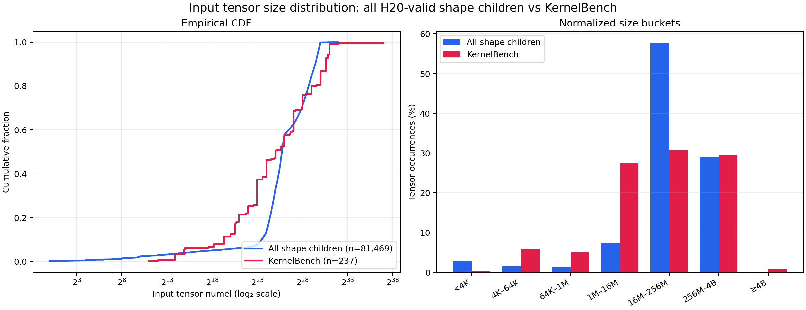
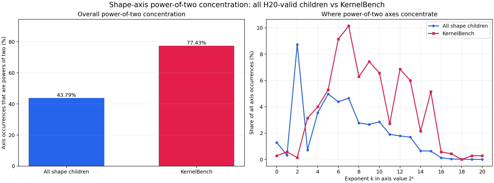
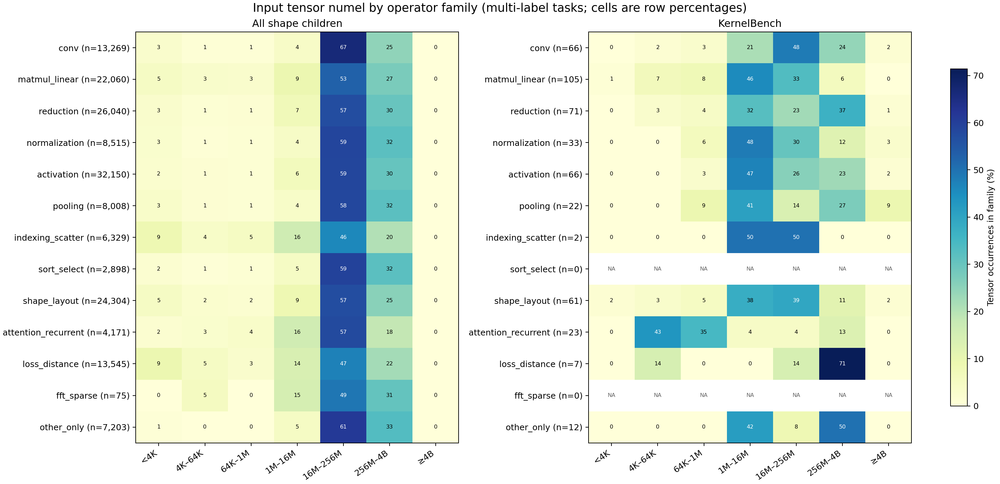
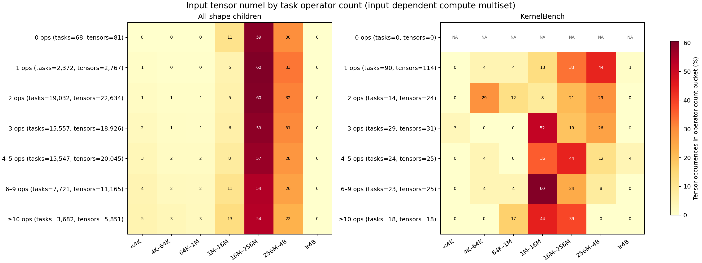

# Shape 扩增

# 摘要

原训练数据里的 tensor 普遍比 KernelBench 小。为了扩大训练集的 shape coverage，本项目使用
static solver 和 DSV4F 生成大输入 tensor 变体。最终得到 63,979 个有效 child，覆盖 45,833 个
parent，占 64,315 个原始样本的 71.26%。

| 方法 | 有效 child | 覆盖 parent | Parent 覆盖率 |
| --- | ---: | ---: | ---: |
| Static solver | 23,358 | 23,358 | 36.32% |
| DSV4F | 40,621 | 22,475 | 34.95% |
| **合计** | **63,979** | **45,833** | **71.26%** |

两种方法处理的 parent 互不重叠。45,833 个已覆盖 parent 中，27,687 个有一个有效 child，18,146
个有两个；其余 18,482 个 parent 没有得到有效 child。Static solver 的覆盖面主要取决于 shape
关系能否静态证明；DSV4F 补上 hard tail，但仍受模型指令遵循和 H20 可执行性限制。两种方法通过
同一套最终门禁，有效结果可以直接合并。

# 背景

下表统计了原训练数据和 KernelBench 的 input tensor numel 分布。可以看到 KernelBench 的 median tensor numel 是原训练数据的约 2000 倍，P90 是约 500 倍。
原训练数据主要覆盖小 tensor，较少暴露 large grid、64-bit indexing、tail block、stride、数值累加、timeout 和显存压力等问题，**因此有必要扩增输入 shape，提高 shape coverage**

| Tensor numel | 原训练数据 | KernelBench |
| --- | ---: | ---: |
| P50 | 16,384 | 33,554,432 |
| P75 | 262,144 | 268,435,456 |
| P90 | 3,145,728 | 1,610,612,736 |
| ≥1M | 18.2% | 88.6% |
| ≥10M | 3.0% | 62.4% |
| ≥100M | 0.5% | 42.2% |


# 扩增方法

## Static solver

训练集中，均通过 `get_inputs()` 得到输入 tensor，因此Static solver 直接分析 `get_inputs()` 的 Python 源码，流程如下：

1. 用 Python AST 找到唯一的顶层 `get_inputs()`，识别 `torch.rand`、`randn`、`randint`、`empty`、`full`、`ones` 和 `zeros`；
2. 按执行顺序解析 module 和 `get_inputs()` 顶层的简单常量赋值；
3. 根据 factory 的参数规则计算 shape、dtype 和 storage bytes；
4. 从 `return` 语句反向追踪 list、tuple、dict 和简单变量，要求每个 factory 恰好返回一次；
5. 按源码 `line/column` 分配 `factory_index`，生成 child 后重新解析并核对 identity。

常量解析只处理数值 literal、已解析的变量、一元正负号和 `+`、`-`、`*`、`//`，不用 `eval()`，也不执行 reference。例如下面的 shape 可以静态求值：

```python
batch_size = 32
hidden_size = 128
height, width = 64, 64

def get_inputs():
    channels = hidden_size // 2
    n = batch_size * 4
    return [torch.randn(n, channels, height, width)]
```

简单变量 alias 也可以追踪：

```python
def get_inputs():
    x = torch.randn(batch_size, hidden_size)
    return [x]
```

### 无法解析的例子

以下情况超出当前 static solver 的范围，都会 fail closed：

**常量无法静态求值。** 函数调用、`**` 幂运算、下标读取和环境变量一律不执行、不猜测：

```python
n = get_size()
n = 2 ** 10
n = values[0]
n = int(os.getenv())
```

**Factory 没有返回。** `temporary` 只是临时 allocation，继续计入会高估 input bytes：

```python
def get_inputs():
    x = torch.randn(batch_size, hidden_size)
    temporary = torch.randn(1024, 1024)
    return [x]
```

**Factory 重复返回。** 两个 forward 参数共享 storage，factory 到参数位置的映射和changed-region 扰动不再唯一：

```python
def get_inputs():
    x = torch.randn(batch_size, hidden_size)
    return [x, x]
```

**返回值经过 tensor 变换。** Solver 无法证明 allocation 与最终 storage 的对应关系：

```python
def get_inputs():
    x = torch.randn(batch_size, hidden_size)
    return [x.transpose(0, 1)]
```

`torch.tensor`、`*_like`、`arange`、`cat`、`stack`、动态分支、条件 return、重复 alias，以及求不出
正整数的 shape，也都会被拒绝。

### Shape 求解

每个 parent 分到一个随机 byte target：`Medium` 为 64–256 MiB，`Large` 为 256 MiB–4 GiB。
寻找 只组合影响同一组 input factory 的 slot，并要求输入存储量能写成 `constant + coefficient × product(slot values)`。例如：

```python
batch = 32
hidden = 128

def get_inputs():
    x = torch.randn(batch, hidden)
    y = torch.randn(batch, hidden)
    return [x, y]
```

`batch` 和 `hidden` 都影响两个 input factory，即两次 `torch.randn` 调用。若 dtype 为`float32`，returned input storage 为：

```text
4 × batch × hidden + 4 × batch × hidden
= 8 × batch × hidden
```

此时 `constant = 0`，`coefficient = 8`。如果再返回一个固定大小的输入：

```python
def get_inputs():
    x = torch.randn(batch, hidden)
    y = torch.randn(batch, hidden)
    z = torch.randn(1024)
    return [x, y, z]
```

存储量变成 `4096 + 8 × batch × hidden`，因此 `constant = 4096`

注意：如果 `x` 使用 `(batch, hidden)`，`y` 只使用 `(batch, 128)`，那么 `batch` 影响两个 factory，`hidden` 只影响一个 factory。两者影响的 factory 集合不同，不能组成上述 product group。

Solver 随后在整数域内搜索新维度，要求 child 输入至少是 parent 的 2 倍，与 target 的误差不超过25%。Solver 不判断维度在语义上是 M/N/K、channel 还是 sequence，这类算子约束交给后面的FakeTensor 和 H20 执行检查兜底。

求解分三种策略：

| 策略 | 适用结构 | Shape slot 规则 |
| --- | --- | --- |
| `exact-two` | 能找到严格 structural pair 的 parent | 恰好修改 2 个 slot；一个新值为 2 的幂 |
| `variable-multislot` | 能证明 product 关系的复杂 parent | 修改 2–5 个 slot；2 的幂只作软偏好 |
| `remaining-hard-tail` | 前两种策略未覆盖的 parent | 使用更宽的 profile 规则，仍要求精确源码证明 |

Solver 只替换已记录的 UTF-8 整数 span，好处是修改边界清楚、结果可复现；代价是动态控制流、复杂 shape 表达式和无法静态证明的维度关系都只能放弃。这也是 static solver 只覆盖 23,358 个 parent 的主要原因

## DSV4F

DSV4F 指 DeepSeek-V4-Flash-0731。模型读取完整的 PyTorch reference、随机 byte target 和 shape约束，给出一组新的输入维度。它能理解一些 static solver 证明不了的代码关系，所以主要用来处理 static solver 处理不了的样本

值得注意的是，DSV4F 请求用 `reasoning_effort=low` 和 128K context。因为128k context下，high effort 会导致大量截断（smoke实验中约70%截断）

## 构造后的静态检查

候选 child 生成后依次做以下检查：

1. 从 parent 原文重放所有 source span，重新 parse，要求无关的源码逐字节必须不变；
2. 核对 input factory 的数量、顺序、dtype 和 ndim；
3. `get_inputs()` 的给出的所有tensor总大小不超过 4 GiB；ndim ≥ 2 时，最大维度不超过次大维度的 1,000 倍；
4. Parent 和 child 都要能完成 FakeTensor forward，shape coupling 和输出结构符合预期；
5. Static solver 要求 `Model` 和 `get_init_inputs()` 不变；DSV4F 如需联动修改 init shape，manifest
   必须明确记录对应关系。

注意：FakeTensor 用来提前淘汰明显跑不起来的候选；动态索引、data-dependent shape、中间 activation和 workspace 这类问题判断不了

## 构造后的动态检查

通过静态检查的 child 在实际 GPU 上实跑，若出现 OOM、unsupported、timeout、worker error等错误，该 child 就不算有效。

最后再用 seed `17/10024/20031` 扰动扩增出来的区域。三个 seed 下新增区域都必须影响输出，否则记为 changed-region reject

注意：这一步验证的是合成的 child 在目标环境下的自洽性和 shape 修改的有效性，不涉及 Kernel 的正确性，仍有可能出现无意义的 shape。

## 失败与偏差

### Static solver 的覆盖特点

`exact-two` 的主要失败原因是找不到满足约束的 structural pair（约 3 万个 parent），另有约
4,700 个候选没过 FakeTensor。该策略强制一个新值为 2 的幂、另一个不是，所以 changed
occurrence 里 2 的幂固定占 50%。这是构造出来的偏差，不能拿它推断 runtime 的自然偏好。

`variable-multislot` 不再固定改两个 slot，也不要求 50% 是 2 的幂，但 same-factory 的 product
关系仍让 2 的幂占多数。`remaining-hard-tail` 通过率低，主要因为建不出 product profile 和
FakeTensor 失败，把 4 GiB 上限抬高也解决不了这类静态证明问题。

Static solver 对不同 source 和 operator 的覆盖差异较大：

| 维度 | 分组 | Parent 覆盖率 |
| --- | --- | ---: |
| Source | CUDA-Agent | 12.85% |
| Source | DrKernel | 31.95% |
| Source | KernelBook | 63.91% |
| Source | Oubo | 31.28% |
| Operator count | ≤1 | 58.72% |
| Operator count | 2–5 | 36.02% |
| Operator count | ≥6 | 32.41% |

直接使用全部 static child，会明显抬高 KernelBook 和低 operator-count 任务的占比。

### DSV4F 的失败和偏差

模型失败主要分四类：

| 类别 | 典型表现 |
| --- | --- |
| 指令遵循 | 修改 docstring、reference、forward、factory、dtype 或 ndim |
| Shape 有效性 | 选择 dead slot、破坏 coupled shape、仍无法建立 input profile |
| 执行 | FakeTensor unsupported、H20 OOM、reference failure、changed-region reject |
| 输出 | 128K 截断、格式错误、没有给出可解析修改 |

虽然 byte target 是随机数，被接受的 shape 仍偏好 32、64、128、256、512、1,000、1,024、2,048、
4,096、8,192 等常见值；不同模型批次中，2 的幂约占 40%–44%，Top-10 高频值约占 38%–43%。
CUDA-Agent 的通过率也低于 DrKernel。模型 proposal、source-span materializer 和 H20 runtime 会
层层改变分布，因此最终采样要联合控制 source、operator、size、variant 和 shape value，不能按生成
顺序直接取第一个 child。

# 合成后的数据分布及使用边界

Shape-only 候选池包含 63,979 个有效 child，覆盖 45,833 个 parent；同一个 parent 可能同时有
Medium 和 Large child。若观察 64,315 个 parent 的完整数据集，每个已覆盖 parent 选一个有效 child，
未覆盖的 18,482 个 parent 保留原样本，分布为：

| Per-tensor numel | 原训练数据 | Shape 扩增后 | KernelBench |
| --- | ---: | ---: | ---: |
| P50 | 16,384 | 786,432 | 33,554,432 |
| P90 | 3,145,728 | 399,507,456 | 1,610,612,736 |

扩增后 P50 是原训练数据的 48 倍，P90 是原来的约 127 倍。Shape 分布已经明显向大 tensor 移动，
但 P50 仍只有 KernelBench 的约 1/43，P90 约为 KernelBench 的 1/4。

## 所有 child 与 KernelBench

下图使用完整的 63,979 个 child，没有按 parent 去重。每个 child 的所有 returned input tensor occurrence 都计入，共 81,469 个；同一 parent 的 Medium 和 Large child 分别计数



| 数据 | Tensor occurrence | P50 | P90 |
| --- | ---: | ---: | ---: |
| 所有有效 child | 81,469 | 56,146,944 | 724,729,856 |
| KernelBench | 237 | 33,554,432 | 1,610,612,736 |

所有 child 的 P50 已高于 KernelBench，但分布仍明显集中在 16M–256M，右尾仍然不足。

### Power-of-two 集中度

这里把 tensor shape 中的每个维度分别计为一个 axis occurrence；例如 `(32, 128)` 贡献两个。
所有 child 共包含 250,619 个 axis occurrence，KernelBench 的 237 个可解析 tensor 包含 700 个。



| 数据 | Axis occurrence | 2 的幂占比 | Top-10 exact value 占比 |
| --- | ---: | ---: | ---: |
| 所有有效 child | 250,619 | 43.79% | 41.11% |
| KernelBench | 700 | 77.43% | 68.29% |

合成结果在 2 的幂上的集中度低于 KernelBench。Child 中最常见的维度值是 4、32、128、3、64，KernelBench 则更集中在 128、64、512、4,096 和 1,024。Static solver 和 DSV4F 虽然都偏好常见整数，但完整 child 集合没有比 KernelBench 更偏向 2 的幂。

### 不同算子类型的 shape 分布

下图沿用背景统计的 operator-family 分类，在每个 family 内计算 tensor numel bucket 占比。
Operator family 是 multi-label；同一个任务可以同时计入 activation、reduction、shape-layout 等多行。
行名中的 `n` 是该 family 的 tensor occurrence 数，不是任务数。



合成后的多数 family 都集中在 16M–256M，family 之间的分布过于相似。KernelBench 的差异更大：attention/recurrent 主要落在 4K–1M，matmul/linear 更多落在 1M–256M，reduction 的 256M–4B占比更高。
因此：当前合成会扩大 tensor，但没有复现各算子类型自身的 shape 结构。
注意：KernelBench 中indexing/scatter、loss/distance 等 family 的可解析 tensor 很少，sort/select 和 FFT/sparse 为零，这些行只能说明现有样本，不能作为稳定的总体估计。

### 不同算子复杂度的 shape 分布

这里的算子复杂度是一个任务中与输入相关的计算算子数；重复调用会重复计数



| 算子数 | Child tasks | Child P50 | KernelBench tasks | KernelBench P50 |
| --- | ---: | ---: | ---: | ---: |
| 0 | 68 | 64,290,816 | 0 | — |
| 1 | 2,372 | 62,095,360 | 90 | 134,217,728 |
| 2 | 19,032 | 59,529,300 | 14 | 16,777,216 |
| 3 | 15,557 | 58,356,364 | 29 | 8,388,608 |
| 4–5 | 15,547 | 55,296,816 | 24 | 33,554,432 |
| 6–9 | 7,721 | 50,331,648 | 23 | 8,388,608 |
| ≥10 | 3,682 | 43,168,000 | 18 | 2,097,152 |

Child 的复杂度桶之间仍然很相似：每桶约 54%–60% 的 tensor 落在 16M–256M，约 22%–33%
落在 256M–4B。KernelBench 的复杂度与 shape 规模关系更明显：单算子任务偏大，而 ≥10 算子任务
没有 tensor 落入 256M–4B，P50 只有 2M。当前合成明显过度拉平了“任务算子越多，单个输入
tensor 通常越小”的关系，尤其会把高复杂度任务扩得过大。KernelBench 每个复杂度桶只有 14–90
个可解析任务，这个趋势可用于识别偏差，但不能当作稳定的总体比例。

## 与 KernelBench 的差距和使用边界

KernelBench 的 tensor 仍然整体更大。当前 shape 方法受到 4 GiB direct-input 上限、1,000:1
维度比、reference 可执行性和 parent 可扩增性的共同限制，不能把 KernelBench 的 shape 分布直接
复刻到训练数据。

残余差距来自四个部分：

- 约三成 parent 没有有效 child；
- CUDA-Agent、matrix 和 indexing 任务的通过率低于 DrKernel、KernelBook 和简单算子；
- H20 校验会更多淘汰 activation、workspace 或计算量较大的 shape；
- 同一 parent 有多个有效 child 时，最终采用哪个 variant 会改变实际训练分布。

4 GiB 上限会截掉最右端的 shape，但解释不了全部差距。大量 parent 无法通过静态证明、FakeTensor
或 H20 runtime，source 和 operator 的覆盖偏差也会保留在最终分布中。

- 新 shape 仍集中在 32、64、128、256、512、1,000、1,024、2,048、4,096、8,192 等常见值；
- 不同 operator family 的 child 都过度集中在 16M–256M，没有保留 KernelBench 的 family-specific shape 分布；
- 不同算子数量的 child 也过度集中在相同大 shape 区间，高复杂度任务没有保留 KernelBench 中较小输入的趋势；
- Static solver 更容易处理 KernelBook、pointwise 和 reduction，DSV4F 也存在 source/operator 偏差；
- 4 GiB 只限制 direct input，限制不了 attention、convolution 和 reduction 的中间显存；
- Changed-region reject 表示新增区域没有影响输出，不代表整个原始参数都是 dead argument；
- FakeTensor 只用于筛选候选，最终结论以 H20 reference 和 changed-region 结果为准。

Shape 产物继续保持 `training_approved=false`。

## GPU-valid child 的语义抽检

对 63,979 个 H20-valid child 的 264 条启发式极端、分层覆盖样本做了 parent→child 人工审计，最终 A=193、B=52、C=19；其中确认由 child 新引入的问题为 1 条，其余 18 条 C 为 parent 原有问题。该抽样用于发现问题，不能外推全量缺陷率

GPU reference 和 changed-region 通过只证明可执行性与新增区域影响，不证明任务语义。抽样方法、具体 UUID、边界复核及门禁建议统一见 [Shape 语义审计](artifacts/shape_semantic_audit/SUMMARY.md)。历史候选的 `training_approved=false` 与正式 release 使用授权分开记录，发版状态见 [数据发版](training_data_release.md)

## 遗留问题

当前 shape 扩增没有按任务算子复杂度限制输入规模。高复杂度 kernel 会同时产生更多参数、中间激活、
workspace 和串行计算，不能使用与单算子任务相同的 byte target 和 shape 上限。现有 ≥10 算子 child
的 input-tensor P50 为 43,168,000，而 KernelBench 同桶只有 2,097,152，约相差 20.6 倍。后续生成
需要按 effective forward 的输入相关算子数分桶，随复杂度增加逐步收紧 byte target、单 tensor 上限
和 direct-input 总量，并继续用真实 H20 峰值显存和时延验证；具体阈值需要通过 canary 确定，不能
直接把 KernelBench 小样本桶的分位数硬编码为门禁。

Static solver 的常量解析目前只支持一元正负号以及 `+`、`-`、`*`、`//`，没有实现 AST 中的
`Pow`。因此 `2 ** 10` 这类可以静态确定的整数表达式也会被拒绝。这是实现覆盖缺口，不是 shape
求解或 AST 的限制；当前尚未统计它导致多少 parent 无法扩增。

幂运算可以加入安全白名单。实现时应要求 base 和 exponent 都是整数、exponent 非负，并在实际计算
前限制结果的 bit length，避免 `2 ** 1000000000` 一类表达式消耗大量 CPU 和内存。计算结果仍需为
正整数，并继续通过 4 GiB、shape balance、FakeTensor 和 H20 门禁。

加入 `ast.Pow` 后，需要重新统计 static solver coverage，并对新增 child 单独完成 canary 和 H20
验证；现有 63,979 个有效 child 和 45,833-parent coverage 在重跑前保持不变。

## 产物与运行记录

- 分布图：`handoffs/data/synthesize/artifacts/shape_child_vs_kernelbench_numel.png`
- Power-of-two 图：`handoffs/data/synthesize/artifacts/shape_child_vs_kernelbench_power2.png`
- Operator-family 图：`handoffs/data/synthesize/artifacts/shape_child_vs_kernelbench_operator_families.png`
- Operator-complexity 图：`handoffs/data/synthesize/artifacts/shape_child_vs_kernelbench_operator_complexity.png`
- 分布统计：`local_artifacts/data/synthesize/shape_child_vs_kernelbench_numel.json`
- GPU-valid child 语义抽检：`handoffs/data/synthesize/artifacts/shape_semantic_audit/SUMMARY.md`
- 语义抽样清单：`local_artifacts/data/synthesize/shape_semantic_audit/manifest.tsv`
- 语义抽样代码：`tools/data/synthesize/model_shape/sample_shape_semantic_audit.py`
- 分布图生成代码：`tools/data/synthesize/model_shape/plot_shape_child_vs_kernelbench.py`
- 公共 shape 合同：`tools/data/synthesize/model_shape/shape_contract.py`
- 原始分布统计：`Data/prompt_tvm_v4/analysis/distribution_profile.json`
- 分布统计代码：`tools/data/synthesize/profile_prompt_tvm_distribution.py`
- Static solver：`tools/data/synthesize/model_shape/solve_multidim_shape_coverage.py`、
  `tools/data/synthesize/model_shape/solve_variable_shape_delta.py`
- Static runtime verifier：`tools/data/synthesize/model_shape/verify_shape_solver_runtime_shards.py`
- Static 结果：`Data/prompt_tvm_v4/shape_solver_multidim_v4_byte_targets_v1/run.full53896/`、
  `Data/prompt_tvm_v4/shape_solver_variable_multislot_v5/run.recoverable12318.balanced_v7/`、
  `Data/prompt_tvm_v4/shape_solver_variable_multislot_v8/run.remaining22566.balanced_v7/`
- DSV4F pipeline：`tools/data/synthesize/model_shape/`
- DSV4F 结果：`Data/prompt_tvm_v4/shape_model_hardtail_v2/`、
  `Data/prompt_tvm_v4/shape_model_full_residual_v3/`、
  `Data/prompt_tvm_v4/shape_model_relaxed_residual_v2/`、
  `Data/prompt_tvm_v4/shape_model_retry_single_v3/`、`Data/prompt_tvm_v4/shape_model_unprofiled_v3/`

### 各批次运行记录

| 方法 | 批次 | 有效 child | 覆盖 parent |
| --- | --- | ---: | ---: |
| Static | `exact-two` | 13,743 | 13,743 |
| Static | `variable-multislot` | 8,763 | 8,763 |
| Static | `remaining-hard-tail` | 852 | 852 |
| DSV4F | `hardtail-full` | 22,864 | 12,415 |
| DSV4F | `strict-residual` | 8,321 | 4,913 |
| DSV4F | `relaxed-residual` | 2,384 | 1,245 |
| DSV4F | `single-output-full-retry` | 3,132 | 1,765 |
| DSV4F | `single-output-low128k-residual` | 619 | 347 |
| DSV4F | `single-output-low128k-final` | 177 | 94 |
| DSV4F | `unprofiled-low128k-residual` | 2,784 | 1,506 |
| DSV4F | `unprofiled-low128k-final` | 225 | 128 |
| DSV4F | `corrected-unprofiled-canary` | 108 | 58 |
| DSV4F | `unprofiled-low128k-canary` | 7 | 4 |
