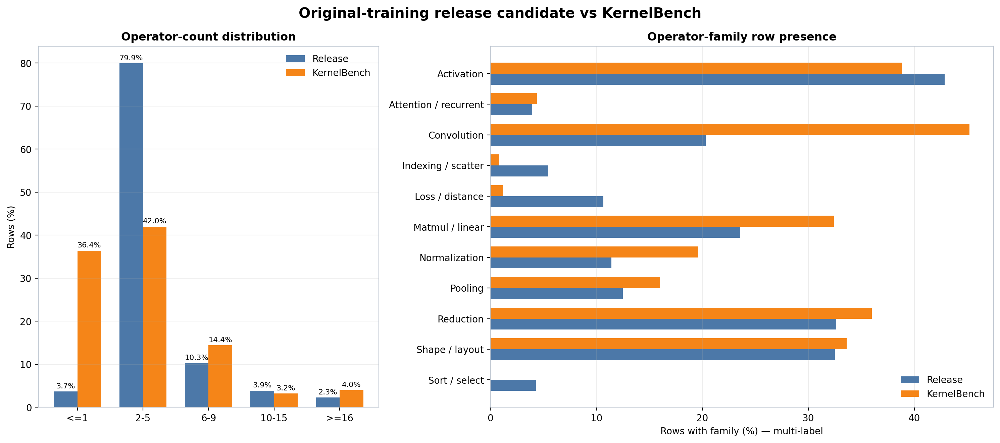
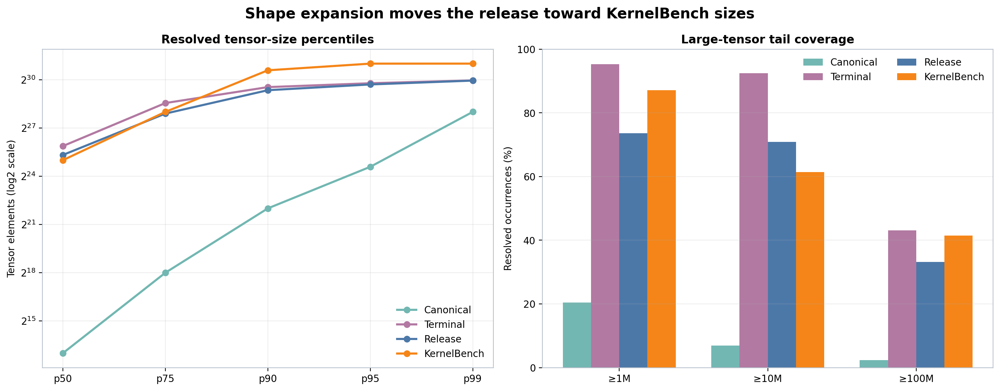

# prompt_tvm_v4 data card

本 v4 正式数据有两个来源：
1. [合成的高复杂度算子数据](./operator_structure_augmentation.md)：使用 typed CSP-DAG 构造的高复杂度合成数据， 共 4,946 条；
2. [清洗后的原训练数据合集](../cleaning/handoff_drkernel_and_accepted_v5_cleanup_20260729.md) ：包含 DrKernel 45,505 条、CUDA-Agent 4,995 条、KernelBook 11,814 条和 Oubo-generated 2,001 条，共 64,315 条

下文将简要介绍两个数据来源的合成方法，以及最终合成的数据集的组成和分布。

# 高复杂度算子合成数据


<!-- 数据位于：

`local_artifacts/data/synthesize/csp_dag_low_level_5k/expansion_v3/run.serial_sd.v8/one_question_per_parent.v1/` -->

<!-- 当前状态为 `review_only=true`、`training_approved=false`。这表示样本、运行证据和审计材料可以复核，但尚未接入训练数据选择器。 -->

## 数据组成

原数据包含 4,946 个 CSP-DAG parent，每个parent的扩增顺序为 `base → shape → dtype`。每个 DAG root 最多有三种已验证题型（child），拟每个 parent 只保留一道题。

最终以 `root_base_uuid` 为发版单位，从该 root 实际可用的题型中确定性选择一道题。4,421 个 root 有 `base+shape+dtype`，525 个 root 有 `base+shape`，输出总数为 4,946。

| 指标 | 数量 | 占比 |
| --- | ---: | ---: |
| 可用 parent | 4,946 | 100% |
| 选中 `base` | 1,740 | 35.18% |
| 选中 `shape` | 1,712 | 34.61% |
| 选中 `dtype` | 1,494 | 30.21% |
| FP16 dtype 题 | 815 | 16.48% |
| BF16 dtype 题 | 679 | 13.73% |

## Shape 与 dtype 的扩增概率

<!-- 固定 lane 顺序为 `base, shape, dtype`。对每个 root 计算

```text
sha256("csp_dag_one_question_per_parent_sample_v1\0" + root_base_uuid)
```

再对该 root 实际可用的 lane 数取模。注意区分 lane 标签和实际扩增：`dtype` 样本 是 `shape` 样本 的 child，选中 `dtype` 的题同时带 shape 和 dtype 两层扩增 -->

| Root 可用题型 | Root 数 | P(含 shape 扩增) | P(含 dtype 扩增) | P(shape-only) | P(shape 且 dtype) |
| --- | ---: | ---: | ---: | ---: | ---: |
| `base+shape+dtype` | 4,421 | 66.67% | 33.33% | 33.33% | 33.33% |
| `base+shape` | 525 | 50.00% | 0% | 50.00% | 0% |
| 全部 root 的理论边际概率 | 4,946 | 64.90% | 29.80% | 35.10% | 29.80% |
| 发版产物实际结果 | 4,946 | 64.82% | 30.21% | 34.61% | 30.21% |

<!-- 实际结果与理论概率一致：理论值按两类可用性加权，实际选择完全由稳定 hash 决定，没有全局 quota。`P(shape 且 dtype)` 约 30% 即 dtype lane 的题，其余约 35% 是 shape-only -->

## 与 KernelBench 的分布对比

<!-- 对比集为本地 KernelBench Level 1/2/3 的 100/100/50 道官方题。所有结构统计从 `reward_model.ground_truth` 静态提取；family 是按样本计数的多标签 样本 presence，同一题可同属于多个 family。这个对比用来判断覆盖边界，KernelBench 不是要逐项拟合的训练分布 -->

### 程序长度与算子数量

| 输入相关算子数 | 高复杂度 4,946 | KernelBench 250 |
| --- | ---: | ---: |
| 1 | 11（0.22%） | 91（36.40%） |
| 2–4 | 30（0.61%） | 80（32.00%） |
| 5–9 | 25（0.51%） | 61（24.40%） |
| 10–15 | 82（1.66%） | 8（3.20%） |
| ≥16 | 4,798（97.01%） | 10（4.00%） |

| 非空且非纯注释源码行 | 高复杂度 4,946 | KernelBench 250 |
| --- | ---: | ---: |
| <20 | 64（1.29%） | 4（1.60%） |
| 20–34 | 911（18.42%） | 147（58.80%） |
| 35–49 | 444（8.98%） | 69（27.60%） |
| 50–74 | 1,197（24.20%） | 20（8.00%） |
| ≥75 | 2,330（47.11%） | 10（4.00%） |

<!-- 这批题明显在 KernelBench 的结构长尾之外：约 97% 的题有至少 16 个输入相关算子，约七成有 50 行以上有效源码。它补的是高复杂度组合，覆盖不了 KernelBench 中占比很高的单算子和短程序 -->

<!-- ### Low-level family 覆盖

| Family（多标签） | 高复杂度 4,946 | KernelBench 250 |
| --- | ---: | ---: |
| activation | 2,063（41.71%） | 103（41.20%） |
| convolution | 2,032（41.08%） | 113（45.20%） |
| indexing/scatter | 2,167（43.81%） | 5（2.00%） |
| loss/distance | 2,172（43.91%） | 3（1.20%） |
| matmul/linear | 1,936（39.14%） | 80（32.00%） |
| normalization | 1,965（39.73%） | 49（19.60%） |
| pooling | 2,028（41.00%） | 40（16.00%） |
| reduction | 2,994（60.53%） | 56（22.40%） |
| scaled-dot-product attention | 130（2.63%） | 1（0.40%） |
| shape/layout | 2,042（41.29%） | 39（15.60%） |

10 个目标 family 全部有覆盖，convolution、activation 和 matmul/linear 的 样本 presence 与 KernelBench 同一量级。indexing/scatter、loss/distance、reduction、normalization、pooling 和 shape/layout 明显更密集，这来自多 family DAG 的合成策略，不能当成与 KernelBench 分布相同 -->

### 输入规模与输入生成先验

tensor 规模以静态解析成功且元素数为正的 tensor-factory occurrence 为单位，高复杂度有 4,946 个 occurrence，KernelBench 有 241 个

| Tensor 元素数 | 高复杂度 | KernelBench |
| --- | ---: | ---: |
| p50 | 11,520 | 33,554,432 |
| p90 | 294,912 | 1,610,612,736 |
| p99 | 1,572,864 | 2,147,483,648 |
| ≥1M | 108（2.18%） | 210（87.14%） |
| ≥10M | 0 | 148（61.41%） |
| ≥100M | 0 | 100（41.49%） |

| 输入 factory（多标签 样本 presence） | 高复杂度 4,946 | KernelBench 250 |
| --- | ---: | ---: |
| `randn` | 3,934（79.54%） | 0 |
| `rand` | 995（20.12%） | 250（100%） |
| `randint` | 0 | 3（1.20%） |

高复杂度题补的是程序拓扑和多算子组合：输入规模比 KernelBench 小几个量级，输入 factory 以 `randn` 为主，KernelBench 则全部用 `rand`。要覆盖 KernelBench 的容量、索引位宽和显存压力，需要单独的大 shape 数据设计，不能从本批数据的源码长度推断

<!-- ### 当前没有覆盖的结构

高复杂度样本都是单个顶层 `Model` class；KernelBench 有 14/250（5.60%）含多个顶层 class。本数据没有用恒等 helper 伪造 multi-class，真实可达的多 class 子图不在本次发版范围内 -->

<!-- ## 去重与审查

4,946 个输出的 root、UUID、reference SHA 和 normalized-AST SHA 全部唯一，每个 root 恰好出现一次，同一 `base → shape → dtype` lineage 的多个 样本 不会重复增加训练权重。与 KernelBench 250 道题相比，reference SHA 和 normalized-AST SHA overlap 均为 0；root 级 strict near-dedup 的 source gate、exact semantic graph 和 identity-normalized semantic graph 均为 0 pair、0 cluster，近似图阈值 0.80 有 2 对，0.85 和 0.90 均为 0 对，近似 pair 只作人工复核信号

上游完整 `base/shape/dtype` artifact 的 28 道分层 Kimi 抽样均返回可解析结果：7 个 PASS、21 个 CONDITIONAL/P2、无 P0/P1。该审查不是对 one-parent parquet 的逐行复验，但其 cross-root 去重结论适用于相同的 4,946 个 DAG root。P2 主要指向单程序内部的机械模板和 effective-complexity 风险；唯一明确的 cross-root near pair 经代码复核，在 Linear 宽度、节点数、非线性和依赖接线上都不同，不构成应删除的语义重复。结论是没发现新的跨 root 真重复，模板化风险仍然没有排除

另有 15 道固定人工样本覆盖 `base/shape/dtype` 和五个 graph-node 区间，确认所有节点可达最终返回，shape 题只改已验证 shape，dtype 题同步转换输入与 registered module state。高节点题中仍能看到重复 Linear、gather/scatter、pooling 和 sink-closing 模板，因此 graph node 数和源码行数只反映机械复杂度，不能直接当作语义难度 -->

<!-- ## 发版产物

| Artifact | 样本s | SHA-256 |
| --- | ---: | --- |
| `selected.parquet` | 4,946 | `a60b9887841aced28031f4ca1cc9dc668b6e209a7396cd224034524c4dae2723` |
| `selected.manifest.jsonl` | 4,946 | `55cb290f180fb851e6ffe3deaedb99e53625211e2813bae1570cecd1f1af140c` |
| `summary.json` | — | `3671a9bf539a3797adba376b16c09cd1a6703326df49fe2317325f74341b54cb` |
| `review_samples.md` | 15 | `d719d03cec72e29ef31484e536bf179447a56f2a05a186cc72c5b0a30abfd379` |

输入 final summary SHA 为 `04fb5a99b76891a820ecb6914f3d04dd356c0094aef13dd9147e9ed7d3b1e3f2`，retained near-dedup summary SHA 为 `823e1bc465ff38f0b04ee7914b98310bcd3254d449869621322b5be086341603`，抽样器 SHA 为 `1f8e945799b11875b59632909ab26f81b4eeeec6977028e401899ab8bfbe4517`

KernelBench 对比绑定以下输入：

| Reference | 样本s | SHA-256 |
| --- | ---: | --- |
| Level 1 | 100 | `e034d42fe5e8ed0fac0e580bb9070379f719080b05d666accbac59abc081435f` |
| Level 2 | 100 | `11c1858d88be14ebc7fa766390f46a0db1ad872e921ddc61411e7df4d2e64cfe` |
| Level 3 | 50 | `6b3c85f2e57f307036b8c38ff26891e8b88ac44afb702a7c7f539d2b8307755e` |

复现 one-parent 产物：

```bash
python -m tools.data.synthesize.review_only.sample_csp_dag_one_question_per_parent \
  --run-root local_artifacts/data/synthesize/csp_dag_low_level_5k/expansion_v3/run.serial_sd.v8 \
  --output-dir /new/empty/output/one_question_per_parent.v1 \
  --review-sample-count 15
```

分布测量使用 `tools/data/synthesize/csp_dag_method/compare_kernelbench_distribution.py`（token-aware family、operator-count 和 code-line 口径）和 `tools/data/synthesize/profile_prompt_tvm_distribution.py`（静态 tensor-factory 解析口径） -->

<!-- ## 使用边界

本批数据提供的是去掉同根 lineage 权重放大、覆盖 10 个 low-level family 的高复杂度组合题；大 tensor、单算子、multi-class 和自然程序分布覆盖都没有验证，也没有训练收益证据

进入训练前还需完成 KernelGym 环境抽检、与其他数据的 cross-dataset near-dedup、等 token-budget ablation 和显式训练批准。若 ablation 不能证明高节点题的收益，应按 effective-complexity 或 motif repetition 收缩，不能继续按源码行数或 node count 扩张 -->

# 原训练集串行扩增数据

## 发版选择

<!-- 以 `prompt_tvm_v4` 的 64,315 个 canonical parent 为全集： -->
已通过 shape 覆盖重采样的约 3.2 万个 parent 取 `shape → random-value → dtype → layout` 串行流水线的最终有效样本，其余约 3.3 万个未覆盖 parent 抽 20% 作 canonical fallback。并严格保持一个 canonical parent 最多对应一道题
<!-- ，同一 lineage 的 parent 和多个 child 不同时进入训练候选。产物位于 `local_artifacts/data/synthesize/prompt_tvm_v4/release_sources/serial_one_question_per_parent.v1/` -->

| 选择结果 | 数量 | 占可选全集 |
| --- | ---: | ---: |
| 串行扩增后的 terminal 样本 | 31,648 | 49.2078% / 64,315 |
| 未覆盖 canonical parent | 32,667 | 50.7922% / 64,315 |
| 从未覆盖 parent 中选出的 fallback | 6,533 | 19.9988% / 32,667 |
| 最终输出 | 38,181 | 59.3656% / 64,315 |

<!-- 每个已覆盖 parent 只取经过完整验证的最末端 样本：某一层没有可接受 child 时，串行流水线已在该处回退到上一层，因此 terminal 样本 可以是 shape-only，也可以叠加 random-value、dtype 或 layout -->

<!-- Fallback 按覆盖缺口分配：先根据 terminal 相对 canonical 全集在 `source × operator bucket × mode` 联合 strata 上的缺口分配 6,533 个配额，再在每个 stratum 内优先选择 terminal 欠覆盖的 exact-token low-level operator family，最后用固定 SHA-256 排序打破并列。最明显的缺口是 KernelBook，31,648 个 terminal 中一条都没有，fallback 补回 5,133 条，使其在 38,181-样本 候选中的比例恢复到 13.4%，仍低于 canonical 全集的 18.4%。后文图表采用通用分布 profiler 的较宽 family 口径，与绑定在 summary 和 comparison report 中的口径不混用计数 -->

## 串行分布扩增

所有 31,648 个 terminal 样本 都含 shape 扩增，random-value、dtype 和 layout 是在同一 样本 上继续叠加的可选层

| 最终 样本 包含的扩增 | 数量 | 占 38,181 条输出 |
| --- | ---: | ---: |
| 无，抽中的 canonical fallback | 6,533 | 17.1106% |
| shape | 5,642 | 14.7770% |
| shape + layout | 1,830 | 4.7930% |
| shape + dtype | 939 | 2.4593% |
| shape + dtype + layout | 329 | 0.8617% |
| shape + random-value | 12,944 | 33.9017% |
| shape + random-value + layout | 3,983 | 10.4319% |
| shape + random-value + dtype | 4,441 | 11.6314% |
| shape + random-value + dtype + layout | 1,540 | 4.0334% |

| 扩增 | 数量 | 占全部输出 | 在 31,648 个扩增 parent 中的条件概率 |
| --- | ---: | ---: | ---: |
| shape | 31,648 | 82.8894% | 100% |
| random-value | 22,908 | 59.9984% | 72.3837% |
| dtype | 7,249 | 18.9859% | 22.9051% |
| layout | 7,682 | 20.1200% | 24.2733% |

<!-- dtype 样本 的直接上游是 shape 或 shape+random-value 样本，因此 `P(shape 且 dtype)` 要按实际组合数计算：对 38,181 条输出约 19%，条件限定在进入扩增池的 31,648 个 parent 则约 23%。选中 dtype 意味着该题同时保留了 shape 与 dtype 两层扩增 -->

<!-- dtype 目标为 FP16 3,663 条、BF16 3,586 条；layout 为 `slice_storage_offset` 4,171 条、`transpose_noncontiguous` 3,508 条、`expand_zero_stride` 3 条；random-value 为 `uniform_01` 7,607 条、`signed_uniform` 7,659 条、`poisson_counts` 7,606 条、`multinomial_categories` 36 条 -->

## 与 KernelBench 的分布对比

<!-- 对比集仍为 KernelBench Level 1/2/3 的 250 道官方题。串行扩增只改输入 shape、输入值分布、dtype 或 storage layout，不改 `Model.forward` 的算子结构；fallback 的覆盖加权会改变最终 parent 子集的结构比例，因此下面的 release 数值均从 38,181-样本 实际产物重新测量，不沿用 64,315-样本 canonical 统计 -->



### 算子数量

| 输入相关算子数 | 原训练集发版候选 38,181 | KernelBench 250 |
| --- | ---: | ---: |
| ≤1 | 1,406（3.68%） | 91（36.40%） |
| 2–5 | 30,525（79.95%） | 105（42.00%） |
| 6–9 | 3,914（10.25%） | 36（14.40%） |
| 10–15 | 1,476（3.87%） | 8（3.20%） |
| ≥16 | 860（2.25%） | 10（4.00%） |

与高复杂度合成数据不同，这部分主要覆盖 2–5 个输入相关算子的中等结构：KernelBench 的单算子题更多，本数据的 2–5 算子组合更多；≥6 算子的总体比例接近，但 ≥16 长尾仍低于 KernelBench

<!-- ### Operator family

family 为多标签 样本 presence，同一题可以命中多个 family

| Family | 原训练集发版候选 38,181 | KernelBench 250 |
| --- | ---: | ---: |
| activation | 16,359（42.85%） | 97（38.80%） |
| attention/recurrent | 1,512（3.96%） | 11（4.40%） |
| convolution | 7,758（20.32%） | 113（45.20%） |
| indexing/scatter | 2,077（5.44%） | 2（0.80%） |
| loss/distance | 4,066（10.65%） | 3（1.20%） |
| matmul/linear | 9,003（23.58%） | 81（32.40%） |
| normalization | 4,364（11.43%） | 49（19.60%） |
| pooling | 4,768（12.49%） | 40（16.00%） |
| reduction | 12,456（32.62%） | 90（36.00%） |
| shape/layout | 12,409（32.50%） | 84（33.60%） |
| sort/select | 1,636（4.28%） | 0 |

activation、attention/recurrent、reduction 和 shape/layout 与 KernelBench 接近；convolution、matmul、normalization 和 pooling 明显偏少，indexing、loss 与 sort/select 更密集。这些差异要靠最终 mixture 处理，仅凭 one-parent 约束消除不了 -->

### 输入 tensor 规模

tensor 规模按静态解析成功且元素数为正的 tensor-factory occurrence 统计。Canonical parent、serial terminal、最终 release 与 KernelBench 分别有 68,463、28,283、37,706 和 241 个 occurrence



<!-- | Tensor 元素数 | Canonical parent | 最终 release | KernelBench |
| --- | ---: | ---: | ---: |
| p50 | 8,192 | 41,969,664 | 33,554,432 |
| p75 | 262,144 | 249,298,944 | 268,435,456 |
| p90 | 4,194,304 | 683,030,077 | 1,610,612,736 |
| p95 | 25,165,824 | 875,757,568 | 2,146,959,360 |
| p99 | 268,435,456 | 1,034,158,080 | 2,147,483,648 |
| ≥1M | 13,976（20.41%） | 27,770（73.65%） | 210（87.14%） |
| ≥10M | 4,710（6.88%） | 26,725（70.88%） | 148（61.41%） |
| ≥100M | 1,636（2.39%） | 12,519（33.20%） | 100（41.49%） | -->

shape 扩增显著抬高了输入规模：release 的 p50/p75 已接近 KernelBench，≥10M occurrence 比例还略高；p90/p95、≥1M 和 ≥100M 仍低于 KernelBench。容量覆盖扩大了，但还没有复现 KernelBench 的完整 shape 分布

<!-- ### 输入值分布

22,908 条 random-value 样本 的目标分布以 manifest family 为准：当前实现保留了原来的确定性 `torch.randn` draw，再经 `erf`、截断或离散映射得到目标分布，因此通用 AST profiler 仍会把这些 样本 计作 `randn`。这只能说明底层 RNG 原语没变，不能据此判断 random-value 扩增有没有发生

最终输出中各 random-value family 各占约 20%，未使用 random-value 扩增的 样本 占约 40%。KernelBench 250 道题全部含 `rand`，但那是源码 factory 口径，与这里的终值分布 family 不等价，两列不能直接比较 -->

## Source 构成

| Source | 数量 | 占比 |
| --- | ---: | ---: |
| DrKernel | 29,235 | 76.5695% |
| CUDA-Agent | 2,645 | 6.9275% |
| KernelBook | 5,133 | 13.4439% |
| Oubo-generated | 1,168 | 3.0591% |

覆盖加权 fallback 明显补回了 terminal 缺失的 KernelBook，但没有强制拟合 canonical source quota。KernelBook 的许可与 repository-grouped split、Oubo-generated 的上游 provenance 等既有准入条件不因扩增而改变，仍需在最终训练 mixture 批准时单独处理

<!-- ## 去重、确定性与人工检查

38,181 个输出对应 38,181 个唯一 canonical parent，UUID、reference SHA 和 normalized-AST SHA 同样全部唯一。与 KernelBench 250 道题、以及第一部分 4,946 道高复杂度 one-parent 数据做 exact comparison，reference SHA 和 normalized-AST SHA overlap 均为 0

生成器在新空目录完整重跑后，`selected.parquet`、manifest 和 review sample 均逐字节相同，确定性选择不依赖全局 shuffle 或运行顺序

人工 diff 覆盖了 canonical、shape，以及 random-value/dtype/layout 的全部 8 种实际叠加组合：

- shape-only 只修改输入或构造参数中已绑定的尺寸
- random-value 保留确定性 draw，并在输入处增加目标值分布变换
- dtype 同步修改 floating input factory 与 registered floating state
- layout 在输入返回前构造目标 storage view，不改 `forward`
- 多层组合按上述顺序叠加，没有观察到附带的 operator-DAG 改写

`review_samples.md` 另附 24 道可直接阅读的真实题，优先覆盖 intervention 组合，再覆盖 source 和 operator bucket。当前检查只闭合了 exact identity、lineage 与代表性代码差异；最终 mixture 的跨数据集 near-dedup、KernelGym 训练环境抽检和训练收益仍是训练准入门槛 -->

<!-- ## 发版产物

| Artifact | 样本s | SHA-256 |
| --- | ---: | --- |
| `selected.parquet` | 38,181 | `96e2d0b5d67c0692d56b82efc2406f1a6a09b51a49bc21ab6798d08f035d4ca8` |
| `selected.manifest.jsonl` | 38,181 | `2c7f70d4f0e13344a1734a95b89a8d760839c1d3c21bf55853805a240eaf9e8e` |
| `summary.json` | — | `9428e6bc19c02a49ab4a7aca490e0e928119a02450844478f367d7b29bac7cbe` |
| `review_samples.md` | 24 | `13567d1318b5407e83a0c66831d901b89fe9c5d1cd1439993b73fb5e1e209fa5` |
| `kernelbench_comparison.json` | — | `eb5d11435e2b5774364d3b1f6a33c16488eb23b265afbbca8971e823a57b9be9` |
| `training_release_vs_kernelbench_structure.png` | — | `b43c3ea249de9ca09073a387145cb65b9a84100f8d3ab26c307a28be3b8f1148` |
| `training_release_vs_kernelbench_tensor_size.png` | — | `e31e10a49690d8d130400e80d88a1fe282cff222dce2d5ae810b6637930c055d` |

Canonical parent 输入归档于 `Data/prompt_tvm_v4/intermediate_artifacts/train.review.parquet`，64,315 样本s，SHA-256 为 `b07205fcadc543964cfc7ee5fd9c1e4d011f0f3481447f656e5297e40b4b99f4`。summary 还逐项绑定 shape、random-value、dtype、layout 的 selected parquet、manifest 和 summary

复现命令要求输出目录尚不存在：

```bash
python -m tools.data.synthesize.review_only.sample_serial_expanded_one_question_per_parent \
  --canonical Data/prompt_tvm_v4/intermediate_artifacts/train.review.parquet \
  --build-manifest Data/prompt_tvm_v4/intermediate_artifacts/build_manifest.json \
  --shape-dir Data/prompt_tvm_v4/intermediate_artifacts/shape_runtime_coverage_resample_v5/run.low128k_final \
  --serial-root Data/prompt_tvm_v4/intermediate_artifacts/serial_augmentation_v1 \
  --output-dir /new/empty/output/one_question_per_parent.v1 \
  --review-sample-count 24 \
  --fallback-fraction 0.20
```

正式 selector 为 `tools/data/synthesize/review_only/sample_serial_expanded_one_question_per_parent.py`。KernelBench 对比图由 `plot_serial_release_vs_kernelbench.py` 生成，完整测量值和输入 SHA 写入 `kernelbench_comparison.json` -->

<!-- ## 使用边界

这是一版 one-parent 发版选择，尚未批准训练。它解决的是同一 canonical parent 的多个串行 child 重复增加训练权重、以及未覆盖 canonical fallback 占比过高的问题，同时保留了已完成的 shape、random-value、dtype 和 layout 覆盖

进入训练前至少还需完成最终 mixture 的 source/license 决策、与其他数据的 near-dedup、KernelGym 环境抽检、长度与显存预算检查，以及等 token-budget ablation。若这些门槛改变了 parent 集合或拒绝了某些 child，应重新运行 one-parent 选择并重新绑定 summary，不能在 parquet 上做没有 manifest 的局部删除 -->

<!-- # 合并候选与内部去重

两部分合并后共 43,127 道题，内部去重保留原训练集优先级，高复杂度数据作补充，产物位于 `Data/prompt_tvm_v4/release/`。该目录是正式的 `prompt_tvm_v4` 数据发版，metadata 为 `release_status=formal_prompt_tvm_v4`、`review_only=false`；`training_approved=false` 仍然保留，正式数据版本的确定不等于已通过许可证和训练 launcher 准入 -->

<!-- ## 统一去重口径

两部分合并后共 43,127 道题
两份上游 manifest 已各自保证 UUID、reference SHA 和 normalized-AST SHA 唯一，合并后这三种 exact identity 也没有碰撞。near-dedup 不能直接使用上游 `extra_info.ops`，因为两份数据对 `__init__`、输入 factory 和 forward operator 的记录范围不同。合并器从每道题的有效 `Model.forward` 重新提取 input-dependent compute token，转成统一 operator set，再执行仓库固定的 source gate：

```text
exact unified operator set
AND
(Python token Jaccard > 0.8 OR Model AST similarity > 0.9)
```

比较顺序固定为原训练集在前、高复杂度在后，同一 source 内按上游 样本 顺序处理，命中 near gate 时保留更早的 样本。这是确定性的优先级去重，不用随机顺序，shape 或 dtype 数值相同也不单独构成重复条件 -->

## 合并候选与内部去重

| 数据部分 | 输入 | 删除 | 保留 | 删除率 |
| --- | ---: | ---: | ---: | ---: |
| 原训练集串行扩增候选 | 38,181 | 3,406 | 34,775 | 8.92% |
| 高复杂度候选 | 4,946 | 85 | 4,861 | 1.72% |
| 合计 | 43,127 | 3,491 | 39,636 | 8.09% |

<!-- 39,636 个输出的 UUID、reference SHA 和 normalized-AST SHA 全部唯一。3,491 个删除项全部是同一数据部分内部的 near duplicate，没有 exact identity 删除，也没有跨两部分删除

统一重提后两部分共有 22 个相同 operator-set bucket，实际比较 204 个跨来源候选对：最高 token Jaccard 0.642857，最高 Model AST similarity 0.8993，都没有越过固定阈值。最接近阈值的是一对单 `Conv2d` 程序，两边的通道数、输入 shape 和初始化方式不同，AST 分数 0.8993，按既定 `>0.9` 规则两条都保留

这轮去重只解决 exact 与固定 source-near 重复，达不到 one-motif-only：单 Conv、单 Norm 这类短程序即使没有越过文本/AST 阈值，仍可能共享同一个粗粒度 motif。若最终配比要求每个 motif 只保留一道题，应另建 motif contract 并重新采样，不能把 0.8993 之类的阈值边界静默改判 -->

<!-- ## 人工检查

`review_pairs.md` 保存 12 对实际删除样本，覆盖原训练集和高复杂度、token-only、AST-only、双阈值命中及阈值边界：

- 原训练集中存在 forward 骨架和 operator set 相同、只改变 shape、dtype 或输入值扩增的多 parent 题，固定 gate 保留其中更早的一条
- 高复杂度的 85 个删除项主要来自统一 renderer 的相近源码模板，部分 typed DAG 接线并不完全相同，这里做的是保守的 source-near 收缩，不能当成 85 对都语义等价
- `cross_source_review.md` 保存 8 对最接近阈值但未删除的跨来源真实代码，包含上述单 `Conv2d` 边界对

逐行决策记录全部 43,127 个输入的位置、来源、identity、统一 operator set、保留结论和匹配分数，任一删除 样本 都能回溯到触发它的保留 样本 -->

<!-- ## 发版产物

| Artifact | 样本s | SHA-256 |
| --- | ---: | --- |
| `train.parquet` | 39,636 | `189da56dca3acbb03b5532b360ec1eb9adde75c173952149a8515dcebfb08f79` |
| `manifest.jsonl` | 39,636 | `7e8d6b9bcfd25395dc25611f781f0954c335e0d8d4139250b1351a431f8e3385` |
| `dedup.decisions.jsonl` | 43,127 | `7cb86094039fad634053d7160cc2824d900d6d537c7e1a64bfffe9a127fc7561` |
| `cross_source.audit.jsonl` | 204 | `011366416411560309d5455fab9895d7da458fceb9a86a2b625c790b7e7613ad` |
| `review_pairs.md` | 12 | `5c724d70fb8b7e78b3ac2dcc5aef4b85945285e8062cb2f9c4c21cd62305dc5a` |
| `cross_source_review.md` | 8 | `0fc9c5fb707ed19cca78000455ecb4781f0e73993f5f73b9475d62baec4b9cff` |
| `summary.json` | — | `a27f01c398514f43ef6b37ef351fa3e1d0f3ace24954c1f95a84272299391c64` |

`manifest.jsonl` 对每个 retained 样本 绑定上游数据部分、源 样本、源 parquet、源 manifest 样本、UUID、reference SHA、normalized-AST SHA 和统一 operator set。summary 还绑定合并器、统一 operator extractor、token similarity 与 AST similarity 实现的 SHA

复现命令要求目标目录尚不存在：

```bash
python -m tools.data.synthesize.review_only.build_combined_training_release_dedup \
  --output-dir /new/empty/output/release
```

这份合并产物完成了两部分之间及各自 selected pool 内部的一轮统一去重。进入训练前仍需核定 source/license、对后续加入的数据重复执行相同口径、完成 KernelGym 环境抽检与 token-budget ablation，并获得显式训练批准 -->

# 数据字段与按来源筛选

正式训练数据为 `Data/prompt_tvm_v4/release/train.parquet`，逐行来源记录为同目录的 `manifest.jsonl`。两者行数相同，manifest 的 `output_position` 与 parquet 的零基行号一一对应。parquet 保存训练实际读取的内容，manifest 保存发版来源、去重后的 identity 和审计信息；需要按数据来源拆分时，应以 manifest 为准。

## `train.parquet` 字段

| 字段 | 类型 | 含义 |
| --- | --- | --- |
| `data_source` | string | 样本原始来源标签，例如 DrKernel 系数据使用 `cuda_llm`，高复杂度数据当前使用 `project_generated_open_csp_dag_canary_v4`。这是样本内部标签，不等同于 manifest 的发版分组 `source_dataset` |
| `prompt` | list of `{role, content}` | 实际送入模型的对话 prompt；当前任务的题面和输出格式约束位于 `content` |
| `ability` | string | 任务能力标签；本发版为 `kernel_optimization` |
| `reward_model.ground_truth` | string | 作为正确性与性能基准的 PyTorch `Model`、`get_inputs()` 和 `get_init_inputs()` 源码 |
| `reward_model.style` | string | reward 解释方式；本发版为 `rule` |
| `extra_info.entry_point` / `module_name` | string | 被替换和执行的模型入口；通常为 `Model` |
| `extra_info.uuid` | string | 样本唯一标识；与 manifest 的 `uuid` 对齐 |
| `extra_info.ops` | JSON string | 上游记录的算子列表。两类数据的提取范围不同，不适合直接跨来源统计；统一算子集合应使用 manifest 的 `unified_forward_operator_set` |
| `extra_info.original_prompt` | list of `{role, content}` | 进入 v4 prompt contract 前的上游题面，主要用于追溯，不是训练时实际读取的 `prompt` |
| `extra_info.repo_name` / `type` / `level` | string | 上游仓库、生成类型和内部层级标签；`level` 不是经过校准的统一难度标签 |
| `extra_info.v4` | struct | v4 清洗、运行验证、来源、许可证、parent identity、reference/AST hash 和原训练集 operator profile 等元数据；不适用于某一来源的子字段会是 null |
| `extra_info.augmentation` | struct or null | 当前行记录的末端 random-value、dtype 或 layout intervention 及 parent/child hash、目标值和验证状态。该字段为 null 不足以证明样本未经扩增，例如 shape-only 和部分其他来源需要结合上游 lineage 判断 |

`extra_info.v4.operator_count` / `operator_bucket` 只在原训练集部分完整存在，高复杂度部分为 null；`extra_info.level`、UUID 前缀以及 `extra_info.ops` 也都不是统一难度 contract。因此不要用这些字段代替来源筛选，或据此给全量数据做未经校准的难度阈值切分。

## `manifest.jsonl` 字段

| 字段 | 含义 |
| --- | --- |
| `output_position` | 对应 `train.parquet` 的零基行号 |
| `source_dataset` | 本次合并使用的权威来源分组：`original_training` 或 `high_complexity` |
| `source_row_index` / `source_parquet_path` | 该行在合并前来源 parquet 中的位置和路径 |
| `source_parquet_sha256` / `source_manifest_sha256` / `source_manifest_row_sha256` | 对来源产物和具体 manifest 行的内容绑定 |
| `uuid` / `reference_sha256` / `normalized_ast_sha256` | 样本、reference 源码和归一化 AST 的 identity；均与 parquet 内容核验过 |
| `unified_forward_operator_set` | 从有效 `Model.forward` 统一重提的 input-dependent compute operator set，适合跨两类来源比较；它是去重用的唯一算子集合，不是算子调用次数 |
| `selection_policy` / `release_status` / `training_approved` | 发版选择策略和准入状态；当前正式版本仍为 `training_approved=false` |

## 剔除高复杂度算子合成数据

最终 parquet 中保留了 4,861 道高复杂度题；本章前面提到的 4,946 是内部去重前数量。如果暂时不训练这批题，应删除 manifest 中 `source_dataset == "high_complexity"` 对应的行，结果为 34,775 道原训练集题。下面的脚本同时生成对齐的派生 parquet 和 manifest，并保留原发版行号便于追溯：

```python
import json
from pathlib import Path

import pyarrow as pa
import pyarrow.compute as pc
import pyarrow.parquet as pq

release_dir = Path("Data/prompt_tvm_v4/release")
output_dir = Path("local_artifacts/data/prompt_tvm_v4_without_high_complexity")
output_dir.mkdir(parents=True, exist_ok=False)

table = pq.read_table(release_dir / "train.parquet")
records = [
    json.loads(line)
    for line in (release_dir / "manifest.jsonl").read_text(encoding="utf-8").splitlines()
    if line.strip()
]

# 先验证 manifest 与 parquet 的逐行绑定，防止错位过滤。
assert len(records) == table.num_rows == 39_636
assert [record["output_position"] for record in records] == list(range(table.num_rows))
parquet_uuids = pc.struct_field(table["extra_info"], "uuid").to_pylist()
assert all(record["uuid"] == parquet_uuids[i] for i, record in enumerate(records))

kept = [
    (old_position, record)
    for old_position, record in enumerate(records)
    if record["source_dataset"] != "high_complexity"
]
filtered = table.take(pa.array([position for position, _ in kept], type=pa.int64()))
assert filtered.num_rows == len(kept) == 34_775

# 标明这是正式 release 的派生子集，不覆盖原始发版文件。
metadata = dict(filtered.schema.metadata or {})
metadata[b"derived.parent_release"] = b"Data/prompt_tvm_v4/release"
metadata[b"derived.filter"] = b"source_dataset != high_complexity"
metadata[b"release.status"] = b"derived_subset"
filtered = filtered.replace_schema_metadata(metadata)
pq.write_table(filtered, output_dir / "train.parquet", compression="zstd")

derived_records = []
for new_position, (old_position, record) in enumerate(kept):
    derived = dict(record)
    derived["parent_release_output_position"] = old_position
    derived["output_position"] = new_position
    derived["derived_filter"] = "source_dataset != high_complexity"
    derived_records.append(derived)

(output_dir / "manifest.jsonl").write_text(
    "".join(
        json.dumps(record, ensure_ascii=False, sort_keys=True, separators=(",", ":")) + "\n"
        for record in derived_records
    ),
    encoding="utf-8",
)
```

当前所有高复杂度行的 parquet `data_source` 也恰好都是 `project_generated_open_csp_dag_canary_v4`，但这是实现细节；使用 manifest 的 `source_dataset` 可以直接表达“剔除整个高复杂度合成来源”，不会依赖 UUID 命名或内部标签。如果目标不是剔除整批来源，而是只移除其中最难的一部分，则需要先定义并人工校准新的逐题难度指标；本发版没有可直接当作真实难度分数的字段。

# 发版目录与可复验中间产物

`Data/prompt_tvm_v4/` 是这一版数据的稳定入口，正式训练数据和可复验中间产物分开存放：

```text
Data/prompt_tvm_v4/
├── README.md
├── release/
└── intermediate_artifacts/
```

`release/` 只保存 39,636-样本 正式数据、逐行 manifest、内部去重 decisions、跨来源审计、人工 pair packet 和许可证。下游读取应使用 `release/train.parquet`，不应从中间目录自行拼接另一版数据

`intermediate_artifacts/` 保存能够解释或复现正式数据来源的权威材料，共约 14 GiB，分为四类：

- 64,315-样本 canonical parent 与其 source/mode/provenance 文件：`train.review.parquet`、`样本_manifest.parquet`、`profile.json`、`analysis/`、`figures/` 和 review manifests
- 正式串行扩增链：`shape_runtime_coverage_resample_v5/`、`random_value_from_shape_v5/`、`serial_augmentation_v1/`
- shape 选择所绑定的最终 source runs：multidim byte-target solver、variable-multislot v5/v8，以及最终 hard-tail、residual、retry 和 unprofiled runs
- parent-preserving coverage 与 semantic synthesis 的审计材料：`augmentation/`、`synthesis/`、`train.coverage.review.parquet` 及其 manifests

这些目录中的历史 summary 仍记录生成时的原始绝对路径，文件内容和 SHA 保持不变，新的复现命令应使用本节给出的 `intermediate_artifacts/` 路径。38,181-样本 one-parent 直接输入另有一份紧凑 authority：

`local_artifacts/data/synthesize/prompt_tvm_v4/release_sources/serial_one_question_per_parent.v1/`

`intermediate_artifacts/recovery_metadata/` 保存上述材料此前进入回收站时生成的 `.trashinfo`，只用于追溯原路径，不作为数据读取输入

<!-- ## 低价值旧产物的可恢复位置

被更高版本取代的试跑、早期模型输出和重复 release 没有放入中间产物目录，仍可恢复，payload 与路径元数据位于：

```text
/nfs/FM/.Trash-0/files/
/nfs/FM/.Trash-0/info/*.trashinfo
```

当前回收站保留约 1.2 GiB，包括早期 shape AI/model/solver 尝试、v3 coverage resample、重复或复验用的 combined release，以及 formal metadata 重建前的 release。`.trashinfo` 的 `Path=` 给出相对 `/nfs/FM` 的原路径；文件名发生冲突时 payload 可能带 `.2` 等后缀，恢复前必须以 `.trashinfo` 为准

回收站尚未清空，内容仍占用 `/nfs/FM` 空间。只有在正式 release 完成下游读取和训练前抽检、且确认不需要回滚之后，才能单独执行永久清理 -->
