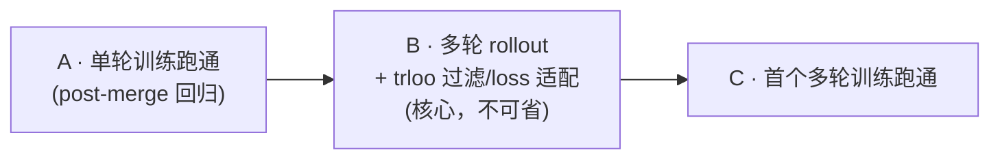

# DrKernel on Slime: Handoff & Migration Plan

> [!NOTE]
> **Architectural Boundary**: 
> Slime manages training, rollout, data organization, checkpointing, and logging. 
> [KernelGYM](file:///nfs/FM/chenshuailin/projects/kernel_agents/KernelGYM-vllm018-cuda-agent) remains a standalone HTTP reward/evaluation service. We reuse the existing implementation for compiling, running, profiling, and worker scheduling, rather than re-implementing them inside Slime.

---

## 📊 项目当前进度 (Project Dashboard)

| 阶段 / 目标 | 状态 | 详细说明 |
| :--- | :---: | :--- |
| **多轮 Eval 闭环 (Multi-turn Eval)** | ✅ 已完成 | 已打通多轮 Eval 闭环 (Qwen3.6-27B / KernelBench L1) |
| **单轮训练 Rollout (Single-turn Training)** | ✅ 已完成 | 基础单轮 rollout 与训练链路正常运作 |
| **多轮训练 Rollout (Multi-turn Training)** | 📐 方案已细化 / 待开发 | 选型已定：per-turn 拆分 + 全插件 + core 零改动（见「剩余工作」Milestone B1）；`generate_rollout_async` 仍为单轮，待按方案 fan-out |
| **训练 Loss Masking & trloo 过滤/loss 适配** | 📐 方案已细化 / 待开发 | delta-tok 构 loss_mask；移植 dev_lhb trloo bundle（reward 中心化+RLOO+gamma 折叠+序列 MIS 过滤）为 plugin hook，core 最多 2 行——见「细化方案」Milestone B |
| **GRPO 多轮训练首跑 (First GRPO Run)** | ⏳ 待开发 | GRPO 多轮训练的端到端验证与 checkpoint 保存待测试 |

---

## ⚙️ 运行与环境配置 (Runtime Pointers)

集群节点、共享路径、数据路径、Endpoint、以及 SGLang/CUDA-graph 等运行时避坑事项，统一参考 **[RUNTIME.md](file:///nfs/FM/chenshuailin/projects/kernel_agents/slime/RUNTIME.md)**。

---

## 🚀 剩余工作：多轮 GRPO 训练 (Next Steps: Multi-turn Training)

### 选型 TL;DR

**per-turn 拆分 + 全插件实现。** 每个 turn = 一个 `Sample`（同轨迹各 turn 共享 `group_id`，走上游 compact 契约）。
dev_lhb `kernel_agent` 的多轮**数学**（loss mask / reward 中心化 / RLOO / 序列 MIS 过滤，即它的 `trloo` 那套）**照搬**，
但落在**上游 hook**（`--custom-reward-post-process-path` / `--rollout-data-postprocess-path` / `--dynamic-sampling-filter-path`）里，
而非像 dev_lhb 那样 patch `slime/` core。编排放在我们已独占的 `--rollout-function-path`（`generate_rollout_async`）内。
**core diff 目标为 0**（trloo 是否注册为同名 estimator 是唯一可能的 ≤2 行增量，见 Milestone B），以免与上游分叉、增加 merge 成本。

### 路线图

---

### Milestone A — 单轮训练跑通（当前）

> 目的：在「多轮就绪」的框架上先跑通单轮训练，**同时回归 post-merge 训练链路**（merge 后训练路径尚未 smoke）。
> 不碰任何多轮专有件。

*   **接缝**：把「单轨迹 → 训练样本」收敛成一个函数 `generate_trajectory_samples`，单轮返回单元素列表、输出维持标准 depth-2（每轨迹 1 个 `Sample`）。这是将来插入 turn-loop 的**唯一**改点。
*   **Sample 字段**：显式维护 `tokens`/`response_length`/`loss_mask`/`status`/`reward`；单轮 `loss_mask` 全 1（或留 `None` 由上游补），无需 delta-tokenization。
*   **分组/奖励**：`group_id` 留 `None`（回退 `index`）；reward 用现有 `kernelgym_rm` per-sample binary。stock GRPO 按 `n_samples` reshape 归一即可，**无需任何自定义 hook**。
*   **不开** `--use-multi-turn`。
*   **产出**：小规模单轮跑通（loss 动 / advantage 非零 / checkpoint 存盘）；启动前 Sanity，跑完 Codex xhigh review。

---

### Milestone B — 多轮 rollout + trloo 过滤/loss 适配（核心，不可省）

> 从「单轮」到「能**正确**训练多轮」的 correctness-critical 中间环节，dev_lhb 已完整实现。**不是可选项**。
> 关键洞察：dev_lhb `loss.py` 里 `trloo` 与 `grpo` **走同一分支**（都 `get_grpo_returns` 广播），
> 真正的 trloo 数学全在 plugin hook 里 → 这一步**几乎 plugin-only**。

**B1. 多轮 rollout 数据生产**（改 `rollout.py`）
*   复用现有多轮 eval loop（`generate_multi_turn_eval_sample`）的 messages 累积 / feedback 渲染 / 每轮 KernelGym reward，抽出训练版 `generate_multi_turn_train_sample`，**每轮产出一个 `Sample`**：`tokens = prompt_ids(含历史)+resp_ids`、`metadata['turn_idx']=k`、共享 `group_id`、per-turn `reward`。
*   **loss_mask（delta-tokenization）**：逐条消息增量编码，assistant delta 置 1、prompt/feedback delta 置 0，严格 `len(loss_mask)==response_length`（对标 tau-bench `_get_token_delta`）。
*   **turn-loop 语义**：训练侧**成功即停**（reward=1 即终止该轨迹；与 eval「跑满 max_turns」不一致，已接受）。首跑**不开 padding**（`(prompt,turn_idx)` 分组天然支持变长组），`--padding-turns` 待 MIS/packing 需要定长时再开。
*   **输出形状**：`generate_rollout_async` 由 `list[list[Sample]]` 变为 `list[list[list[Sample]]]`（prompt × n_samples × turns），命中上游 `_validate_group_id_annotated`（depth≥2 且 len>1 → 要求同组共享 `group_id`）。

**B2. trloo bundle（移植 dev_lhb 的数学为 plugin hook，4 件）**
1.  **gamma 折叠**（rollout 内，对标 `_set_multi_turn_rewards`）：反向 `mtr[t]=r[t]+γ·mtr[t+1]` → `metadata['multi_turn_reward']`。`γ` 由 `--multi-turn-gamma` 控制（`γ=0` ⇒ 每轮独立 binary；`γ=1` ⇒ 跨轮累计）。
2.  **reward post-process**（新增 `kernelgym_reward_post_process.py`，挂 `--custom-reward-post-process-path`，对标 `reward_post_process_by_group`）：按 `(group_index, turn_idx)` 分组、排除 `remove_sample`、mean(±std) 中心化、RLOO 缩放 `×g/(g-1)`；trloo 时改读 `multi_turn_reward`。
3.  **序列级 MIS 样本过滤**（新增 `kernelgym_sequence_mis.py`，挂 `--rollout-data-postprocess-path`，对标 `kernel_filter.sequence_mis`）：用 actor/rollout log-prob 比值，对整条 response 的 `loss_mask` 置零（`turns_geometric`：跨 `max_turns` 取几何平均、整组共用一个比值）。
4.  **dynamic filter + filter-by-last-turn**（`--dynamic-sampling-filter-path` + 插件内）：按最后一非 pad turn 决定整条轨迹去留。

**B3. core 决策（唯一可能动 core 的地方）**
*   **(a) 走 `grpo`，core 零 diff**（推荐，干净 merge）：上述 plugin hook 已算出最终 advantage，`loss.py` 照常广播。
*   **(b) 加 2 行增量 core 注册 `trloo`**：`arguments.py` choices + `loss.py` 分支各并入 `trloo`，与 dev_lhb 同名、`if est=="trloo"` gate 直接照搬。
*   两者**训练数学完全等价**（因 loss.py trloo==grpo）。

**B4. 移植对照清单（dev_lhb `kernel_agent` 实跑配置，来源 `run_qwen3.6_27B.sh` 等，HEAD `ad956da`）**

*样本过滤方式*

| 机制 | hook / arg | 作用层 | 判据 / 逻辑 | 多轮处理 | 我们是否对齐 |
| :--- | :--- | :--- | :--- | :--- | :--- |
| **Dynamic sampling filter**（DAPO） | `--dynamic-sampling-filter-path` | rollout 期 · 组级 | 剔除零方差（全过/全挂）组。**slime 内置** `check_reward_nonzero_std`（`std>1e-6`）即此；dev_lhb 自建 `filter_cuda_kernel_group` 只多两件**多轮/padding 专属**护栏：可配阈值 `1e-3` + small-group 拒绝（`<min_group_size`）+ 排除 `remove_sample`(pad) | 自建版配 filter-by-last-turn 作用在最后一非 pad turn 组 | 🟡 单轮用 slime 内置（**已挂** `check_reward_nonzero_std` + `--over-sampling-batch-size`）；自建 `filter_cuda_kernel_group` 仅多轮+padding 才需要（待 B） |
| **Filter by last turn** `--filter-by-last-turn` | arg + core `_get_last_non_pad_turn_group` | rollout 期 · 轨迹级 | 用每条轨迹最后一非 pad turn 的组跑 dynamic filter，keep/drop 整条轨迹 | 多轮专用；反向跳过 `is_pad_turn` | ❌ 未（多轮专用，待 B；core 也无 `_get_last_non_pad_turn_group`） |
| **Sequence-level MIS** `sequence_mis` | `--rollout-data-postprocess-path` + `--sequence-mis-config` | 训练期（DP 切分前）· 改 `loss_mask` | actor/rollout log-prob 比值；聚合后越界（`<lower`/`>upper`）或 `token_veto`（逐 token 超 `token_veto_threshold`）→ 整条 response 的 `loss_mask` 置零；`use_advantage` 保护正优势样本 | `aggregation` ∈ `kl`/`geometric`/**`turns_geometric`**（跨 `max_turns` 几何平均、整组共用比值）→ 需 `--enable-turns-dp-partitions` | ❌ 未（待 B；插件无 `kernelgym_sequence_mis.py`） |
| **Padding turns** `--padding-turns` | arg | rollout 期 | 不足 `max_turns` 补 `is_pad_turn` 占位（`loss_mask=0`、`remove_sample=True`）。非丢弃，是定长对齐+屏蔽 | 多轮专用（给 turns_geometric / turns-DP 提供定长组） | ❌ 未（多轮专用，待 B） |

> 27B 实跑：`--sequence-mis-config '{"aggregation":"turns_geometric","token_veto_threshold":1e-4,"lower":0.999,"upper":1.001,"use_advantage":true}'`（lower/upper 极窄带 0.999/1.001 → 强 off-policy 一致性约束）。

*loss*

| 维度 | 设置 | 说明 | 我们是否对齐 |
| :--- | :--- | :--- | :--- |
| 优势估计 | `--advantage-estimator trloo` | 按 `(group_index, turn_idx)` 组内 leave-one-out；`loss.py` 中 `trloo`==`grpo`/`gspo`/`rloo` 同分支 → `get_grpo_returns` 广播到 token | 🟡 单轮已（**rloo == 单轮 trloo**，已移植进 core：`arguments.py` choices + `loss.py` 分支 + `group_normalize_rewards`）；多轮 trloo（gamma+turn 分组）待 B |
| reward → advantage | `reward_post_process_by_group`（`--custom-reward-post-process-path`） | 按 `(group_index, turn_idx)` 分组、排除 `remove_sample`、`mean(±std)` 中心化、RLOO 缩放 `×g/(g-1)`；trloo 读 `multi_turn_reward` | 🟡 单轮 LOO 缩放 `×g/(g-1)`（按 prompt 分组）已在 core `group_normalize_rewards`；`(prompt,turn_idx)` 分组 + `multi_turn_reward` 待 B |
| 多轮折扣 | `--multi-turn-gamma 1.0` | `_set_multi_turn_rewards` 反向折叠 `mtr[t]=r[t]+γ·mtr[t+1]` | ❌ 未（待 B） |
| 策略损失 | PPO clipped surrogate；`--eps-clip 0.2 --eps-clip-high 0.28` | 非对称 clip（DAPO clip-higher） | ✅ 已对齐（单轮脚本已设 `eps-clip 0.2/0.28`，上游原生支持） |
| KL | 未开 | run script 未设 `--kl-coef`/`--use-kl-loss`/`--kl-loss-coef`（默认 0） | ✅ 对齐（我们同样未开） |
| Entropy | `--entropy-coef 0.00` | 关 | ✅ 对齐（脚本 `--entropy-coef 0.00`） |
| TIS | `# --use-tis`（注释） | 关 | ✅ 对齐（未开） |
| loss 归约 | `--calculate-per-token-loss`；分母 `group_mask_sums` | per-token 归一；`group_mask_sums` 保证一条轨迹只计一次 | 🟡 `group_mask_sums` 上游已有（单轮 `group_id=None` 退化为 per-sample）；但单轮脚本**未设** `--calculate-per-token-loss`（默认 per-sample-mean）→ 此点**未对齐** |
| loss_mask 归零来源 | sequence-MIS veto + `remove_sample`(pad) | 被 veto / pad 的 token 不进 loss | ❌ 未（MIS / pad 均待 B） |

> 对齐图例：✅ 已对齐 · 🟡 部分（单轮已 / 多轮待 B）· ❌ 未实现（待 Milestone B）。截至当前进度：单轮 rloo+clip-higher 已落地（core+脚本+单测），多轮 rollout 与全部样本过滤未开始。

---

### Milestone C — 首个多轮训练跑通

*   **改动清单（全部落 `slime_plugins/drkernel/`）**：① `rollout.py`（B1）；② `kernelgym_reward_post_process.py`（B2.2）；③ `kernelgym_sequence_mis.py`（B2.3）；④ dynamic filter（B2.4）。args 复用现有 `--use-multi-turn/--max-turns/--padding-turns/--multi-turn-gamma/--filter-by-last-turn`。core 按 B3 二选一。
*   **观察项**：Loss 变化、Advantage 是否恒为 0、loss_mask veto 比例、Checkpoint 能否保存。
*   **准则**：启动前 Sanity（loss_mask 对齐 + `group_id` 契约 + `(group_index,turn_idx)` 分组 + MIS veto 抽样可视化 + 配置校验）；**行为敏感改动补单测**（loss_mask 构造、reward 分组中心化、sequence-MIS veto）；跑完导出 logs 由 **Codex xhigh** review 再下结论。

---

### 设计要点（一次讲清，供上文引用）

*   **Sample 形状契约**：每 turn 一个标准 `Sample`；同轨迹各 turn 共享 `group_id`，`group_index` 仍 = prompt id。
*   **损失分母**：上游 `group_id → group_mask_sums`（`slime/ray/rollout.py`，与 dev_lhb 逐字相同）保证「一条轨迹只计一次」，**直接复用，不改 core**。
*   **数据转换**：**无需自定义 converter**。上游 `_convert_samples_to_train_data` flatten depth-3 → 读 `tokens`/`response_length`/`loss_mask`/`group_id` → 算 `group_mask_sums`，直接可用。
*   **与 dev_lhb 的差异（仅编排，不涉及数学）**：

    | 维度 | dev_lhb | 本方案 |
    | :--- | :--- | :--- |
    | 编排位置 | `--custom-generate-function-path` + patch core `sglang_rollout.py` | 全在插件 `generate_rollout_async`，**core 零 diff** |
    | trloo 过滤/loss 适配 | plugin + patch core（`sglang_rollout.py` / 可选 estimator） | **数学照搬**为 plugin hook；core 最多 2 行或干脆走 `grpo` |
    | `turn_indices` | patch core `_convert_samples_to_train_data` | 不需要；hook 直接读 `metadata['turn_idx']` |

### 后续：Reward 吞吐瓶颈

KernelGYM `/evaluate` 为同步请求，长尾编译/运行可能极慢。大规模训练下评估是否需要 Batch/Group 请求、异步提交-轮询或限流，防止 rollout 被 reward 服务阻塞、GPU 空置。

---

## 🏆 Reward 映射方案 (Phase 1)

为避免 reward 语义漂移并保证与旧版 DrKernel 的实验结果可比，第一阶段**不引入 speedup 塑造**与**多轮 best-of-turn 聚合**，奖励函数逻辑保持极简且固定：

$$\text{Reward} = \begin{cases} 1.0 & \text{Compiled} \land \text{Correctness} \land \neg \text{Decoy} \\ 0.0 & \text{Otherwise} \end{cases}$$

### 🎯 状态到奖励的映射规则

| 状态类型 | Reward | 详细备注 |
| :--- | :---: | :--- |
| **抽取失败** | `0.0` | 记录 `extract_error`，不向 KernelGym 发起网络请求 |
| **系统/网络异常** | `0.0` | 记录 `error_type` (如 HTTP 503, Client Timeout 等) |
| **编译失败** | `0.0` | 记录编译报错 |
| **正确性校验失败** | `0.0` | 对应 `correctness = false` |
| **检出 Decoy Kernel** | `0.0` | 命中 decoy_kernel 检测 |
| **编译+正确+非 Decoy** | `1.0` | 唯一满分状态 |

### 🔒 固定的 KernelGym 请求配置
已在 [kernelgym_rm.py](file:///nfs/FM/chenshuailin/projects/kernel_agents/slime/slime_plugins/drkernel/kernelgym_rm.py) 中锁定，训练中不可随意变更：
*   **超时配置**：Client timeout = `1800s`，API Request timeout = `90s`
*   **功能配置**：`detect_decoy_kernel = true`，`enable_profiling = true`，`verbose_errors = true`
*   **采样配置**：
    *   验证尝试次数 `kernelgym_num_correct_trials = 5`
    *   性能测试次数 `num_perf_trials = 50`
    *   Warmup 次数 `num_warmup = 30`
    *   性能截断次数 `perf_trim_count = 5`
    *   基准后端 `reference_backend = pytorch`

---

## ⚡ 关键风险及规避方案 (Risk Management)

| 风险点 | 风险描述 | 规避与应对措施 |
| :--- | :--- | :--- |
| **评估长尾拖慢训练** | KernelGYM 计算用时过长，阻塞 rollout 进程，导致 GPU 空置 | 1. 限制 `eval_throttle` 最大并发。 2. 后续引入异步非阻塞的提交-轮询机制。 |
| **多轮 Token 溢出** | 随着轮数上升，Context 长度（首轮+反馈）急剧增长，极易导致 OOM | 1. 严格使用白名单摘要过滤报错信息 (< 1600 chars)。 2. 监控 SGLang 的 Prefix Cache 命中率。 |
| **梯度/Loss 计算偏差** | 若 `loss_mask` 编写有瑕疵，导致模型在 User 或 Feedback Token 上计算了梯度 | 1. 编写完备的 Token-level Mask 单元测试。 2. 导出少量训练 batch 样本的 mask 可视化结果，进行人工复核。 |
| **模板跨模型退化** | Qwen3.6-27B 上表现优异的精简模板，在 9B 级模型上可能导致输出彻底退化 | 1. 模板变更须进行消融对照实验。 2. 见模板专项手记。 |

---

## 🔗 相关手记与文档索引 (Related Handoffs)

*   **Prompt 模板消融实验**：[handoff_prompt_templates.md](file:///nfs/FM/chenshuailin/projects/kernel_agents/slime/handoffs/in_progress/handoff_prompt_templates.md) （包含 v1/v2_3/v2_4 对照及 27B vs 9B 结论）。
*   **W8A8 量化 Rollout**：[handoff_drkernel_w8a8_rollout.md](file:///nfs/FM/chenshuailin/projects/kernel_agents/slime/handoffs/rollout_speedup/handoff_drkernel_w8a8_rollout.md) （取代早期的 W8A8 废弃方案）。
*   **AWQ W4A16 实验**：[handoff_w4a16_awq.md](file:///nfs/FM/chenshuailin/projects/kernel_agents/slime/handoffs/rollout_speedup/handoff_w4a16_awq.md)。
*   **Rollout 加速技术总览**：[handoff_rollout_speedup.md](file:///nfs/FM/chenshuailin/projects/kernel_agents/slime/handoffs/rollout_speedup/handoff_rollout_speedup.md) （包含 Prefix Cache、SpecDec、并发度等专题）。
*   **多轮精度数据及分析**：[per_turn_acc_nopt.py](file:///nfs/FM/chenshuailin/projects/kernel_agents/slime/scripts/analysis/per_turn_acc_nopt.py) & [evidence_per_turn_quality.txt](file:///nfs/FM/chenshuailin/projects/kernel_agents/slime/handoffs/in_progress/evidence_per_turn_quality.txt)。
