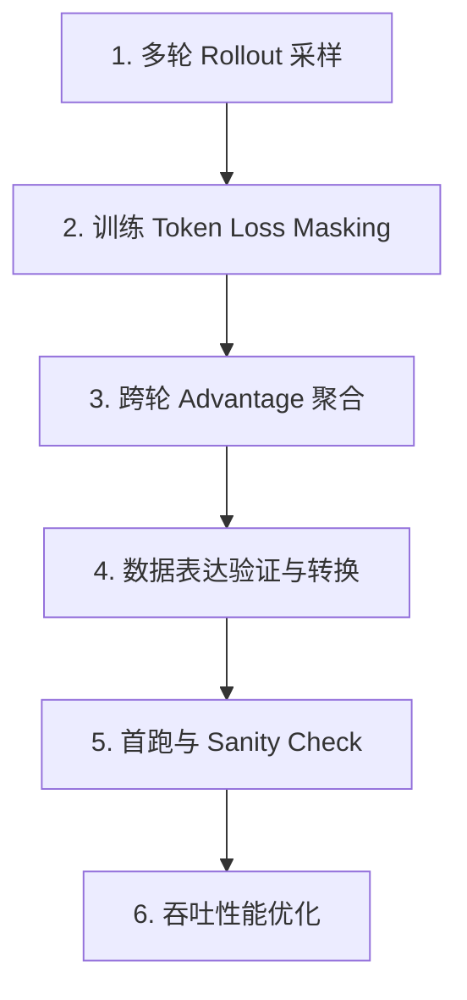

# DrKernel on Slime: Handoff & Migration Plan

> [!NOTE]
> **Architectural Boundary**: 
> Slime manages training, rollout, data organization, checkpointing, and logging. 
> [KernelGYM](file:///nfs/FM/chenshuailin/projects/kernel_agents/KernelGYM-vllm018-cuda-agent) remains a standalone HTTP reward/evaluation service. We reuse the existing implementation for compiling, running, profiling, and worker scheduling, rather than re-implementing them inside Slime.

---

## 📊 项目当前进度 (Project Dashboard)

| 阶段 / 目标 | 状态 | 详细说明 |
| :--- | :---: | :--- |
| **多轮 Eval 闭环 (Multi-turn Eval)** | ✅ 已完成 | 已打通多轮 Eval 闭环 (Qwen3.6-27B / KernelBench L1) |
| **单轮训练 Rollout (Single-turn Training)** | ✅ 已完成 | 基础单轮 rollout 与训练链路正常运作 |
| **多轮训练 Rollout (Multi-turn Training)** | 📐 方案已细化 / 待开发 | 选型已定：per-turn 拆分 + 全插件 + core 零改动（见下「细化方案」§0–§5）；`generate_rollout_async` 仍为单轮，待按方案 fan-out |
| **训练 Loss Masking & 跨轮 Reward 聚合** | 📐 方案已细化 / 待开发 | delta-tokenization 构 loss_mask；GRPO 归一走上游 hook `--custom-reward-post-process-path`，首跑 per-turn binary、不上 gamma |
| **GRPO 多轮训练首跑 (First GRPO Run)** | ⏳ 待开发 | GRPO 多轮训练的端到端验证与 checkpoint 保存待测试 |

---

## ⚙️ 运行与环境配置 (Runtime Pointers)

我们不在本文档中维护过时的端口和路径。关于集群节点、共享路径、数据路径和 Endpoint 等动态事实，请统一参考 **[RUNTIME.md](file:///nfs/FM/chenshuailin/projects/kernel_agents/slime/RUNTIME.md)**。

### 📌 当前主线测试配置

*   **基座模型**：Qwen3.6-27B
*   **计算节点**：
    *   A800 节点 `.22` (SGLang 端口: `16834`)
    *   A100 节点 `.16` (SGLang 端口: `23422`)
*   **Reward 服务 (KernelGYM)**：地址端口为 `.40:20111` 或 `.39:8111`
*   **关键参数**：
    *   多轮评估参数：`--use-multi-turn --max-turns <N>`
    *   上下文长度限制：`65536`，生成样本数 `n_samples = 8`
*   **运行脚本**：
    *   多轮评测与环境变量覆盖：[eval_drkernel_example.sh](file:///nfs/FM/chenshuailin/projects/kernel_agents/slime/scripts/eval_drkernel_example.sh)
    *   训练/评测快速调试：[debug.sh](file:///nfs/FM/chenshuailin/projects/kernel_agents/slime/scripts/debug.sh)

### ⚠️ 工程避坑指南 (Eng Warnings)
1.  **最小迭代保护**：在 eval-only 阶段，确保 [model.py](file:///nfs/FM/chenshuailin/projects/kernel_agents/slime/slime/backends/megatron_utils/model.py#L165) 中的 `scheduler_train_iters = max(args.train_iters, 1)` 逻辑完好，以避免零迭代报错。
2.  **SGLang 503 错误**：客户端并发量必须 $\le$ `--sglang-max-running-requests`，否则会触发路由器的 `503 / no_available_workers / all circuits open` 保护。
3.  **Cuda Graph Capture 崩溃**：当开启 `expandable_segments:True` 且 $TP \ge 4$ 时，自定义 All-Reduce 会在 cuda-graph 捕获时崩溃。必须附加 `--sglang-disable-custom-all-reduce` 参数。

---

## 🚀 剩余工作：多轮 GRPO 训练 (Next Steps: Multi-turn Training)

要打通多轮 GRPO 训练，必须按以下步骤推进：

> [!IMPORTANT]
> **方案选型（已定）**：采用 **per-turn 拆分（上游 compact `group_id` 契约）+ 全插件实现 + core 零改动**。
> 表达层与 dev_lhb `kernel_agent` 收敛（每 turn 一个 `Sample`、共享 `group_id`、`group_id→group_mask_sums` 损失分母），
> 但**不照搬 dev_lhb 的 core 改动**（`--custom-generate-function-path` + patch `sglang_rollout.py` + `trloo` estimator + core 注入 `turn_indices`）。
> 冲突一律 prefer 上游：编排放在我们已独占的 `--rollout-function-path`（`generate_rollout_async`）内，
> GRPO 归一改用上游 hook `--custom-reward-post-process-path`，`--advantage-estimator` 保持 `grpo`。
> 最终 diff 仅落在 `slime_plugins/drkernel/`，避免 `slime/` core 与上游分叉、降低后续 merge 成本。

### 实施分期 (Staging) — 先单轮、框架预留多轮

逐步推进：**先把 single-turn 训练在「多轮就绪」的框架上跑起来**（同时是 post-merge 训练链路的回归验证 —— merge 后训练路径尚未 smoke），多轮专有逻辑往后放。

**Milestone A（当前）：single-turn 训练跑通**
*   `generate_rollout_async` 维持标准 depth-2 输出（每条轨迹 = 1 个 `Sample`）；把「单轨迹 → 训练样本」收敛到一个**接缝函数**（如 `generate_trajectory_samples`），单轮返回单元素，作为将来插入 turn-loop 的唯一改点。
*   **显式维护** Sample 字段：`tokens` / `response_length` / `loss_mask` / `status` / `reward`（单轮 `loss_mask` 全 1 即可，无需 delta-tokenization）。
*   `group_id` 留 `None`（回退 `index`，每样本自成一组）；reward 用现有 `kernelgym_rm` per-sample binary。
*   **不需要任何多轮专有件**：stock GRPO 按 `n_samples` reshape 归一 + 上游 `group_mask_sums` 直接可用，**无需自定义 reward post-process**。
*   产出：小规模 GRPO 单轮跑通（loss 动 / advantage 非零 / checkpoint 存盘），Sanity + Codex xhigh review。

**Milestone B（后续）：多轮专有件**（仅在确认单轮 OK 后再做，对应下文 §1–§3 标注 [MT] 的条目）
*   per-turn fan-out → depth-3 + `group_id` 契约；delta-tokenization 交错 loss_mask；
*   `kernelgym_reward_post_process.py` 按 `(group_index, turn_idx)` 分组；
*   成功即停的 turn-loop、`--multi-turn-gamma` 折现、`--padding-turns` / `--filter-by-last-turn`（均插件内实现）。

> 下文 §1–§5 为多轮目标态全景；其中标 **[MT]** 的为 Milestone B 专有、当前不实现，标 **[A]** 的为单轮即需。

### 0. 与 dev_lhb 的「同 / 异」对照（落地依据）

**完全照搬 dev_lhb（与上游不冲突）**：
*   每 turn 一个 `Sample`：`tokens = prompt_ids(含历史) + resp_ids`，维护 `response_length` / `loss_mask` / `status` / per-turn `reward`。
*   同一轨迹各 turn 共享 `Sample.group_id`；`group_index` 仍 = prompt id。
*   损失分母 `group_id → group_mask_sums`（上游 `slime/ray/rollout.py` 与 dev_lhb 逐字相同，**直接复用，不改 core**）。
*   reward post-process 按 `(group_index, turn_idx)` 分组中心化（对标 dev_lhb `kernel_reward.reward_post_process_by_group`）。

**刻意偏离 dev_lhb（prefer 上游）**：
| 维度 | dev_lhb | 本方案 |
| :--- | :--- | :--- |
| 编排位置 | `--custom-generate-function-path` + **patch core** `sglang_rollout.py` | 全在插件 `generate_rollout_async`，**core 零 diff** |
| filter-by-last-turn / padding | core `sglang_rollout.py`（`_get_last_non_pad_turn_group`） | 上游无；首跑**不做 padding**（变长组天然支持），需要时在插件内实现 |
| advantage estimator | 新增 core `trloo`，读 `metadata['multi_turn_reward']` | 保持 `grpo`，RLOO 缩放（如需）折进 post-process，不引入 `trloo` |
| `turn_indices` | patch core `_convert_samples_to_train_data` | 不需要；post-process 直接读 `sample.metadata['turn_idx']` |

### 1. 多轮训练 Rollout 采样（插件内）
*   **[A] 接缝**：把「单轨迹 → 训练样本」收敛为 `generate_trajectory_samples`，单轮返回单元素列表、输出维持 depth-2，作为将来插入 turn-loop 的唯一改点。
*   **[MT] 现状**：`generate_rollout_async`（`rollout.py:266`）为单轮，复用 `generate_and_rm_group`。
*   **改造**：复用现有多轮 eval loop（`generate_multi_turn_eval_sample`）的 messages 累积 / feedback 渲染 / 每轮 KernelGym reward，抽出**训练版** `generate_multi_turn_train_sample`，每轮产出一个 `Sample`：
    *   `tokens = prompt_ids(含历史) + resp_ids`，`response_length = len(resp_ids)`；
    *   `group_id` = 轨迹唯一 id（同轨迹各 turn 相同），`metadata['turn_idx'] = k`，per-turn binary `reward`；
    *   **训练侧成功即停**（reward=1 即终止该轨迹，避免「已通过还硬续一轮」的退化语义；注意与 eval「跑满 max_turns」行为不一致，已接受）；
    *   **首跑不做 padding**：按 `(prompt, turn_idx)` 字典分组天然支持变长组；`--padding-turns` 留到 Phase 2b（MIS/packing 需要定长时）再开。
*   **输出形状**：`generate_rollout_async` 返回从 `list[list[Sample]]`（prompt × n_samples）变为 `list[list[list[Sample]]]`（prompt × n_samples × turns），命中上游 `_validate_group_id_annotated`（depth≥2 且 len>1 → 要求同组共享 `group_id`）。

### 2. 训练 Token Loss Masking（delta tokenization）
*   **[A] 单轮**：仅一段 assistant response，`loss_mask` 全 1（或留 `None` 让上游补 1），prompt 由 `response_length` 边界天然屏蔽，**无需 delta-tokenization**。
*   **[MT] 核心**：只训练 Assistant 自身生成的 token；屏蔽首轮 prompt 头部、各轮 User/KernelGym 反馈 token、（后续）padding turn。
*   **实现**：用 **delta tokenization**（对标 tau-bench `_get_token_delta`）逐条消息增量编码——assistant delta 上 `loss_mask=1`，prompt/feedback delta 上 `=0`，严格保证 `len(loss_mask) == response_length`（上游 `rollout.py` 有 `assert`）。
*   **验证**：loss_mask 对齐单测 + dump 1~2 条训练 batch 的 token+mask 可视化做人工复核（见风险表「梯度/Loss 计算偏差」）。

### 3. 跨轮 Reward 聚合与 Advantage（上游 hook，分两步）
*   **[A] 单轮**：stock GRPO 按 `n_samples` reshape 归一即可，**无需自定义 reward post-process**。
*   **[MT] Phase 2a（首跑）：per-turn 独立 binary。** 每个 turn 用自身那轮的 `1.0/0.0`（reward 映射保持下文锁定的极简版），按 `(group_index, turn_idx)` 组做 GRPO 中心化 → 每轮相对「兄弟轨迹的同一轮」得到 advantage；**不跨轮折现**（等价 gamma=0）。
*   **实现**：新增 `slime_plugins/drkernel/kernelgym_reward_post_process.py`，按 `(group_index, turn_idx)` 分组、排除 `remove_sample`、做 mean(±std) 中心化；挂 `--custom-reward-post-process-path`，`--advantage-estimator grpo`。
*   **Phase 2b（闭环验证后再加）**：可选 `--multi-turn-gamma` 反向折现（插件内标量级 backward fold，dev_lhb `_set_multi_turn_rewards` 思路，同一个 post-process 消费）+ 可选 `--padding-turns` / `--filter-by-last-turn`（插件内实现）。best-of-turn / speedup 塑造按 handoff 继续排除。

### 4. 训练数据格式转换
*   **结论**：**无需自定义 converter**。每个 turn 已是标准 `Sample`，上游 `_convert_samples_to_train_data`（flatten depth-3 → 读 `tokens`/`response_length`/`loss_mask`/`group_id` → 算 `group_mask_sums`）可直接复用。仅需 sanity 校验：契约能过 `_validate_group_id_annotated`、`group_mask_sums` 对每轨迹只计一次。

### 5. 首次 GRPO 训练小规模验证
*   **改动清单（仅 `slime_plugins/drkernel/`）**：①`rollout.py` 新增 `generate_multi_turn_train_sample` + 改 `generate_rollout_async` fan-out；②新增 `kernelgym_reward_post_process.py`；③复用现有 args（`--use-multi-turn` / `--max-turns` / 后续 `--multi-turn-gamma` 等）。
*   **观察项**：Loss 变化、Advantage 是否恒为 0、Checkpoint 能否保存。
*   **执行准则**：启动前 Sanity Check（loss_mask 对齐 + group_id 契约 + 配置校验）；为**行为敏感改动补单测**（loss_mask 构造、group 分组）；跑完导出 logs 并由 **Codex review (xhigh)** 再下结论（substantial change 规则）。

### 6. Reward 吞吐瓶颈分析
*   KernelGYM `/evaluate` 为同步请求，长尾任务的编译和运行可能极其耗时。
*   在大规模训练下评估是否需要引入 Batch/Group 请求、异步提交/轮询机制或限流，防止 Rollout 进程被 Reward 服务彻底阻塞。

---

## 🏆 Reward 映射方案 (Phase 1)

为避免 reward 语义漂移并保证与旧版 DrKernel 的实验结果可比，第一阶段**不引入 speedup 塑造**与**多轮 best-of-turn 聚合**，奖励函数逻辑保持极简且固定：

$$\text{Reward} = \begin{cases} 1.0 & \text{Compiled} \land \text{Correctness} \land \neg \text{Decoy} \\ 0.0 & \text{Otherwise} \end{cases}$$

### 🎯 状态到奖励的映射规则

| 状态类型 | Reward | 详细备注 |
| :--- | :---: | :--- |
| **抽取失败** | `0.0` | 记录 `extract_error`，不向 KernelGym 发起网络请求 |
| **系统/网络异常** | `0.0` | 记录 `error_type` (如 HTTP 503, Client Timeout 等) |
| **编译失败** | `0.0` | 记录编译报错 |
| **正确性校验失败** | `0.0` | 对应 `correctness = false` |
| **检出 Decoy Kernel** | `0.0` | 命中 decoy_kernel 检测 |
| **编译+正确+非 Decoy** | `1.0` | 唯一满分状态 |

### 🔒 固定的 KernelGym 请求配置
已在 [kernelgym_rm.py](file:///nfs/FM/chenshuailin/projects/kernel_agents/slime/slime_plugins/drkernel/kernelgym_rm.py) 中锁定，训练中不可随意变更：
*   **超时配置**：Client timeout = `1800s`，API Request timeout = `90s`
*   **功能配置**：`detect_decoy_kernel = true`，`enable_profiling = true`，`verbose_errors = true`
*   **采样配置**：
    *   验证尝试次数 `kernelgym_num_correct_trials = 5`
    *   性能测试次数 `num_perf_trials = 50`
    *   Warmup 次数 `num_warmup = 30`
    *   性能截断次数 `perf_trim_count = 5`
    *   基准后端 `reference_backend = pytorch`

---

## ⚡ 关键风险及规避方案 (Risk Management)

| 风险点 | 风险描述 | 规避与应对措施 |
| :--- | :--- | :--- |
| **评估长尾拖慢训练** | KernelGYM 计算用时过长，阻塞 rollout 进程，导致 GPU 空置 | 1. 限制 `eval_throttle` 最大并发。 2. 后续引入异步非阻塞的提交-轮询机制。 |
| **多轮 Token 溢出** | 随着轮数上升，Context 长度（首轮+反馈）急剧增长，极易导致 OOM | 1. 严格使用白名单摘要过滤报错信息 (< 1600 chars)。 2. 监控 SGLang 的 Prefix Cache 命中率。 |
| **梯度/Loss 计算偏差** | 若 `loss_mask` 编写有瑕疵，导致模型在 User 或 Feedback Token 上计算了梯度 | 1. 编写完备的 Token-level Mask 单元测试。 2. 导出少量训练 batch 样本的 mask 可视化结果，进行人工复核。 |
| **模板跨模型退化** | Qwen3.6-27B 上表现优异的精简模板，在 9B 级模型上可能导致输出彻底退化 | 1. 模板变更须进行消融对照实验。 2. 见模板专项手记。 |

---

## 🔗 相关手记与文档索引 (Related Handoffs)

*   **Prompt 模板消融实验**：[handoff_prompt_templates.md](file:///nfs/FM/chenshuailin/projects/kernel_agents/slime/handoffs/in_progress/handoff_prompt_templates.md) （包含 v1/v2_3/v2_4 对照及 27B vs 9B 结论）。
*   **W8A8 量化 Rollout**：[handoff_drkernel_w8a8_rollout.md](file:///nfs/FM/chenshuailin/projects/kernel_agents/slime/handoffs/rollout_speedup/handoff_drkernel_w8a8_rollout.md) （取代早期的 W8A8 废弃方案）。
*   **AWQ W4A16 实验**：[handoff_w4a16_awq.md](file:///nfs/FM/chenshuailin/projects/kernel_agents/slime/handoffs/rollout_speedup/handoff_w4a16_awq.md)。
*   **Rollout 加速技术总览**：[handoff_rollout_speedup.md](file:///nfs/FM/chenshuailin/projects/kernel_agents/slime/handoffs/rollout_speedup/handoff_rollout_speedup.md) （包含 Prefix Cache、SpecDec、并发度等专题）。
*   **多轮精度数据及分析**：[per_turn_acc_nopt.py](file:///nfs/FM/chenshuailin/projects/kernel_agents/slime/scripts/analysis/per_turn_acc_nopt.py) & [evidence_per_turn_quality.txt](file:///nfs/FM/chenshuailin/projects/kernel_agents/slime/handoffs/in_progress/evidence_per_turn_quality.txt)。
