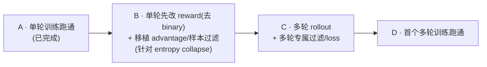

# DrKernel on Slime: Handoff & Migration Plan

> [!NOTE]
> **Architectural Boundary**: 
> Slime manages training, rollout, data organization, checkpointing, and logging. 
> [KernelGYM](file:///nfs/FM/chenshuailin/projects/kernel_agents/KernelGYM-vllm018-cuda-agent) remains a standalone HTTP reward/evaluation service. We reuse the existing implementation for compiling, running, profiling, and worker scheduling, rather than re-implementing them inside Slime.

---

## 📊 项目当前进度 (Project Dashboard)

| 阶段 / 目标 | 状态 | 详细说明 |
| :--- | :---: | :--- |
| **多轮 Eval 闭环 (Multi-turn Eval)** | ✅ 已完成 | 已打通多轮 Eval 闭环 (Qwen3.6-27B / KernelBench L1) |
| **单轮训练 Rollout (Single-turn Training)** | ✅ 已完成 | 单轮 rollout + 训练链路已实跑跑通，精度尚可；⚠️ 观察到 **entropy 随训练持续下降**（疑似 entropy collapse），见「Milestone A · 首跑结果」 |
| **单轮 reward 改造 + 数学移植 (Single-turn reward + math)** | 📐 方案已细化 / 待开发 | **下一步（reward 优先）**：① 先改 reward——去 phase-1 binary，改 speedup/coverage/penalty shaping（针对 entropy collapse，对标 main）；② 再移植 reward 中心化 hook + 序列级 MIS + dynamic filter 增强。仍单轮，见 Milestone B 与 [entropy collapse 手记](file:///nfs/FM/chenshuailin/projects/kernel_agents/slime/handoffs/in_progress/handoff_entropy_collapse_debug.md) |
| **多轮训练 Rollout (Multi-turn Training)** | 📐 方案已细化 / 待开发 | 选型已定：per-turn 拆分 + 全插件 + core 零改动；`generate_rollout_async` 仍为单轮，待按方案 fan-out。见 Milestone C |
| **多轮专属过滤/loss 适配 (Multi-turn-only math)** | 📐 方案已细化 / 待开发 | delta-tok 构 loss_mask + gamma 折叠 + turns_geometric MIS + filter-by-last-turn + padding-turns，均多轮专用。见 Milestone C |
| **GRPO 多轮训练首跑 (First GRPO Run)** | ⏳ 待开发 | GRPO 多轮训练的端到端验证与 checkpoint 保存待测试。见 Milestone D |

---

## ⚙️ 运行与环境配置 (Runtime Pointers)

集群节点、共享路径、数据路径、Endpoint、以及 SGLang/CUDA-graph 等运行时避坑事项，统一参考 **[RUNTIME.md](file:///nfs/FM/chenshuailin/projects/kernel_agents/slime/RUNTIME.md)**。

---

## 🚀 剩余工作：多轮 GRPO 训练 (Next Steps: Multi-turn Training)

### 选型 TL;DR

**per-turn 拆分 + 全插件实现。** 每个 turn = 一个 `Sample`（同轨迹各 turn 共享 `group_id`，走上游 compact 契约）。
dev_lhb `kernel_agent` 的多轮**数学**（loss mask / reward 中心化 / RLOO / 序列 MIS 过滤，即它的 `trloo` 那套）**照搬**，
但落在**上游 hook**（`--custom-reward-post-process-path` / `--rollout-data-postprocess-path` / `--dynamic-sampling-filter-path`）里，
而非像 dev_lhb 那样 patch `slime/` core。编排放在我们已独占的 `--rollout-function-path`（`generate_rollout_async`）内。
**core diff 目标为 0**（trloo 是否注册为同名 estimator 是唯一可能的 ≤2 行增量，见 Milestone B），以免与上游分叉、增加 merge 成本。

### 路线图

---

### Milestone A — 单轮训练跑通（✅ 已完成）

> 目的：在「多轮就绪」的框架上先跑通单轮训练，**同时回归 post-merge 训练链路**（merge 后训练路径尚未 smoke）。
> 不碰任何多轮专有件。

*   **接缝**：把「单轨迹 → 训练样本」收敛成一个函数 `generate_trajectory_samples`，单轮返回单元素列表、输出维持标准 depth-2（每轨迹 1 个 `Sample`）。这是将来插入 turn-loop 的**唯一**改点。
*   **Sample 字段**：显式维护 `tokens`/`response_length`/`loss_mask`/`status`/`reward`；单轮 `loss_mask` 全 1（或留 `None` 由上游补），无需 delta-tokenization。
*   **分组/奖励**：`group_id` 留 `None`（回退 `index`）；reward 用现有 `kernelgym_rm` per-sample binary。stock GRPO 按 `n_samples` reshape 归一即可，**无需任何自定义 hook**。
*   **不开** `--use-multi-turn`。
*   **产出**：小规模单轮跑通（loss 动 / advantage 非零 / checkpoint 存盘）；启动前 Sanity，跑完 Codex xhigh review。

#### 首跑结果（已跑通 ✅）

*   **链路**：单轮 rollout + 训练 + checkpoint 存盘全程正常；loss/advantage 行为符合预期。
*   **精度**：尚可（达到「跑通」预期，未做系统化质量调优）。
*   **⚠️ 待查：entropy 持续下降（疑似 entropy collapse）**
    *   **现象**：训练过程中 policy entropy 单调下降、未见回升或平台，提示分布过早坍缩到少数高奖励模式，存在探索不足 / 过拟合到当前 reward 形态的风险。
    *   **专项手记**：见 [handoff_entropy_collapse_debug.md](file:///nfs/FM/chenshuailin/projects/kernel_agents/slime/handoffs/in_progress/handoff_entropy_collapse_debug.md)。该手记把 `--entropy-coef 0.00` 作为固定条件；新增硬事实是 main 分支实现未观察到 collapse、曲线为 `train/entropy_loss`、rollout time 同时上升，因此排查重点从“加熵正则”改为先做 main 对照与 metric 代码口径确认，再定位 reward/filter/RLOO/PPO-TIS/rollout/loss_mask 因果链。
    *   **当前配置（与现象相关的可能成因，按怀疑度排序，均为待验证假设而非结论）**：
        1.  **度量或聚合假象** —— 需先确认 `train/entropy_loss`、`correct_entropy`、rollout 文本多样性不是混用口径；`correct_entropy` 实际更接近 correct 样本 NLL，不是 full-vocab policy entropy。
        2.  **二值 0/1 reward + RLOO 中心化** —— 组内只要出现「全对/全错」以外的分化就给出强梯度，binary reward 缺乏中间梯度，容易把概率质量快速推向已成功样本。
        3.  **dynamic nonzero-std filter 的样本选择偏置** —— 过滤全对/全错组后，训练可能集中在 `1/16`、`2/16` 这类稀有成功组，放大少数成功模板。
        4.  `--eps-clip-high 0.28` + TIS/off-policy mismatch —— 上侧 clip 放宽和 TIS 权重可能加速正优势 token 的概率集中；需用 `pg_clipfrac`、`ppo_kl`、`tis_clipfrac`、train/rollout logprob 差验证。
        5.  rollout sampling / stop / weight-sync / loss_mask 问题 —— 若 rollout 分布本身已窄、stop 过早、权重同步异常，或固定模板 token 被大量训练，entropy 会下降但根因不在 entropy loss。
    *   **建议的下一步排查（待执行，先不改结论）**：
        1.  先**确认测量正确**：核对 W&B 里 entropy 的定义/计算位置（是否 per-token、是否被 loss_mask 影响），排除是度量假象。
        2.  导出不同 step 的 rollout dump，人工核对同 prompt 组内 response/kernel 多样性、pass@k、重复率和失败类别，确认是否真 collapse。
        3.  统计每个 rollout 的 group reward pattern（`0/16, 1/16, ..., 16/16`）、accepted vs rejected group 分布、advantage 分布。
        4.  对齐 `reward/correctness`、`pg_clipfrac`、`ppo_kl`、`tis/tis_clipfrac`、train-rollout logprob mismatch 与 entropy 的时间关系。
        5.  固定 `--entropy-coef 0.00` 做短消融：dynamic filter on/off、clip-high 0.28→0.2、TIS on/off、RLOO/advantage clipping 或 std-normalized 对照。学习率只作为后置更新强度控制，不作为首要解释。
    *   **已决定的首个动作**：在排查的同时，先执行 **Milestone B1 改 reward**（去 phase-1 binary，改 speedup/coverage/penalty shaping）——这是 current vs main 最显著的差异之一（main 用 shaping 未 collapse），既是排查项 #2 的直接干预，也是后续多轮的前置。改后须做 binary vs shaped 对照。
    *   **状态**：观察项，尚未定位根因；按「Execution Policy 6/7」当作 bug 对待，待闭合因果链后再下结论。

---

### Milestone B — 单轮：先改 reward，再移植 advantage/样本过滤（仍单轮）

> **第一优先级：改 reward（去 binary）。** 依据 entropy collapse 排查手记 [handoff_entropy_collapse_debug.md](file:///nfs/FM/chenshuailin/projects/kernel_agents/slime/handoffs/in_progress/handoff_entropy_collapse_debug.md) 的「当前差异」表：current 单轮用 **phase-1 binary 0/1**，而 main（**未观察到 collapse**）用 **speedup / coverage / penalty shaping**——`binary 更容易把概率推向少数成功模板`，是 entropy collapse 的首要嫌疑。故 reward shaping 排在最前，其余数学（reward 中心化 / advantage 对账 / sequence-MIS / dynamic filter）随后。
> 其余动机：(1) 这套数学是多轮的前置依赖，先在单轮 de-risk 可解耦「数学正确性」与「多轮编排复杂度」；(2) sequence-MIS 与 dynamic filter 也会改变有效训练分布，与 collapse 排查相关。
> 关键洞察：dev_lhb `loss.py` 里 `trloo` 与 `grpo` **走同一分支**（都 `get_grpo_returns` 广播）→ 真正的数学全在 plugin hook 里。单轮下 `(group_index, turn_idx)` 分组退化为 per-prompt、gamma 折叠为恒等 → 这些 hook **几乎可原样移植、core 零 diff**（rloo 已在 A 落地）。

**B1. reward shaping（最高优先，直接针对 entropy collapse）**（改 `kernelgym_rm.py` 的状态→reward 映射，对标 main `reward_func` + coverage RS）
*   从 phase-1 binary 0/1 改为连续 shaped reward：**speedup**（相对 baseline 的性能比，给正确 kernel 连续梯度）+ **coverage RS**（对标 main `--use-coverage-rs --coverage-rs-key time_coverage --coverage-rs-threshold 0.3 --coverage-rs-factor 0.1`）+ **penalty**（decoy / 编译失败 / 抽取失败仍 0 或负）。
*   目的：binary 0/1 在组内只要出现少数成功就给同质强梯度，把概率质量快速推向少数成功模板；连续 shaped reward 提供中间梯度、降低 collapse 压力（main 未 collapse 的关键差异之一）。
*   **与「🏆 Reward 映射方案 (Phase 1)」冲突**：phase-1 binary 是为「与旧 DrKernel 结果可比」而定；现因 entropy collapse 需要 revisit。该节已加注；shaping 上线须做对照（binary vs shaped 的 entropy / 精度 / reward pattern）。
*   仍单轮，不引入多轮 best-of-turn 聚合。

**B2. reward 中心化 post-process hook**（新增 `kernelgym_reward_post_process.py`，挂 `--custom-reward-post-process-path`，对标 dev_lhb `reward_post_process_by_group`）
*   按 `group_index` 分组（单轮无 `turn_idx`，退化为 per-prompt）、排除 `remove_sample`、`mean(±std)` 中心化、RLOO 缩放 `×g/(g-1)`。
*   单轮下与 core `group_normalize_rewards` **数学等价**；显式 hook 化的目的是把分组/中心化逻辑前移到插件，给 Milestone C 预留 `(group_index, turn_idx)` 分组 + `multi_turn_reward` 读取接口（届时只加 turn 维度，不重写）。

**B3. advantage estimator（已在 A 落地，本步仅对账）**
*   `--advantage-estimator rloo` == 单轮 trloo，已在 core（`arguments.py` choices + `loss.py` 分支 + `group_normalize_rewards`）落地。
*   本步不新增 core 改动，只核对 B2 hook 与 core advantage 的衔接，**避免双重中心化/缩放**（hook 已做中心化时 core 不能再做一次）。

**B4. 序列级 MIS 样本过滤**（新增 `kernelgym_sequence_mis.py`，挂 `--rollout-data-postprocess-path` + `--sequence-mis-config`，对标 `kernel_filter.sequence_mis`）
*   用 actor/rollout log-prob 比值：聚合后越界（`<lower`/`>upper`）或 `token_veto`（逐 token 超阈值）→ 整条 response 的 `loss_mask` 置零；`use_advantage` 保护正优势样本。
*   单轮用 `aggregation ∈ kl/geometric`（`turns_geometric` 是多轮专用，留 Milestone C）。
*   **与 entropy collapse 相关**：这是强 off-policy 一致性约束（27B 实跑用 `lower/upper=0.999/1.001` 极窄带），会显著改变有效训练分布；上线时务必把 entropy 曲线纳入前后对比。

**B5. dynamic filter 增强**（移植 dev_lhb `filter_cuda_kernel_group`，挂 `--dynamic-sampling-filter-path`）
*   在 slime 内置 `check_reward_nonzero_std` 基础上补 dev_lhb 的**单轮可用**护栏：可配阈值（如 `1e-3`，比内置 `1e-6` 严）+ small-group 拒绝（`<min_group_size`）+ 排除 `remove_sample`。
*   `--filter-by-last-turn` / `--padding-turns` 是多轮专用，本步**不做**（留 Milestone C）。

**core 决策**：单轮全部走 `grpo`/`rloo` 同分支，**core 零 diff**。`trloo` 同名注册（≤2 行：`arguments.py` choices + `loss.py` 分支并入）是多轮才可能需要的增量，留 Milestone C 决定。

**准则**：每个 plugin hook 补单测（reward shaping 映射、reward 分组中心化、sequence-MIS veto 阈值边界）；启动前 Sanity（导出 reward shaping 前后的 reward 分布对照 + 中心化前后对照 + MIS veto 比例与抽样可视化 + 配置校验）；跑完导出 logs 由 **Codex xhigh** review。**特别关注**：对比 binary vs shaped reward（B1）以及开启 B4/B5 前后的 entropy / reward / advantage 曲线，判断各项对 entropy collapse 的影响。

#### 移植对照清单（dev_lhb `kernel_agent` 实跑配置，来源 `run_qwen3.6_27B.sh` 等，HEAD `ad956da`）

> 「我们是否对齐」列：✅ 已对齐 · 🟡 部分 · ❌ 未实现。**待 B** = 本里程碑（单轮可移植件）；**待 C** = 多轮专用件，留 Milestone C。

*样本过滤方式*

| 机制 | hook / arg | 作用层 | 判据 / 逻辑 | 多轮处理 | 我们是否对齐 |
| :--- | :--- | :--- | :--- | :--- | :--- |
| **Dynamic sampling filter**（DAPO） | `--dynamic-sampling-filter-path` | rollout 期 · 组级 | 剔除零方差（全过/全挂）组。**slime 内置** `check_reward_nonzero_std`（`std>1e-6`）即此；dev_lhb 自建 `filter_cuda_kernel_group` 多三件：可配阈值 `1e-3`（单轮可用）+ small-group 拒绝 `<min_group_size`（单轮可用）+ 排除 `remove_sample`(pad，多轮专用) | 自建版配 filter-by-last-turn 作用在最后一非 pad turn 组 | 🟡 单轮已用 slime 内置（**已挂** `check_reward_nonzero_std` + `--over-sampling-batch-size`）；移植可配阈值 + small-group 拒绝（**待 B**）；pad 排除 / filter-by-last-turn（**待 C**） |
| **Filter by last turn** `--filter-by-last-turn` | arg + core `_get_last_non_pad_turn_group` | rollout 期 · 轨迹级 | 用每条轨迹最后一非 pad turn 的组跑 dynamic filter，keep/drop 整条轨迹 | 多轮专用；反向跳过 `is_pad_turn` | ❌ 未（多轮专用，**待 C**；core 也无 `_get_last_non_pad_turn_group`） |
| **Sequence-level MIS** `sequence_mis` | `--rollout-data-postprocess-path` + `--sequence-mis-config` | 训练期（DP 切分前）· 改 `loss_mask` | actor/rollout log-prob 比值；聚合后越界（`<lower`/`>upper`）或 `token_veto`（逐 token 超 `token_veto_threshold`）→ 整条 response 的 `loss_mask` 置零；`use_advantage` 保护正优势样本 | `aggregation` ∈ `kl`/`geometric`（单轮可用）/**`turns_geometric`**（跨 `max_turns` 几何平均、整组共用比值，多轮专用）→ 需 `--enable-turns-dp-partitions` | ❌ 未（**待 B**：kl/geometric 单轮可用，插件无 `kernelgym_sequence_mis.py`；turns_geometric **待 C**） |
| **Padding turns** `--padding-turns` | arg | rollout 期 | 不足 `max_turns` 补 `is_pad_turn` 占位（`loss_mask=0`、`remove_sample=True`）。非丢弃，是定长对齐+屏蔽 | 多轮专用（给 turns_geometric / turns-DP 提供定长组） | ❌ 未（多轮专用，**待 C**） |

> 27B 实跑：`--sequence-mis-config '{"aggregation":"turns_geometric","token_veto_threshold":1e-4,"lower":0.999,"upper":1.001,"use_advantage":true}'`（lower/upper 极窄带 0.999/1.001 → 强 off-policy 一致性约束）。

*loss*

| 维度 | 设置 | 说明 | 我们是否对齐 |
| :--- | :--- | :--- | :--- |
| **reward shaping** | main `reward_func` + `--use-coverage-rs --coverage-rs-key time_coverage --coverage-rs-threshold 0.3 --coverage-rs-factor 0.1` | speedup（性能比连续 reward）+ coverage RS + penalty；非 binary | ❌ current 为 phase-1 binary 0/1（**待 B1**，entropy collapse 首要嫌疑 → 改 speedup/coverage/penalty） |
| 优势估计 | `--advantage-estimator trloo` | 按 `(group_index, turn_idx)` 组内 leave-one-out；`loss.py` 中 `trloo`==`grpo`/`gspo`/`rloo` 同分支 → `get_grpo_returns` 广播到 token | 🟡 单轮已（**rloo == 单轮 trloo**，已移植进 core：`arguments.py` choices + `loss.py` 分支 + `group_normalize_rewards`）；多轮 trloo（gamma+turn 分组）**待 C** |
| reward → advantage | `reward_post_process_by_group`（`--custom-reward-post-process-path`） | 按 `(group_index, turn_idx)` 分组、排除 `remove_sample`、`mean(±std)` 中心化、RLOO 缩放 `×g/(g-1)`；trloo 读 `multi_turn_reward` | 🟡 单轮 LOO 缩放 `×g/(g-1)`（按 prompt 分组）已在 core `group_normalize_rewards`；显式 post-process hook（per-prompt 中心化）**待 B**；`(prompt,turn_idx)` 分组 + `multi_turn_reward` **待 C** |
| 多轮折扣 | `--multi-turn-gamma 1.0` | `_set_multi_turn_rewards` 反向折叠 `mtr[t]=r[t]+γ·mtr[t+1]` | ❌ 未（多轮专用，**待 C**） |
| 策略损失 | PPO clipped surrogate；`--eps-clip 0.2 --eps-clip-high 0.28` | 非对称 clip（DAPO clip-higher） | ✅ 已对齐（单轮脚本已设 `eps-clip 0.2/0.28`，上游原生支持） |
| KL | 未开 | run script 未设 `--kl-coef`/`--use-kl-loss`/`--kl-loss-coef`（默认 0） | ✅ 对齐（我们同样未开） |
| Entropy | `--entropy-coef 0.00` | 关 | ✅ 对齐（脚本 `--entropy-coef 0.00`） |
| TIS | `--use-tis` / `# --use-tis` | 需按实际 launcher 复核；当前 27B debug 脚本已开 `--use-tis`，旧 dev_lhb 对照处曾记录为注释 | 🟡 状态易漂移；分析 entropy 时必须记录实际 argv，并同时看 `tis/tis_clipfrac/tis_abs` |
| loss 归约 | `--calculate-per-token-loss`；分母 `group_mask_sums` | per-token 归一；`group_mask_sums` 保证一条轨迹只计一次 | 🟡 上游已有；当前 27B debug 脚本已设 `--calculate-per-token-loss`，旧记录曾称单轮未设，后续以实际 argv 为准 |
| loss_mask 归零来源 | sequence-MIS veto + `remove_sample`(pad) | 被 veto / pad 的 token 不进 loss | ❌ 未（MIS veto **待 B**；pad `remove_sample` 多轮专用 **待 C**） |

> 对齐图例：✅ 已对齐 · 🟡 部分 · ❌ 未实现。**待 B** = 单轮件，**reward shaping（B1）排最前**，其后 reward post-process hook / sequence-MIS kl·geometric / dynamic filter 阈值+min-group；**待 C** = 多轮专用件（多轮 rollout / gamma / turns_geometric / filter-by-last-turn / padding / multi_turn_reward）。截至当前进度：单轮 rloo+clip-higher 已落地（core+脚本+单测），reward shaping / post-process hook / sequence-MIS / filter 增强（Milestone B）与多轮（Milestone C）均未开始。

---

### Milestone C — 多轮 rollout + 多轮专属过滤/loss（核心，不可省）

> 从「单轮数学已就绪」（Milestone B）扩展到多轮：只新增多轮 rollout 编排 + 多轮专属件，复用 B 已落地的 reward post-process / sequence-MIS / filter hook（只加 turn 维度）。

**C1. 多轮 rollout 数据生产**（改 `rollout.py`）
*   复用现有多轮 eval loop（`generate_multi_turn_eval_sample`）的 messages 累积 / feedback 渲染 / 每轮 KernelGym reward，抽出训练版 `generate_multi_turn_train_sample`，**每轮产出一个 `Sample`**：`tokens = prompt_ids(含历史)+resp_ids`、`metadata['turn_idx']=k`、共享 `group_id`、per-turn `reward`。
*   **loss_mask（delta-tokenization）**：逐条消息增量编码，assistant delta 置 1、prompt/feedback delta 置 0，严格 `len(loss_mask)==response_length`（对标 tau-bench `_get_token_delta`）。
*   **turn-loop 语义**：训练侧**成功即停**（reward=1 即终止该轨迹；与 eval「跑满 max_turns」不一致，已接受）。首跑**不开 padding**（`(prompt,turn_idx)` 分组天然支持变长组），`--padding-turns` 待 MIS/packing 需要定长时再开。
*   **输出形状**：`generate_rollout_async` 由 `list[list[Sample]]` 变为 `list[list[list[Sample]]]`（prompt × n_samples × turns），命中上游 `_validate_group_id_annotated`（depth≥2 且 len>1 → 要求同组共享 `group_id`）。

**C2. 多轮专属数学（在 B 的 hook 上加 turn 维度）**
1.  **gamma 折叠**（rollout 内，对标 `_set_multi_turn_rewards`）：反向 `mtr[t]=r[t]+γ·mtr[t+1]` → `metadata['multi_turn_reward']`。`γ` 由 `--multi-turn-gamma` 控制（`γ=0` ⇒ 每轮独立 binary；`γ=1` ⇒ 跨轮累计）。
2.  **reward post-process 扩 turn 维**（复用 B2 hook）：分组键由 `group_index` 改为 `(group_index, turn_idx)`，trloo 时改读 `multi_turn_reward`。
3.  **turns_geometric MIS**（复用 B4 hook）：`aggregation=turns_geometric` 跨 `max_turns` 几何平均、整组共用一个比值，需 `--enable-turns-dp-partitions`。
4.  **filter-by-last-turn + padding**：`--filter-by-last-turn`（按最后一非 pad turn 的组决定整条轨迹去留）+ `--padding-turns`（定长对齐）。filter-by-last-turn 需 core `_get_last_non_pad_turn_group`（dev_lhb 有，上游无 → 见下）。

**C3. core 决策（唯一可能动 core 的地方）**
*   **(a) 走 `grpo`，core 零 diff**（推荐，干净 merge）：plugin hook 已算出最终 advantage，`loss.py` 照常广播。
*   **(b) 加 ≤2 行注册 `trloo`**：`arguments.py` choices + `loss.py` 分支并入 `trloo`（与 dev_lhb 同名，`loss.py` trloo==grpo）。
*   filter-by-last-turn 若启用，core 还需补 `_get_last_non_pad_turn_group`（上游无）——这是 C 阶段唯一不可避免的 core 增量。

### Milestone D — 首个多轮训练跑通

*   **改动清单（全部落 `slime_plugins/drkernel/`）**：① `rollout.py`（C1）；② 复用并扩展 B 的 `kernelgym_reward_post_process.py` / `kernelgym_sequence_mis.py` / dynamic filter（C2）。args 复用现有 `--use-multi-turn/--max-turns/--padding-turns/--multi-turn-gamma/--filter-by-last-turn`。core 按 C3 决策。
*   **观察项**：Loss 变化、Advantage 是否恒为 0、loss_mask veto 比例、Checkpoint 能否保存、**entropy 是否随多轮加剧坍缩**。
*   **准则**：启动前 Sanity（loss_mask 对齐 + `group_id` 契约 + `(group_index,turn_idx)` 分组 + MIS veto 抽样可视化 + 配置校验）；**行为敏感改动补单测**（loss_mask 构造、reward 分组中心化、sequence-MIS veto）；跑完导出 logs 由 **Codex xhigh** review 再下结论。

---

### 设计要点（一次讲清，供上文引用）

*   **Sample 形状契约**：每 turn 一个标准 `Sample`；同轨迹各 turn 共享 `group_id`，`group_index` 仍 = prompt id。
*   **损失分母**：上游 `group_id → group_mask_sums`（`slime/ray/rollout.py`，与 dev_lhb 逐字相同）保证「一条轨迹只计一次」，**直接复用，不改 core**。
*   **数据转换**：**无需自定义 converter**。上游 `_convert_samples_to_train_data` flatten depth-3 → 读 `tokens`/`response_length`/`loss_mask`/`group_id` → 算 `group_mask_sums`，直接可用。
*   **与 dev_lhb 的差异（仅编排，不涉及数学）**：

    | 维度 | dev_lhb | 本方案 |
    | :--- | :--- | :--- |
    | 编排位置 | `--custom-generate-function-path` + patch core `sglang_rollout.py` | 全在插件 `generate_rollout_async`，**core 零 diff** |
    | trloo 过滤/loss 适配 | plugin + patch core（`sglang_rollout.py` / 可选 estimator） | **数学照搬**为 plugin hook；core 最多 2 行或干脆走 `grpo` |
    | `turn_indices` | patch core `_convert_samples_to_train_data` | 不需要；hook 直接读 `metadata['turn_idx']` |

### 后续：Reward 吞吐瓶颈

KernelGYM `/evaluate` 为同步请求，长尾编译/运行可能极慢。大规模训练下评估是否需要 Batch/Group 请求、异步提交-轮询或限流，防止 rollout 被 reward 服务阻塞、GPU 空置。

---

## 🏆 Reward 映射方案 (Phase 1)

> [!WARNING]
> **正在 revisit（Milestone B1）**：Phase-1 binary 0/1 是为「与旧 DrKernel 结果可比」而定，但 [entropy collapse 排查](file:///nfs/FM/chenshuailin/projects/kernel_agents/slime/handoffs/in_progress/handoff_entropy_collapse_debug.md) 显示 binary 是 collapse 的首要嫌疑（main 用 speedup/coverage/penalty shaping 未 collapse）。Milestone B1 将改为连续 shaped reward，下方 binary 定义保留作历史基线与对照实验的 baseline。

为避免 reward 语义漂移并保证与旧版 DrKernel 的实验结果可比，第一阶段**不引入 speedup 塑造**与**多轮 best-of-turn 聚合**，奖励函数逻辑保持极简且固定：

$$\text{Reward} = \begin{cases} 1.0 & \text{Compiled} \land \text{Correctness} \land \neg \text{Decoy} \\ 0.0 & \text{Otherwise} \end{cases}$$

### 🎯 状态到奖励的映射规则

| 状态类型 | Reward | 详细备注 |
| :--- | :---: | :--- |
| **抽取失败** | `0.0` | 记录 `extract_error`，不向 KernelGym 发起网络请求 |
| **系统/网络异常** | `0.0` | 记录 `error_type` (如 HTTP 503, Client Timeout 等) |
| **编译失败** | `0.0` | 记录编译报错 |
| **正确性校验失败** | `0.0` | 对应 `correctness = false` |
| **检出 Decoy Kernel** | `0.0` | 命中 decoy_kernel 检测 |
| **编译+正确+非 Decoy** | `1.0` | 唯一满分状态 |

### 🔒 固定的 KernelGym 请求配置
已在 [kernelgym_rm.py](file:///nfs/FM/chenshuailin/projects/kernel_agents/slime/slime_plugins/drkernel/kernelgym_rm.py) 中锁定，训练中不可随意变更：
*   **超时配置**：Client timeout = `1800s`，API Request timeout = `90s`
*   **功能配置**：`detect_decoy_kernel = true`，`enable_profiling = true`，`verbose_errors = true`
*   **采样配置**：
    *   验证尝试次数 `kernelgym_num_correct_trials = 5`
    *   性能测试次数 `num_perf_trials = 50`
    *   Warmup 次数 `num_warmup = 30`
    *   性能截断次数 `perf_trim_count = 5`
    *   基准后端 `reference_backend = pytorch`

---

## ⚡ 关键风险及规避方案 (Risk Management)

| 风险点 | 风险描述 | 规避与应对措施 |
| :--- | :--- | :--- |
| **评估长尾拖慢训练** | KernelGYM 计算用时过长，阻塞 rollout 进程，导致 GPU 空置 | 1. 限制 `eval_throttle` 最大并发。 2. 后续引入异步非阻塞的提交-轮询机制。 |
| **多轮 Token 溢出** | 随着轮数上升，Context 长度（首轮+反馈）急剧增长，极易导致 OOM | 1. 严格使用白名单摘要过滤报错信息 (< 1600 chars)。 2. 监控 SGLang 的 Prefix Cache 命中率。 |
| **梯度/Loss 计算偏差** | 若 `loss_mask` 编写有瑕疵，导致模型在 User 或 Feedback Token 上计算了梯度 | 1. 编写完备的 Token-level Mask 单元测试。 2. 导出少量训练 batch 样本的 mask 可视化结果，进行人工复核。 |
| **模板跨模型退化** | Qwen3.6-27B 上表现优异的精简模板，在 9B 级模型上可能导致输出彻底退化 | 1. 模板变更须进行消融对照实验。 2. 见模板专项手记。 |
| **Entropy collapse**（单轮首跑已观察到） | policy entropy 随训练持续下降；可能是度量假象、正常 sharpening，也可能是真探索坍缩 | 固定 `--entropy-coef 0.00` 排查：1. 核对 entropy 度量口径。 2. dump rollout 文本确认行为是否真坍缩。 3. 统计 reward pattern / advantage / filter 选择偏置。 4. 对齐 `pg_clipfrac`、`ppo_kl`、TIS 与 train-rollout logprob mismatch。详见「Milestone A · 首跑结果」和 entropy 专项手记。 |

---

## 🔗 相关手记与文档索引 (Related Handoffs)

*   **Entropy collapse 排查**：[handoff_entropy_collapse_debug.md](file:///nfs/FM/chenshuailin/projects/kernel_agents/slime/handoffs/in_progress/handoff_entropy_collapse_debug.md) （current vs main 差异、`train/entropy_loss` 口径、排查优先级与短消融矩阵；Milestone B1 改 reward 的依据来源）。
*   **Prompt 模板消融实验**：[handoff_prompt_templates.md](file:///nfs/FM/chenshuailin/projects/kernel_agents/slime/handoffs/in_progress/handoff_prompt_templates.md) （包含 v1/v2_3/v2_4 对照及 27B vs 9B 结论）。
*   **W8A8 量化 Rollout**：[handoff_drkernel_w8a8_rollout.md](file:///nfs/FM/chenshuailin/projects/kernel_agents/slime/handoffs/rollout_speedup/handoff_drkernel_w8a8_rollout.md) （取代早期的 W8A8 废弃方案）。
*   **AWQ W4A16 实验**：[handoff_w4a16_awq.md](file:///nfs/FM/chenshuailin/projects/kernel_agents/slime/handoffs/rollout_speedup/handoff_w4a16_awq.md)。
*   **Rollout 加速技术总览**：[handoff_rollout_speedup.md](file:///nfs/FM/chenshuailin/projects/kernel_agents/slime/handoffs/rollout_speedup/handoff_rollout_speedup.md) （包含 Prefix Cache、SpecDec、并发度等专题）。
*   **多轮精度数据及分析**：[per_turn_acc_nopt.py](file:///nfs/FM/chenshuailin/projects/kernel_agents/slime/scripts/analysis/per_turn_acc_nopt.py) & [evidence_per_turn_quality.txt](file:///nfs/FM/chenshuailin/projects/kernel_agents/slime/handoffs/in_progress/evidence_per_turn_quality.txt)。
