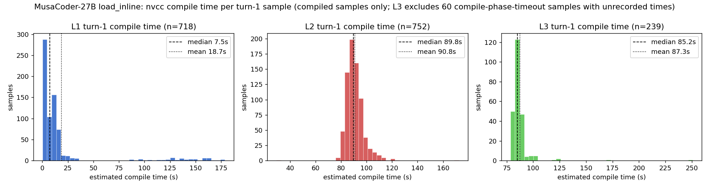

# L1 vs L2 Turn-1 时间开销对比

## 结论

同为 100 题 × 8 samples 的 turn-1（=单轮）评测，**L2 的单样本评测（env）开销是 L1 的 ~3.2×（均值 116s vs 36s；中位数 97.7s vs 13.6s，7.2×），其中 ~78% 花在 nvcc 编译上**。叠加 L2 run 的配置差异（1 个 sglang engine vs L1 的 2 个、KernelGym 4 GPU worker vs 8），这完全解释了 L2 全程 20.4h vs L1 5h40m 的墙钟差。

三个驱动因素按贡献排序：

1. **编译时间（主因）**：L2 的 load_inline 编译中位数 **89.8s**（且高度均匀：p90 也只有 98.5s），L1 只有 **7.5s**（12×）。L2 是 conv+多算子融合 kernel，生成的 extension 源码规模远大于 L1 的单算子 kernel。L2 错误样本也要全额支付编译（错误样本 env 均值 88s ≈ 编译本身），而 L1 错误样本大多快速失败（均值 10.8s、中位数 0.6s）。
2. **性能剖析（次因）**：correct 样本的 100 次 perf trial，L2 估计均值 **34.5s** vs L1 **18.6s**——L2 的朴素融合 kernel 相对 cuDNN reference 慢得多（典型 speedup ~0.07×，单次 forward 103ms vs 7.3ms），跑 100 遍成本高。
3. **生成长度（放大器）**：L2 turn-1 response 均值 **8418 tokens** vs L1 **5838**（1.44×），直接拉长生成时间。

correctness 阶段（5 次 trial）两级都可忽略（均值 1-1.7s，占 env 时间 <4%）。

## Turn-1 数据（每级 800 样本，来自 dump 逐样本统计）

| 指标 | L1 | L2 | L2/L1 |
|---|---:|---:|---:|
| response tokens（mean / median） | 5838 / 5751 | 8418 / 8286 | 1.44× |
| env 总时间 s（mean / median / p90，compiled 样本） | 36.4 / 13.6 / 138.0 | 116.0 / 97.7 / 188.9 | 3.2× / 7.2× |
| 其中编译 est. s（mean / median） | 18.7 / 7.5 | 90.8 / 89.8 | 4.9× / 12× |
| 其中 correctness s（mean） | 1.15 | 1.65 | - |
| 其中 perf est. s（mean，仅 correct 样本） | 18.6 | 34.5 | 1.9× |
| env 时间合计（GPU·h，turn-1 全部） | 7.3 | 24.2 | 3.3× |
| 编译占 env 合计比例 | 51% | **78%** | - |
| 错误样本 env 均值 s（fail-fast 程度） | 10.8（中位 0.6，快速失败） | 88.2（中位 87.7，全额编译） | 8.2× |
| 300s 超时样本数（error_message 含 timeout） | 8 | 29 | 3.6× |

## 编译时间分布（turn-1，仅 compiled 样本）

| | n | mean | median | min | max |
|---|---:|---:|---:|---:|---:|
| L1 | 718 | 18.7s | 7.5s | 0.2s | 178.7s |
| L2 | 752 | **90.8s** | **89.8s** | 29.4s | 172.4s |
| L3 | 239 | 87.3s | 85.2s | 78.5s | 250.9s |

分布形态：**L1 强右偏**——主体在 25s 以内（单算子 kernel），少数 conv 类拖出 90-178s 长尾；**L2 是紧凑的钟形，集中在 80-110s**，几乎没有低于 30s 的样本——conv+多算子融合 extension 的 nvcc 编译存在一个 ~90s 的"地板"，每个样本（无论对错）都要支付。这就是 L2 单样本 env 开销中位数 7.2× 于 L1 的直接原因。**L3 的可见分布与 L2 几乎一致（中位 85.2s）**，但这是幸存者口径：另有 **60 个 compile 阶段超时样本未被记录**（约占 compile 尝试的 20%），真实分布是双峰——"~85s 完成"+"超过预算被杀"。~85-90s 地板在 L2/L3 一致，说明它主要是 torch extension 固定开销（头文件/模板），与 kernel 数量关系不大；把编译推过预算的是少数超大 module 源码。

## L3 turn-1 时间开销（补充；口径注意：非完整 800）

L3 = 50 题 × 8 = 400 trajectory，但 turn-1 仅 **344 条在 dump 中**（56 条被 3000s per-trajectory wall-clock guard 中止且记录被丢弃，见 L3 结果分析）；env 统计只覆盖 compiled 的 239 条。数字与 L1/L2 表同口径：

| 指标 | L3（turn-1，present=344） | vs L2 |
|---|---:|---|
| response tokens（mean / median / max） | **12666 / 11874 / 32768** | 1.5× / 1.4×（L1 的 2.2×） |
| env 总时间 s（mean / median / p90，compiled n=239） | 93.6 / 86.5 / 115.2 | 反而低于 L2（116/97.7） |
| 其中编译 est.（mean / median） | 87.3 / 85.2 | ≈L2（~90s 地板一致） |
| 其中 correctness s（mean） | 2.0 | ≈ |
| 其中 perf est. s（mean，仅 correct n=31） | 32.8 | ≈ |
| 记录内 300s task 超时 | 6 | - |
| **未记录的 compile 阶段超时** | **60（占 compile 尝试 ~20%）** | L2 为 0 |

读法：L3 的"能打完分的样本"单价与 L2 相当（compile 地板一致、正确样本太少所以 perf 阶段几乎不出现，env 均值反而更低）；**L3 真正的时间开销爆点不在单样本均价，而在（a）1.5× 长的生成、（b）20% 的 compile 尝试直接烧掉整个（未记录的）超时预算、（c）重型题 3 轮累计 env 时间触发 3000s trajectory guard（56 条中止）**。三者都指向 full-model 融合的源码规模，而不是输入 tensor 尺寸。

## 与墙钟时间的对账

| run 配置 | L1（5h40m，3 turns 全程） | L2（20.4h，3 turns 全程） |
|---|---|---|
| rollout | 8 GPU、2 engine（TP4）、32 并发 | 4 GPU、1 engine（TP4）、16 并发 |
| KernelGym | .21 独立节点、8 GPU worker | .22 同机 GPU 0-3、4 worker |
| gen 吞吐（log 实测均值） | 334 tok/s × 2 engine | 254 tok/s × 1 engine |

墙钟差 3.6×（5h40m→20.4h）≈ 生成容量减半（2→1 engine）× response 1.44× 长 × env 单样本 3.2× 贵（且 eval worker 减半）。多轮流水线中前段以生成为瓶颈、尾段以 eval/超时为瓶颈（一个 300s 超时任务会占住 16 并发中的一个槽位直到超时返回）。

## 附：TVM-FFI（Qwen3.6-27B）L3 的 task 超时预算分析

上文的 load_inline 计时**不适用于 TVM-FFI 后端**——实测（Qwen3.6-27B L3 tvm-v2 run 的全部 438 个已打分样本，含全部 turn）：

| 阶段 | TVM-FFI L3 实测 | 对照 load_inline |
|---|---|---|
| 编译 est.（median / p99 / max） | **0.2s / 30.5s / 58.2s** | ~85-90s 地板 |
| task 总时长（median / p90 / p99 / max） | 0.9s / 24.8s / 228.7s / **275.1s** | 均值 94-116s |
| correct 样本 task 总时长（median / p90 / max） | 24.2s / 137.4s / 275.1s | - |

TVM-FFI 编译快（content-keyed cache + 独立编译路径，无 torch extension 固定开销）；耗时尾巴几乎全部来自 **correct 样本的 100 次 perf trial**（慢而正确的 kernel：perf 阶段 p90 117.6s、max 232s）。

**超时预算模拟**（在该分布上重放不同 budget）：

| budget | 误伤样本 | 其中 correct |
|---|---:|---:|
| 180s | 8/438（1.8%） | **6**（≈全部 61 个 correct 样本的 10%） |
| 240s | 4/438（0.9%） | 4 |
| **300s** | **0** | **0** |

**结论：TVM-FFI L3 用 180s 不合理——会选择性杀掉 correct 样本（compile 失败秒级返回，撞预算的几乎只有"慢而正确"的样本），correctness 被人为压低 ~1.4pt，而节省的墙钟可忽略（中位 task <1s）。保持 300s（实测 max 275s，0 误伤，留有余量）。** 若需要进一步压缩 eval 成本，正确的旋钮是降低 `num_perf_trials`（100 次 perf trial 是尾巴的来源），不是收紧 timeout。

### 推演：如果换一个 L3 correct rate ~90% 的强模型，timeout 该设多少？

高正确率下几乎每个样本都要跑满整条流水线（compile + 5 correctness + **100 perf trial**），预算不再由"少数慢尾巴"决定，而由 **correct 样本自身的耗时分布**决定。task 成本 ≈ compile（p99 ~30s）+ ~105 × (ref_runtime + kernel_runtime)：

- 现有 correct 样本分布（61 个）：median 24.2s / p90 137.4s / max 275.1s。90% correct（~360/400 样本）意味着从同一分布抽 ~6 倍多的样本，尾部命中更多——300s 会开始产生个位数误伤。
- 量级推演：L3 最慢 reference forward ~47ms（LSTM 双向，实测）。correct kernel 若为 ref 的 1/20 速度 → 105 trial ≈ 100s，300s 足够；若 1/100 速度 → ≈ 500s，300s/600s 都可能不够——但这么慢的"正确"kernel 本身 reward 价值趋零。
- **建议：600s**。约为实测 correct-max（275s）的 2 倍余量，覆盖到 "kernel ≈ ref 的 1/80 速度" 为止；比这更慢的样本让它超时是可接受的裁决（相当于隐式 "太慢即失败"）。不建议 >600s——预算加倍换回的只是几乎无价值的极慢 kernel，还把 worker 占用拖长。
- 代价提示：90% correct 时**总 eval GPU 时间会涨 ~5 倍**（现均值 10.6s/task 是被大量秒级 fail 拉低的；correct 均值 48.4s）。若吞吐吃紧，先降 `num_perf_trials`（100→25 大约砍掉尾巴的 3/4，fast@ 的分辨率对 25 次仍然够用），再考虑加 worker。

## 备注与口径

- L2 每样本编译 ~90s 高度均匀，说明是 conv/融合 extension 的 nvcc 固有成本（worker 为 MAX_TASKS_PER_WORKER=1 冷启动）；L1 中位 7.5s 但长尾到 178s（简单 elementwise/matmul 编译快，conv 类同样慢）。机制层面（PCH/缓存/冷启动差异）未逐项核实，此处只给测量值。
- perf est. = num_perf_trials × (reference_runtime + kernel_runtime)，为下界（不含 warmup）；编译 est. = kg_kernel_total_s − correctness − perf est.，为残差（含 worker 内加载开销）。
- L1 用原始 largeshape dump（未替换 179 条污染 trajectory；污染影响 correctness 判定，不影响本文的时间统计口径）。L1 eval 在 .21、L2 在 .22，同为 A800-80G。

<!-- 证据与复现：
- 统计脚本：/tmp/t1_time_breakdown.py、/tmp/t1_time_breakdown_l3.py、/tmp/compile_hist.py、/tmp/compile_hist3.py（.22），源自本 session scratchpad。
- 直方图数据：.22:/tmp/compile_times.json（L1 718 / L2 752 条）、/tmp/compile_times_l3.json（L3 239 条）。
- L3 dump：…/MusaCoder-27B.mt3_level3.load_inline/dumps/rollout_data/eval_0.pt（turn_idx==0 present=344；56 wall-clock-aborted 记录被丢弃，60 compile 超时无 kg 计时）。
- TVM-FFI 附录数据：.22:/tmp/qwen_l3_timing.py；dump = slime-dev-csl-2/experiments/Eval.TVMFFI.Qwen3.6-27B.…turn3.n8/Qwen3.6-27B.level3.kg21_tf32off_correctness.20260621.093912/dumps/rollout_data/eval_0.pt（438 scored 样本，该 run 实际 client timeout=300s，实测 T1 超时仅 3/400、wall-clock abort 0）。
- L1 dump: /nfs/FM/chenshuailin/projects/kernel_agents/slime-musacoder-mt/experiments/EvalMT3.load_inline.MusaCoder-27B.CTX40960/MusaCoder-27B.mt3_largeshape_nosplit.load_inline/dumps/rollout_data/eval_0.pt（turn_idx==0 的 800 条）
- L2 dump: 同目录 …/MusaCoder-27B.mt3_level2.load_inline/dumps/rollout_data/eval_0.pt
- 字段：kg_kernel_total_s（worker 内任务总时长）、correctness_trial_s、reference_runtime/kernel_runtime/num_perf_trials、response_length、reward_extra_info.error_message（timeout 判定）。
- gen 吞吐：两个 run 的 log 中 "gen throughput" 均值（L1 20260626.035433.log n=3877、L2 20260702.070822.log n=9094）。
- 单样本示例（L2 correct）：kg_total 98.3s = 编译 ~86s + correctness 0.87s + perf ~11.4s。
-->
