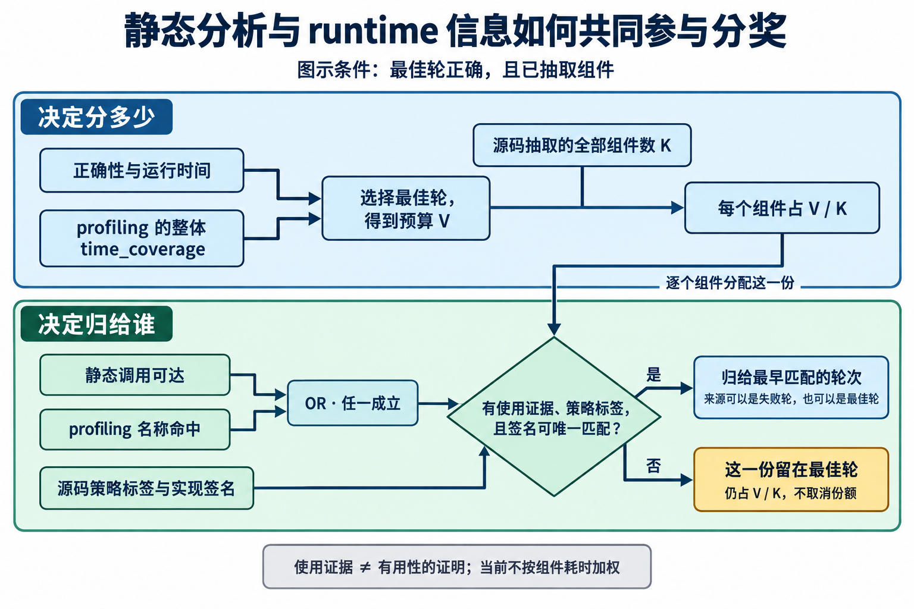
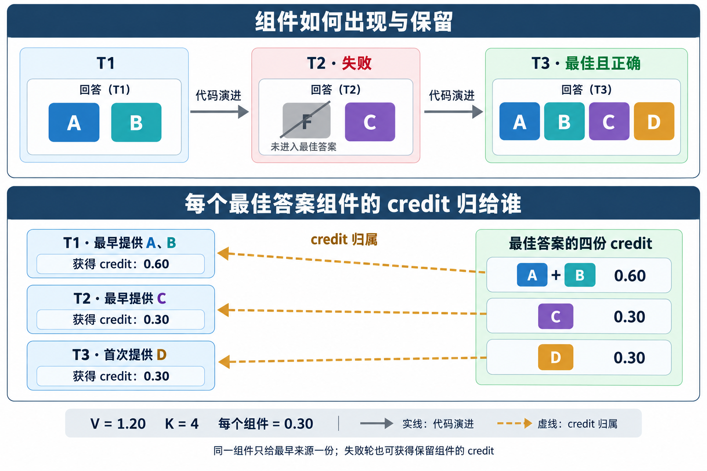

# 优化策略识别与最佳答案组件追踪

当前用一套通用源码规则识别优化实现，再将最佳答案中的具体实现追溯到最早出现的轮次。规则库包含 9 个类别， 58 项模板
<!-- ，覆盖访存、数据复用、并行归约、流水、计算精度、融合拆分、同步、调度和库配置；同一套规则用于所有题目 -->

<!-- 策略覆盖与组件分奖已接入代码，真实 rollout 与两节点训练检查均已通过。与最新三轮 packed TRLOO 的正式对照已启动；下文分别报告实现覆盖、实际分奖和训练验证，不把来源匹配当作训练收益 -->

## 方法

### 一次分析记录哪些信息

输入是同一轨迹各轮保存的源码和评测状态。分析器先从每轮回答中选取实际代码段，解析语法树，提取函数、kernel 定义、调用关系和调用参数，形成该轮的结构化记录
<!-- ；记录同时保留对应源码和位置，供模板检查与人工复核 -->

单轮策略识别在这些函数和调用记录上检查向量指针访问、shared 分块、Tensor Core 调用等形态，输出策略名称、所在组件、源码位置、匹配依据及具体参数。离线轨迹分析还会比较相邻轮的调用结构，记录实现组织怎样变化；正式训练使用每轮的组件描述搜索最佳答案的来源。两种跨轮比较的对象和用途分别在下面说明

失败轮也参与分析。比如第二轮已经写出组件 C，但程序在 F 处运行失败，C 的源码策略仍会记录；失败状态与策略记录一起保存。后文用这条轨迹的 A、B、C、D 说明来源追踪与分奖。profiling 提供额外的调用证据，缺少 profiling 的源码同样进入分析

### 离线分析怎样比较相邻轮的调用结构

这里的“实现组织”指 host 函数中有哪些 kernel 调用点，以及各自的 launch 配置。比较顺序是先将两轮源码分别结构化，再对齐调用者，最后比较调用记录

1. 每轮提取 host 函数及其 kernel 调用列表，记录被调用的名称、实参和 `<<<grid, block, shared, stream>>>` 中实际填写的配置表达式
2. 在同一代码区段内，按函数的完整名称对齐两轮的 host 函数；只比较两边均能唯一确定的函数
3. 比较调用点数量、新增和消失的 kernel 名称；对两轮均只调用一次的同名 kernel，另外比较调用目标表达式与 launch 配置

例如，两轮在同一个 `forward_cuda` 中先后采用分离实现与融合实现，抽取后的关键记录如下

| 结构化字段 | 第一轮 | 第二轮 |
|---|---|---|
| host 函数 | `forward_cuda` | `forward_cuda` |
| kernel 调用及实参 | `A(x, tmp)`、`B(tmp, y)` | `F(x, y)` |
| 源码中的调用点数量 | 2 | 1 |

调用点减少，同时 A、B 消失、F 新增，分析器记录一条“launch 合并候选”，附上前后数量和新增／消失的名称。反向变化记录为拆分候选；同名 kernel 的 block 配置从 `128` 改成 `256`，则记录为 launch 配置变化

这些变化记录用于离线解释轨迹和统计策略覆盖。下面的正式训练流程则以最佳答案中的具体组件为起点，比较其与所有较早轮次的实现签名，决定 credit 的来源轮次

### 从策略描述得到分奖单位

每个 native kernel 定义是一份具体实现，每个计算库调用点也是一份具体实现。一个 kernel 可以携带多个策略标签，分奖时仍计为一个组件。它调用的 device helper、宏、全局声明和 host launch 配置一并进入该组件的签名，用于判断另一轮是否保留了同一实现。库调用的签名还保留所在 host 函数与配置操作

签名保留源码中的名字、类型、常数、运算顺序和调用参数，忽略空白与注释。组件描述还分别保存从 `ModelNew.forward` 出发的静态调用路径和 profiling 命中名称，供下一步判断最佳答案是否使用了该组件

下面把组件 A 具体化为一个加 bias 的 kernel，只列出用于说明识别机制的 native 代码

```cpp
#define BIAS 1.0f
__device__ float add_bias(float v) { return v + BIAS; }
__global__ void A(const float* __restrict__ x,
                  float* __restrict__ y, int n) {
    int i = blockIdx.x * blockDim.x + threadIdx.x;
    if (i < n) y[i] = add_bias(__ldg(x + i));
}
void launch_A(const float* x, float* y, int n) {
    A<<<(n + 127) / 128, 128>>>(x, y, n);
}
```

这段代码经当前分析器提取后，关键记录如下

| 抽取内容 | 结果 |
|---|---|
| 分奖组件 | kernel `A`，只计一个单位 |
| 策略标签 | 连续访存 `coalesced_access`、只读缓存 `read_only_cache`、无别名限定 `restrict_aliasing` |
| 组件依赖 | device helper `add_bias` 和宏 `BIAS` 纳入 A 的签名，不单独分奖 |
| 直接调用配置 | `launch_A` 的实现、launch 配置和实参纳入 A 的签名 |

因此，三个标签共同描述 A，A 仍只占一份 credit。若将 block 大小从 `128` 改成 `256` 并调整 grid 表达式，即使 kernel 正文未变，整体实现签名也会变化；只增加注释则保持签名不变。这两种变化均已用当前分析器核对

### Runtime 分析怎样补充静态分析

静态分析描述代码中的具体实现，runtime 结果补充答案质量和组件使用证据。当前复用每轮正常评测返回的结果，将源码、正确性、计时和已有 profiling 记录绑定到同一候选。它们在正式训练中的用途如下

| Runtime 信息 | 在当前方法中的作用 |
|---|---|
| 正确性与参考／候选运行时间 | 沿用原 task reward 评价各轮答案，选择最佳轮并确定可分配的正质量预算；跨轮组件分奖以正确的最佳答案为依据 |
| Profiling 中的 kernel 名称 | 与源码组件的函数名匹配，记录该组件在 profiling 执行中出现的证据，补充静态调用路径 |
| 自定义 kernel 与全部 GPU 工作的累计耗时 | 计算原 task reward 中的整体 `time_coverage`；组件份额仍按最佳答案中的组件等权划分 |

具体到一个最佳轮组件，代码采用 `use_observed = bool(source_path or profile_hits)`：从 `ModelNew.forward` 沿可唯一解析的调用边能找到它，或者 profiling 中有匹配名称，都可以提供使用证据。profiling 因而能补足静态调用链解析不完整的情况。两种证据均缺失时，该组件的份额留在最佳轮；有使用证据、策略标签和可匹配签名时，再搜索此前轮次的来源

下图把“分多少”和“归给谁”分开表示：$V$ 是最佳轮的正质量预算，$K$ 是最佳答案中抽取的全部分奖组件数。使用证据由静态可达与 profiling 名称命中取并集，具体份额再按来源分配



例如真实 rollout 的 group19，第三轮评测正确，profiling 中出现 `pad_kernel(float const*, ...)`，静态调用路径也能到达这个 kernel。实现签名比较进一步发现，它与第一轮编译失败答案中的 `pad_kernel` 及直接 launcher 相同，因此该组件的份额回到第一轮。这里评测结果决定答案质量，profiling 补充最佳轮的调用证据，源码签名确定最早来源；较早失败轮也可以提供被保留的实现。对应的[组件记录](../../local_artifacts/component_reward_training/source_strategy_training/real_rollout_audit/group19_manual/turn_2_analysis.json)与[原始评测／profiling](../../local_artifacts/component_reward_training/source_strategy_training/real_rollout_audit/group19_manual/turn_2_environment.json)可直接核对

实现上，评测返回的原始 `metadata.profiling.kernels` 会在 feedback 精简前单独保留到该轮的 `source_component_profiles`，由[组件分析器](../../examples/kernel_agent/source_components.py)读取。58 项模板识别和跨轮实现身份仍由源码分析负责，runtime 结果在上述位置参与分奖

### 从最佳答案回到较早的轮次

假设三轮代码依次为 `[A, B] → [F, C] → [A, B, C, D]`，第三轮正确且获得最高质量分，相同字母表示实现签名相同的组件。分析器从第三轮的组件出发，分别比较此前的实现签名：A、B 最早见于第一轮，C 最早见于第二轮，D 首次出现在第三轮。即使第二轮的 F 出错，只要 C 的实现保留到了正确的最佳答案，第二轮仍可获得 C 的份额

A 中间被替换、后来重新出现时，credit 仍回到第一次出现的轮次。融合五个算子的 F5 与融合三个算子的 F3 分别有自己的实现签名；`F3 → F5 → F3` 可以把恢复的 F3 追溯到早期 F3。无法确定来源的组件份额留在最佳轮

### 每个轮次具体分到多少 credit

分配顺序是先按最佳答案的组件等分，再按来源轮次汇总。沿用原 task reward 选择最高质量轮，平分时取最早一轮。记最佳轮为 $t^\star$，其正质量预算为 $V = \max(q_{t^\star}, 0)$，组件描述中的全部分奖单位数为 $K$

1. 每个组件分得 $V/K$。一个 kernel 即使命中多个策略标签，也只占一份
2. 每个组件的这一份全部归给最早可匹配、且符合入训条件的来源轮次。同一实现出现在多个轮次时，后续保留它的轮次不再重复分得这一份
3. 最佳轮首次出现的组件，以及来源未解析、缺少使用证据或没有策略标签的组件，其份额留在最佳轮。这些组件同样计入分母 $K$

设最终归给第 $t$ 轮的组件份额数量为 $n_t$，最佳轮的 $n_{t^\star}$ 包含上述保留份额，则

$$
C_t = \frac{V}{K}\,n_t,
\qquad \sum_t n_t = K,
\qquad \sum_t C_t = V
$$

沿用上面的轨迹，假设最佳轮质量分为 $1.20$，四个组件均可确定来源，则每个组件对应 $0.30$，各轮汇总如下



| 轮次 | 本轮实现 | 最佳答案中归给本轮的组件 | 份额数量 $n_t$ | Credit $C_t$ |
|---|---|---|---:|---:|
| 第一轮 | A、B | A、B | 2 | 0.60 |
| 第二轮 | F、C | C | 1 | 0.30 |
| 第三轮（最佳） | A、B、C、D | D | 1 | 0.30 |
| 合计 | — | A、B、C、D | 4 | 1.20 |

因此，多轮之间按各自提供的最佳答案组件数量分配，不按获得 credit 的轮次数平均分配。A、B 在第三轮重新出现，它们的份额仍全部归第一轮；F 未进入最佳答案，因此不占分奖份额。如果连 D 也来自更早轮次，且没有需留在最佳轮的份额，最佳轮自身可以得到零 credit。若最佳轮没有可分析的组件，则整个 $V$ 留在最佳轮

同一例子中，如果 D 缺少使用证据，它对应的 $0.30$ 仍留在第三轮，其它三份的金额不变；不会删去 D 后把总预算改为三等份

### 怎样形成训练目标

当前训练 baseline 在第 $t$ 轮答案正确时的质量分为

$$
q_t = 0.5 + 0.5\min(\mathrm{speedup}_t, 2) + 0.5\,\mathrm{time\_coverage}_t
$$

符合原条件的 output mismatch 保留 0.25，其它失败为 0。本次沿用这个质量分，改变的是它在各轮之间怎样分配

第 $t$ 轮分奖后的训练目标为

$$
r_t = C_t + \min(q_t, 0)
$$

其中 $C_t$ 是该轮获得的组件 credit，$q_t$ 是原 task reward。目标直接进入原有同题、同轮次的 TRLOO 比较和 packing。全错轨迹若原来有部分质量奖励，该奖励留在最高质量轮；有正 credit 的失败轮保留训练 token，padding、aborted 和明确移除的轮次保持排除

例如，将上面的轨迹记为甲，再取同一题的轨迹乙。为展示比较方式，简化为两条完整入训轨迹，且各轮原 task reward 均非负，因此本例 $r_t=C_t$

| 同一题的轨迹 | 第一轮目标 $r_1$ | 第二轮目标 $r_2$ | 第三轮目标 $r_3$ |
|---|---:|---:|---:|
| 甲：上面的 A/B/C/D 例子 | 0.60 | 0.30 | 0.30 |
| 乙：另一次采样的分奖结果 | 0.00 | 0.60 | 0.60 |

TRLOO 按表格的列比较：甲的第二轮与乙的第二轮构成一组，每个样本减去组内其它样本的平均目标。只有两条轨迹时，第二轮得到的 advantage 为

$$
a_{\text{甲},2}=0.30-0.60=-0.30,
\qquad a_{\text{乙},2}=0.60-0.30=0.30
$$

因此，分得正 credit 与得到正 advantage 是不同的步骤：甲的第二轮虽有 credit，但低于同组的另一条轨迹。分组键沿用 baseline 的题目与轮次，各轨迹的历史上下文可以不同；packing 将轨迹组织为训练序列，保持上述比较分组

采样过滤按完整逐轮目标向量计算组内方差，沿用原有阈值和最小组大小；整条轨迹一起保留或丢弃。最后一轮的单个分数不再独自决定一条轨迹是否入训

### 当前覆盖的优化策略

| 类别 | 模板数 | 覆盖的实现方式 |
|---|---:|---|
| 访存 | 14 | 连续 lane 访问、向量访问、restrict、缓存、shared 布局、动态/分布式 shared、常量/pinned/managed 内存 |
| 数据复用 | 4 | shared 分块、线程内累加块、原地更新、中间缓冲消除 |
| 并行与归约 | 8 | shuffle、warp/block collective、grid-stride、每线程多输出、warp 分组、任务队列、原子汇总 |
| 流水与传输 | 6 | 异步拷贝、TMA、pipeline、双缓冲、预取、异步内存传输 |
| 计算与精度 | 9 | 展开、Tensor Core、打包低精度算术、混合精度累加、fast math、rsqrt、FMA、位运算索引、循环外预计算 |
| 融合与拆分 | 5 | 逐元素计算链、归约后处理、多输出 kernel、launch 合并与拆分 |
| 同步 | 3 | cooperative grid、warp sync、memory fence |
| 调度与资源 | 6 | 编译期特化、launch bounds/资源配置、launch 参数变化、CUDA Graph、stream/event、block cluster |
| 库实现与配置 | 3 | 库计算调用、math mode、算法与 epilogue 配置 |

所有模板均由实际代码触发。各项的具体条件与最小代码示意集中在附录，前面的流程不依赖逐项阅读模板

对 fusion，离线策略分析同时记录 kernel 内的计算链和跨轮 launch 组织变化。例如同一 host 函数中的 `[F5] → [F3, D, E]` 会进入 launch 拆分候选。正式分奖分别保留 F5 和 F3 的组件身份，按最佳答案实际采用的实现追踪来源

## 实验结果

### 数据与覆盖率

使用已有的训练 rollout121 留样，以及 Qwen3.8、DeepSeek 的 L3 五轮评测，共 1,056 条轨迹、4,768 轮。训练留样为 16 题，每题 16 条三轮轨迹；两个 L3 池各为 50 题，每题 8 条五轮轨迹。统计纳入所有非 padding 轮次，保留未观测、计时缺失和 evaluator 错误等原始状态

下表按轨迹去重：“原四类”是 shuffle、shared 暂存、向量访问、unroll；“显式策略”指直接出现 API、指令或 pragma 等证据；“任一策略”还包含连续访存、预计算等结构模式。三列都使用本轮全源码口径

| 数据 | 轨迹数 | 轮次 | 原四类命中轨迹（%） | 显式策略命中轨迹（%） | 任一策略命中轨迹（%） |
|---|---:|---:|---:|---:|---:|
| Qwen3.8 训练留样 | 256 | 768 | 50.78 | 100.00 | 100.00 |
| Qwen3.8 L3 | 400 | 2000 | 66.75 | 98.50 | 98.50 |
| DeepSeek L3 | 400 | 2000 | 42.00 | 100.00 | 100.00 |

近乎所有轨迹都包含可识别的实现形态。加入常见的 `__restrict__` 指针限定符后，显式策略的轨迹覆盖也很高。这说明词表已覆盖常见代码写法；是否产生不同于最佳轮奖励的训练信号，需要继续看实际跨轮分奖

### 实际跨轮分奖

对训练 rollout121 的每条完整轨迹运行正式归因函数，使用保存的原始质量分和源码。下表的轨迹分母包括全错、无正奖励和 fallback 轨迹

| 训练留样指标 | 结果 |
|---|---:|
| 发生跨轮 credit 的轨迹（%） | 19.53 |
| 归到较早轮次的组件 | 77 |
| 较早来源轮失败或未正常完成的组件 | 12 |
| 未归因份额的轨迹平均值（%） | 8.20 |
| 总正质量预算与实际 credit 的差 | 0.00 |
| hard-removed 轮得到的 credit | 0.00 |
| 正式源码分析总耗时（s） | 5.41 |

约五分之一的训练轨迹实际改变了奖励落点。这是可以进入训练验证的非零覆盖信号，但当前只来自一个 batch 的留样。比如 trajectory0234 的第三轮获得最高质量分，其中唯一 kernel 的实现已在第二轮出现，质量预算全部回到第二轮

这组实验只重构 attribution 所需的样本状态，导出文件没有完整训练 token；产生的临时 mask 仅用于检查归因资格，不能用于 GPU 训练。正式训练前另做真实 rollout 与 train-only 检查

同一函数还分析了两个 L3 五轮池，分母均为各模型全部轨迹，包含全错轨迹

| 数据 | 跨轮 credit 轨迹（%） | 较早来源组件 | 其中失败或未正常完成来源 | 源码分析总耗时（s） |
|---|---:|---:|---:|---:|
| Qwen3.8 L3 | 10.50 | 175 | 169 | 25.03 |
| DeepSeek L3 | 11.75 | 126 | 114 | 25.66 |

这两组中，较早来源集中在整体失败的轮次。人工检查发现了真实的“实现已写好，接口仍出错”情况：Qwen group29 第一轮的 binding 使用旧 dtype API 而编译失败，后续最佳轮保留了其中四个计算组件；DeepSeek group314 第三轮的 FFI 调用错误地使用 keyword，第四轮改为 positional 后通过，native GRU kernel 保持相同。因此，这里的 credit 主要在补偿失败答案中已保留的实现，而非只把成功答案重复分奖

### 新生成轨迹的端到端检查

使用原始 FP8 release 权重新跑了一个诊断 batch，保留相同的三轮 context、采样参数和四个 TP4 engine。生成及评测完成后，对保存的原始 Sample 逐项检查候选身份、完整 credit、真实 token/mask/logprob 和 predictive support

| 实际诊断指标 | 结果 |
|---|---:|
| 轨迹／turn | 32 / 96 |
| 发生跨轮 credit 的轨迹（%） | 3.13 |
| 无正确答案而保留 partial quality 的轨迹（%） | 31.25 |
| 生成／评测耗时（s，不含启动） | 195.94 |
| 源码分析耗时（s） | 1.83 |
| 身份／credit／token 合同错误 | 0 |
| 评测／客户端超时 | 0 |

本批唯一跨轮样本是 group19：第一轮因 binding 对 Tensor 调用不存在的 `.contiguous()` 而编译失败；第三轮 Correct 后，其中逐字保留的 `pad_kernel` 和直接 launcher 对应的一份 credit 回到第一轮，其余五份留在第三轮。这个比例低于训练 step121 留样，两个池分别来自原始权重与已训练权重，且题目不同；当前少量诊断不能用来估计全训练集覆盖率

两节点 train-only 已使用这份真实 dump 完成全部 microbatch。正式训练随后也完成了首个更新（日志 step0）和更新后的权重回灌，第二步正在运行；两阶段均未出现 OOM、非有限数值或训练异常

| 训练验证 | microbatch | loss | grad norm | MTP loss |
|---|---:|---:|---:|---:|
| 真实 dump 的 train-only | 32 | 0.0015804 | 0.11201 | 0.31660 |
| 首个正式更新 | 246 | -0.0011798 | 0.12143 | 0.29893 |

下面的覆盖率以首个正式 batch 的实际入训轨迹为分母，已经经过动态采样过滤；它不代表所有生成尝试或全训练集的自然比例

| 首个正式 batch 指标 | 结果 |
|---|---:|
| 入训轨迹／turn | 256 / 768 |
| 有跨轮 credit 的轨迹 | 45 |
| 有跨轮 credit 的轨迹（%） | 17.58 |
| 分给较早轮次的正奖励预算（%） | 25.23 |
| 采样收集耗时（s） | 890.52 |
| 累计源码分析耗时（s） | 51.90 |
| 不可归因部分占正奖励预算（%） | 4.74 |

累计源码分析耗时约为收集 wall time 的百分之六，这不是单独测出的净 wall-time 增量。当前主要结论是：分奖在真实正式数据中产生了非零变化，源码处理成本也已可测；训练收益仍待 checkpoint 对照

### 失败轮中的策略观察

| 数据 | 已观测失败轮 | 命中策略的失败轮 | 占失败轮（%） |
|---|---:|---:|---:|
| Qwen3.8 训练留样 | 141 | 141 | 100.00 |
| Qwen3.8 L3 | 1015 | 1003 | 98.82 |
| DeepSeek L3 | 1451 | 1448 | 99.79 |

失败程序中保留了大量可分析的实现。成功与失败状态现在和源码特征分开保存，后续可以从这些失败轮中搜索最佳答案的组件来源

### 模板和真实样例

58 项模板都有构造检查；当前真实样本命中 41 项。其余 17 项包含 TMA、Tensor Core 直接指令、双缓冲、block cluster 等，在本批源码中没有命中，仍保留其规则和构造示例

人工检查覆盖了以下代表性代码，完整源码和命中位置随每条轨迹保存

| 样本 | 实际看到的内容 |
|---|---|
| 训练留样 trajectory0000，T2 | 局部 `partial[]` 数组累加与二维 shared 暂存，分别记录线程内累加块和 shared 分块 |
| 训练留样 trajectory0001，T1→T2 | 一个 model kernel 改成 reduce 与 output 两个 launch，记录拆分候选 |
| 训练留样 trajectory0002，T2→T3 | row-reduce 与 col-GELU 两个 launch 改成一个 fused kernel，记录合并候选 |
| 训练留样 trajectory0176，T1 | half 输入转换到 float 后累加，记录混合精度累加 |
| Qwen L3 group9，T2/T3 | 向量访问、TF32 math mode、库算法与 epilogue 配置分开记录，失败轮也有结果 |
| Qwen L3 group25，T5 | `__shared__ float smem[32][33]`，记录 shared padding |
| Qwen L3 group5，T4 | GEMM kernel 的 launch bounds 配置 |
| Qwen L3 group19，T1 | 失败轮中实际写出的 device-to-device `cudaMemcpyAsync` 调用 |

以表中的 Qwen3.8 L3 group9 为例，第二轮同时使用 `float4` bias kernel 和带 `CUBLAS_COMPUTE_32F_FAST_TF32` 的 GEMM，分析器分别记录“向量访存”“库计算”“库 math mode”和“显式算法配置”，并指向各自的代码位置。第三轮评测失败，但源码中的 cuBLASLt epilogue 设置和算法选择调用仍被记录；这些记录描述失败尝试写出了什么，具体实现是否保留由后续来源追踪判断。该例源码与调用证据见 [trajectory0265](../../local_artifacts/paper/optimization_speedup_pilot/strategy_expansion_20260910/coverage_final/trajectories/trajectory_0265.json)

### 训练配置与执行

训练以最新 v4_1 packed 三轮 TRLOO 为 baseline，使用原始 release actor checkpoint 创建新实验，不从旧 step119 续跑。源码分奖在 slime 内完成，KernelGym 沿用已有评测 URL 与正常评测预算

正式作业为 `raysubmit_gBanNugYvJf2nrHv`，曲线见 [W&B](https://wandb.ai/shuailin_chen/slime/runs/60pc5qed)。首个更新训练用时 865.9 秒，更新后回灌用时 1.3 秒；目前只确认训练闭环运行正常，尚未产生可与 baseline 比较的 checkpoint 结果

| 项目 | 配置 |
|---|---|
| 模型／数据 | Qwen3.8-27B，v4_1，39636 题 |
| 训练／rollout | node69+70 BF16 actor；node53+64 FP8 rollout，各节点 8 张 H20 |
| 并行 | actor TP4/PP2/CP2；4 个 TP4 rollout engine |
| 每个 batch | 16 题 × 每题 16 轨迹，packing |
| 轮次／context | 3 轮，24576 / 32768 / 40960 |
| 推理与 MTP | T1.0，top_p1，medium；MTP3 rollout，训练 MTP TF1 系数 0.2 |
| 优化器／policy | lr 1e-6；原 TRLOO、DPPO predictive top20+tail |
| 运行上限 | 3000 次更新，沿用 baseline 的配置上限 |
| 本次改动 | 开启 source component credit，不启用跨轨迹状态聚合 |
| 存储 | 每 20 步保存，新实验只保留最近 1 代完整 checkpoint；旧 checkpoint 不动 |

存储调整是因为 node69 同时保留三代 checkpoint 的峰值会超过剩余空间；学习与采样参数不变。完整 debug rollout 只用于受控诊断，正式训练不持续保存大体积逐 batch dump

Ray head 临时目录改到 node70 的 `/nfs/LOCAL/chenshuailin/ray_csrc70`。原目录所在盘超过 Ray 的 95% 使用率阈值，虽然仍有空闲空间，spill 时也可能被拒绝；其它节点的 Ray 路径保持不变

## 局限与当前边界

### 分奖假设与训练收益

- **最佳答案的全部组件都会占一份 credit，实际贡献尚未验证**：有正质量预算时，最佳答案中按当前粒度抽取的全部组件都等分 $V$，每个组件占 $V/K$。当前没有通过删除或替换组件的消融来判断它对正确性、加速是否真正有帮助，因此冗余、无贡献甚至拖慢运行的组件也可能获得份额。来源追踪决定这份 credit 归哪个轮次；缺少使用证据或无法归因时，份额留在最佳轮，而非取消。因此“获得 credit”不等于“已证明这个组件有用”
- **最佳轮由现有质量分决定**：沿用 baseline 的 task reward，其中存在上限或并列，所以选中的最佳轮不一定是 raw speedup 最大的一轮
- **训练收益还需对照验证**：等权分奖是启发式，来源可匹配不能直接推出奖励更好。本轮同时改变总质量预算与轮间分配，后续仍需“只奖励最佳轮”对照来区分两者的收益

### 策略识别与来源追踪

- **模板命中不等于发现有效优化**：本轮优先扩展策略种类，尚未评估匹配 precision／recall。连续复制也可能命中连续访存，warp 编号的边界检查也会进入 warp 分组模板；普通结构模式和显式 API 证据因此分别统计
- **源码覆盖尚不完整**：主要覆盖 CUDA/C++，宏展开、间接库调用、其它 kernel 语言和任意算法重写仍有缺口。未命中模板不代表策略没有使用，例如库内部使用 Tensor Core 与源码直接写 MMA 属于不同观察层次
- **实现签名偏保守**：重命名、等价改写，以及 host 函数中无关代码变化都可能打断匹配。此前局部阶段匹配和表达式规范化仍是附录中的离线分支，未用于本次训练
- **组件粒度可能遗漏接口修复的贡献**：签名涵盖直接 CUDA launcher，未囊括所有上游 FFI wrapper 和 Python 调用者。group19 的 pad kernel 虽然早已保留，上游参数传递和输出布局仍在最后一轮修复，见[源码人工核对](../../local_artifacts/component_reward_training/source_strategy_training/real_rollout_audit/group19_manual/review.md)。将全部份额归给早期 native 实现，可能让完成接口修复的最后一轮得到零 credit，DeepSeek group314 就属于这种情况

### 调用结构与 runtime 证据

- **合并／拆分只是静态结构候选**：比较对象是源码调用点。A、B 被 F 替换，尚不能证明 F 完成了两者的全部计算，也不代表运行时调用次数的变化。Launch 配置仍按表达式文本比较；中间缓冲消除结合分配语句正则、实参共用和变量名消失检查，尚未形成完整数据流分析
- **使用证据不等于输出贡献**：静态可达与 profiling 名称命中取并集，未执行但静态可达的分支仍可能进入来源搜索。库内部 GPU kernel 名称也未必与 cuBLAS API 同名，名称未命中不能说明没有调用。当前 source 训练未启用 NVBit／runtime 图采集，未用实际调用序列、访存依赖或硬件计数器验证优化收益；profiling 耗时也未用于估计单个组件的因果贡献或设置其分奖权重

## 附录：全部已实现模板

模板的 CUDA 机制按 [CUDA Best Practices Guide](https://docs.nvidia.com/cuda/cuda-c-best-practices-guide/index.html)、[PTX ISA](https://docs.nvidia.com/cuda/parallel-thread-execution/index.html) 和 [cuBLAS 文档](https://docs.nvidia.com/cuda/cublas/index.html)核对；实际识别条件以代码注册表为准。下面的代码是写法示意，完整可解析构造样例在检查文件中

“自然样本命中轮次”按全池去重；变化类规则计入变化发生后的轮次。表中数量用于定位样例，类别之间可以重叠

### 访存

| ID／策略 | 实际模板 | 最小写法示意 | 自然样本命中轮次 |
|---|---|---|---:|
| `shared_staging`<br>Shared 暂存 | 同一 shared 数组有读写，函数内有 block barrier | `s[t]=x[t]; __syncthreads(); y[t]=s[t]` | 1208 |
| `vector_memory`<br>向量访存 | 显式向量指针被索引或解引用，包含 half2/bfloat162 | `reinterpret_cast<float4*>(x)[i]` | 182 |
| `coalesced_access`<br>连续 lane 访存 | 全局数组下标对 threadIdx.x 的可解析仿射系数为 ±1 | `int i=blockIdx.x*blockDim.x+threadIdx.x; y[i]=x[i]` | 3720 |
| `read_only_cache`<br>只读缓存加载 | 实际调用 __ldg | `__ldg(x+i)` | 250 |
| `cache_policy`<br>缓存策略 | 显式缓存 load/store intrinsic、PTX 修饰符或缓存配置 API | `asm("ld.global.cg.f32 ...")` | 1 |
| `shared_padding`<br>Shared padding | 多维 shared 数组的最后一维带 padding | `__shared__ float tile[32][33]` | 20 |
| `shared_swizzle`<br>Shared 索引重排 | shared 下标或其局部定义中包含 XOR | `tile[row][col ^ (row & 7)]` | 0 |
| `shared_transpose`<br>Shared 转置 | 同一 shared 数组的二维读写下标次序互换 | `tile[ty][tx]=x[i]; y[j]=tile[tx][ty]` | 1 |
| `constant_memory`<br>常量内存 | kernel 引用 __constant__ 声明的符号 | `__constant__ float coeff[16]; y[i]=coeff[k]*x[i]` | 0 |
| `restrict_aliasing`<br>指针无别名限定 | 指针参数显式携带 __restrict__ | `const float* __restrict__ x` | 2984 |
| `dynamic_shared_memory`<br>动态 shared | extern shared 数组或动态 shared 函数属性 | `extern __shared__ float scratch[]` | 618 |
| `distributed_shared_memory`<br>分布式 shared | cluster shared 映射 API 或 shared::cluster PTX | `cluster.map_shared_rank(smem, rank)` | 0 |
| `pinned_host_memory`<br>Pinned host 内存 | cudaHostAlloc/MallocHost/HostRegister 调用 | `cudaHostAlloc(&host, bytes, flags)` | 0 |
| `managed_memory`<br>Managed 内存放置 | cudaMallocManaged/MemAdvise/MemPrefetchAsync 调用 | `cudaMemAdvise(ptr, bytes, advice, device)` | 1 |

### 数据复用

| ID／策略 | 实际模板 | 最小写法示意 | 自然样本命中轮次 |
|---|---|---|---:|
| `shared_tiling`<br>Shared 分块 | 循环使用有暂存读写和同步的多维 shared 数组 | `__shared__ float tile[16][16]; for(...) { tile[r][c]=x[i]; ... }` | 217 |
| `register_tiling`<br>线程内累加块 | 循环自更新线程局部数组元素 | `float acc[4]; for(...) acc[j]+=x[i]` | 117 |
| `inplace_update`<br>原地更新 | 同一全局指针参数被读写 | `x[i]=x[i]*scale` | 1859 |
| `intermediate_elimination`<br>中间缓冲消除候选 | launch 合并时，共享于旧调用实参的分配缓冲消失 | `tmp=empty(...); A(x,tmp); B(tmp,y) -> F(x,y)` | 0 |

### 并行与归约

| ID／策略 | 实际模板 | 最小写法示意 | 自然样本命中轮次 |
|---|---|---|---:|
| `warp_shuffle`<br>Warp 数据交换 | 语法树中实际调用 __shfl 系列函数 | `__shfl_down_sync(mask, v, 16)` | 340 |
| `warp_collective`<br>Warp 集合操作 | warp reduce/vote/match intrinsic 或 cooperative-group collective | `__reduce_add_sync(mask, v)` | 0 |
| `block_collective`<br>Block／Warp 集合库 | CUB Reduce/Scan/Load/Store 类型与成员调用共同出现 | `cub::BlockReduce<float,128>(temp).Sum(v)` | 0 |
| `grid_stride`<br>Grid-stride 循环 | 循环步长依赖 blockDim 和 gridDim | `for(int i=tid;i<n;i+=blockDim.x*gridDim.x) y[i]=x[i]` | 309 |
| `thread_coarsening`<br>每线程多输出 | 循环写出的全局下标同时依赖迭代变量和线程索引 | `for(int j=0;j<4;j++) y[tid+j*blockDim.x]=v` | 709 |
| `warp_specialization`<br>Warp 分工 | 条件分支依赖由 threadIdx.x / 32 或 >> 5 得到的 warp 编号 | `int warp=threadIdx.x/32; if(warp==0) { ... } else { ... }` | 98 |
| `persistent_queue`<br>持久化任务队列 | while/do 循环通过 atomic 增量取得任务 | `while(...) { task=atomicAdd(queue,1); ... }` | 0 |
| `atomic_accumulation`<br>原子部分结果汇总 | 实际调用 atomicAdd/Max/Min 等原子累加操作 | `atomicAdd(out+index, partial)` | 262 |

### 流水与传输

| ID／策略 | 实际模板 | 最小写法示意 | 自然样本命中轮次 |
|---|---|---|---:|
| `async_copy`<br>异步设备拷贝 | memcpy_async、pipeline copy 调用或 cp.async PTX | `cuda::memcpy_async(group, shared, global, bytes, barrier)` | 0 |
| `tma_copy`<br>TMA／bulk copy | cp.async.bulk 系列 PTX 或对应 cuda::ptx 调用 | `asm("cp.async.bulk.tensor.2d.shared::cluster.global ...")` | 0 |
| `pipeline_staging`<br>拷贝计算流水 | producer/consumer、async commit/wait 或 mbarrier 指令 | `pipe.producer_commit(); pipe.consumer_wait()` | 0 |
| `double_buffer`<br>双缓冲 | 双槽 shared 数组按 &1 或 %2 交替索引 | `__shared__ float s[2][256]; s[stage & 1][tid]=x[i]` | 0 |
| `prefetch`<br>预取 | PTX prefetch 指令或 cuda::ptx prefetch 调用 | `asm("prefetch.global.L2 [%0];" :: "l"(x))` | 0 |
| `async_transfer`<br>异步传输 | cudaMemcpy 系列 Async 或 cudaMemPrefetchAsync 调用 | `cudaMemcpyAsync(dst,src,bytes,kind,stream)` | 523 |

### 计算与精度

| ID／策略 | 实际模板 | 最小写法示意 | 自然样本命中轮次 |
|---|---|---|---:|
| `unroll_request`<br>循环展开 | for 前紧邻 unroll pragma，排除参数 0、1 | `#pragma unroll 4` | 872 |
| `tensor_core`<br>Tensor Core MMA | WMMA/MMA 调用或 mma、wgmma、tcgen05.mma PTX | `nvcuda::wmma::mma_sync(d,a,b,c)` | 0 |
| `packed_math`<br>低精度打包计算 | half2／bfloat162 算术 intrinsic | `__hfma2(a,b,c)` | 0 |
| `mixed_precision_accumulation`<br>低精度输入、FP32 累加 | 低精度输入参数与 float 标量自更新共同出现 | `const half* x; float sum=0; for(...) sum+=__half2float(x[i])` | 42 |
| `fast_math`<br>快速数学函数 | 快速 intrinsic 或 approx PTX 算术指令 | `__expf(x) + __fdividef(a,b)` | 304 |
| `reciprocal_sqrt`<br>倒数平方根 | rsqrt/rsqrtf 调用或 rsqrt PTX | `rsqrtf(var + eps)` | 1145 |
| `explicit_fma`<br>显式 FMA | fma/fmaf、低精度 FMA 调用或 PTX fma | `fmaf(a,b,c)` | 87 |
| `bitwise_indexing`<br>位运算索引 | 数组下标或局部定义中出现移位、mask、XOR | `int row=i>>5; int col=i&31; y[row*stride+col]=v` | 160 |
| `loop_invariant_hoisting`<br>循环外预计算 | 循环前计算的变量在循环中使用，且循环体未对该变量赋值 | `float inv=1.0f/n; for(...) y[i]=x[i]*inv` | 3025 |

### 融合与拆分

| ID／策略 | 实际模板 | 最小写法示意 | 自然样本命中轮次 |
|---|---|---|---:|
| `reduction_epilogue`<br>归约后处理 | 循环中的自更新标量参与循环后的变换写回 | `for(...) sum+=x[i]; y[0]=tanhf(sum)` | 1495 |
| `pointwise_fusion`<br>逐元素计算链 | 写回值及其局部初始化依赖包含至少两次计算，地址计算单独处理 | `float v=x[i]+bias; y[i]=fmaxf(v,0)` | 2853 |
| `multi_output_fusion`<br>多输出 kernel | 同一 kernel 写入至少两个不同指针参数 | `y[i]=f(x[i]); z[i]=g(x[i])` | 942 |
| `launch_fusion`<br>Launch 合并候选 | 同名唯一 host 函数内，多个旧 launch site 被更少的新 site 替换 | `A(...); B(...); C(...) -> F(...)` | 63 |
| `launch_fission`<br>Launch 拆分候选 | 同名唯一 host 函数内，旧 launch site 被更多的新 site 替换 | `F(...) -> ABC(...); D(...); E(...)` | 95 |

### 同步

| ID／策略 | 实际模板 | 最小写法示意 | 自然样本命中轮次 |
|---|---|---|---:|
| `cooperative_grid_sync`<br>Grid 同步 | cooperative launch 或 grid.sync 调用 | `cudaLaunchCooperativeKernel(...); grid.sync()` | 3 |
| `warp_synchronization`<br>Warp 同步 | 实际 __syncwarp 调用 | `__syncwarp(mask)` | 3 |
| `memory_fence`<br>内存栅栏 | __threadfence 系列或 membar PTX | `__threadfence_system()` | 3 |

### 调度与资源

| ID／策略 | 实际模板 | 最小写法示意 | 自然样本命中轮次 |
|---|---|---|---:|
| `compile_time_specialization`<br>编译期特化 | 模板 kernel、constexpr 声明或 if constexpr | `template<int N> __global__ void k(...) { ... }` | 124 |
| `launch_bounds`<br>资源与 occupancy 配置 | launch bounds、函数资源属性或 occupancy API | `__launch_bounds__(128,2)` | 84 |
| `cuda_graph`<br>CUDA Graph | Graph capture、instantiate、launch API | `cudaGraphLaunch(graph,stream)` | 0 |
| `launch_config_change`<br>Launch 配置变化 | 同一 kernel 调用点的 launch 参数或模板实参变化 | `k<<<grid,128>>>(x) -> k<<<grid,256>>>(x)` | 301 |
| `stream_event_scheduling`<br>Stream/event 调度 | CUDA stream/event 创建、记录、等待、同步或销毁调用 | `cudaEventRecord(done,s); cudaStreamWaitEvent(other,done,0)` | 92 |
| `thread_block_cluster`<br>Block cluster | cluster launch/config API 或 cluster 同步 | `cudaLaunchAttributeClusterDimension; cluster.sync()` | 0 |

### 库实现与配置

| ID／策略 | 实际模板 | 最小写法示意 | 自然样本命中轮次 |
|---|---|---|---:|
| `library_offload`<br>库实现候选 | 匹配 GEMM/Matmul 等调用名前缀，包含部分 descriptor 配置 API | `cublasGemmEx(handle, ...)` | 2468 |
| `library_math_mode`<br>库精度与 math mode | 库调用显式设置或携带 math/compute mode | `cublasSetMathMode(h,CUBLAS_TF32_TENSOR_OP_MATH)` | 238 |
| `library_algorithm`<br>库算法与 epilogue | 算法选择 API、显式算法参数或 matmul epilogue 配置 | `cublasLtMatmulDescSetAttribute(desc,CUBLASLT_MATMUL_DESC_EPILOGUE,...)` | 838 |

## 附录：本轮证据与检查

两张方法插图使用 imagegen 内置工具生成，并人工核对箭头方向、分支含义与分奖金额；[生成提示词](../../local_artifacts/component_reward_training/document_figures/prompts.md)保留完整约束。[示例核对](../../local_artifacts/component_reward_training/document_figures/validation.json)记录源码示例的实际提取结果、签名变化与 TRLOO 数值结果，图中的金额均为解释方法的构造示例

规则定义见 [optimization_strategies.py](../../tools/data/trajectory_structure/optimization_strategies.py)，单阶段分析入口见 [optimization_coverage.py](../../tools/data/trajectory_structure/optimization_coverage.py)，复现命令见[工具说明](../../tools/data/trajectory_structure/README.md#single-pass-optimization-strategy-coverage)

当前 58 项模板的覆盖分母、示例与 1081 项代码/输入哈希核对见 [strategy58_coverage](../../local_artifacts/component_reward_training/source_strategy_training/strategy58_coverage/README.md)。本页覆盖率与模板命中数统一使用该次扫描

正式分奖代码见 [source_components.py](../../examples/kernel_agent/source_components.py)与[source_component_reward.py](../../examples/kernel_agent/source_component_reward.py)。训练留样的逐轮签名、源码位置和 allocation 见 [credit_pilot/train121](../../local_artifacts/component_reward_training/source_strategy_training/credit_pilot/train121/summary.json)，完整运行配置由 [training_plan.json](../../local_artifacts/component_reward_training/training_plan.json)索引

新生成的真实训练输入验证见 [real_rollout_audit](../../local_artifacts/component_reward_training/source_strategy_training/real_rollout_audit/summary.json)。Grok 与代理 Kimi 审查因服务恢复失败而无最终结论，原生 Kimi 因额度耗尽不可用，实际采用自审与真实环境验证；[审查记录](../../local_artifacts/component_reward_training/source_strategy_training/source_reward_review_result.json)不记为独立审查通过

正式参数、源码/数据/overlay 哈希与首步闭环证据分别见 [formal_effective_config.json](../../local_artifacts/component_reward_training/source_strategy_training/formal_effective_config.json)和[formal_first_update_evidence.json](../../local_artifacts/component_reward_training/source_strategy_training/formal_first_update_evidence.json)。脱敏参数文件也已复制到实际实验目录

新增 [CPU 检查](../../tools/data/trajectory_structure/check_optimization_strategies.py)覆盖全部模板、失败轮输入及完整产物输出。正式归因、transport、soft-finalize 与 packed TRLOO 检查使用真实 Torch 和 tree-sitter。初次 47 项扫描的规则与末尾哈希问题已修复，该初版产物有 INVALID 标记，不作为当前结果

## 附录：历史试验

源码片段、规范化整函数、局部计算阶段和精确 runtime 图的探索，集中在[失败路径复盘](component_tracking_failed_paths.md)。当前训练只使用前文的保守整实现签名，以下历史数字不与当前覆盖率合并

| 历史试验 | 关键结果 | 详细证据 |
|---|---|---|
| 四类优化规则，L3 正确且计时有效轮 | 全部 800 条轨迹中有 6 条早期留存候选 | [汇总与源码](../../local_artifacts/paper/optimization_speedup_pilot/20260910_checked/summary.json)、[人工检查](../../local_artifacts/paper/optimization_speedup_pilot/20260910_checked/manual_review.md) |
| 整函数与局部阶段，同一 rollout121 留样 | 旧、新并集为 28 条轨迹；新增分支没有增加轨迹覆盖 | [同数据对照](../../local_artifacts/paper/optimization_speedup_pilot/region_iteration_20260910/holdout/summary.json)、[人工核对](../../local_artifacts/paper/optimization_speedup_pilot/region_iteration_20260910/manual_review.md) |
| 精确 runtime 图的自然退化候选 | 唯一表面正例是 profiler 造成的评分伪退化，其余多数证据不完整 | [裁定](../../local_artifacts/component_reward_training/library_binary_iteration/adjudication.json)、[最终 replay manifest](../../local_artifacts/component_reward_training/library_binary_replay_20260910_final/manifest.json) |

历史表达式规范化和局部阶段分支仍可通过[工具说明](../../tools/data/trajectory_structure/README.md)复核；采图方法另见[runtime 图教程](runtime_graph_extraction.md)。训练接线以本文方法、[实验计划](plan.md)和[集成合同](../../local_artifacts/component_reward_training/integration_contract.md)为准
