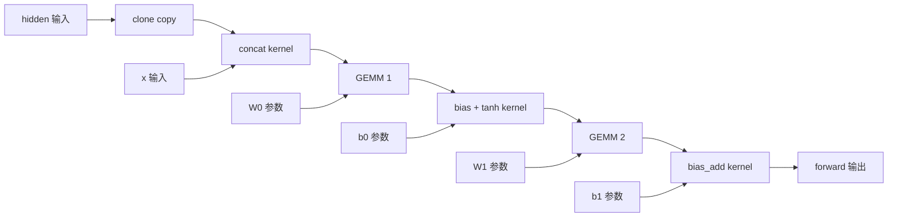

# Runtime 调用组件追踪

组件追踪已改为整次 forward 的调用图：自定义 kernel 用 memory-only NVBit 捕获实际 global-memory 区域，受支持的 cuBLAS GEMM 用成功 API 的逻辑矩阵契约覆盖，再恢复 buffer 版本和跨轮调用对应。真实 Qwen RNN 的五个 GPU kernel 全部进入调用清单，主体两次 GEMM 与前后处理均可审核；T4→最佳已提供正确答案 T5 保留 clone 和三个自定义调用，两次 GEMM 有明确配置变化及未解析扩展属性

本线独立实现采集、storage 身份、依赖、匹配和回溯，未导入另一条线的本轮代码。输出可用于观察最佳答案保留了哪些调用，结构候选与训练状态等价分开，未接 reward/GRPO。[调用追踪批次摘要](../../local_artifacts/component_tracking/coarse/reviewed/summary.json)、[reference 配置对齐摘要](../../local_artifacts/component_tracking/coarse/aligned/summary.json)

## 怎么捕获、怎么匹配

NVBit 在整个 forward 记录 kernel 名称、grid/block、stream、shared memory、真实参数槽和 opaque 实现标识，所有 CTA 默认参与。只记录谓词为真的 global-memory 访问，warp 内精确连续地址压成一段；不展开 FFMA、寄存器邻域或 kernel 内部数学计算。参数指针只绑定 storage，不作为读写证据

TorchDispatch observer 用弱引用记录 storage 生命周期和 tensor view，避免 observer 延长临时 tensor 生命周期。地址重用与重叠生命周期的 alias 分开；CUDA copy/fill 取成功 API 契约。Sgemm/GemmEx 记录矩阵尺寸、转置、leading dimension、dtype、alpha/beta、compute/math mode 与 workspace 模式，其逻辑读写来自 [cuBLAS GEMM 契约](https://docs.nvidia.com/cuda/cublas/index.html#cublas-t-gemm)，库内部 workspace 与实际事务仍 opaque

版本边要求区域相交及程序本来的同 stream 或 event/device sync 顺序，插桩强制同步不制造依赖。覆盖写入按区域分裂版本；未知中间调用会使旧版本失效，后续完整覆盖可局部恢复。in-place 调用仅在已观测的同线程访问顺序支持时确认入口版本，其余内部或无序读写标未知。这些都属于调用级来源判断

对应候选先由读写区域、边界角色和上游调用接口产生，唯一的一对一组才进一步比较配置与实现标识。函数名/hash 不提名候选；实现标识仅区分已对应调用的版本，不证明数学等价或创作来源。重复接口保留歧义，无法一对一对应的融合、拆分或替换保留未知。完整但没有已观测数据效果的调用保留清单，单列且不计组件留存

## 真实 RNN 保留了什么

g259 T4/T5 都恢复出下列完整路径，两个 GEMM 的子 kernel 仍可见，但不与父 API 重复计节点

每份图为 6 个调用节点、6 条边界输入边、5 条跨调用区域版本边，另列最终输出依赖。三个自定义 kernel 的压缩记录分别为 524,288 / 393,216 / 196,608 条，覆盖所有 CTA、无丢失；concat 覆盖 32,768 个 CTA。主体 GEMM 的 A/B/C 区域由 API 契约覆盖，不能把它说成采到了库内全部物理访存。[T4 完整图](../../local_artifacts/component_tracking/coarse/reviewed/graphs/rnn_t4_trace_a.json)

| T4→T5 调用 | 最终对应 | 证据 |
|---|---|---|
| clone、concat、bias+tanh、bias_add | 4 个观测留存 | 区域接口、依赖角色、配置与 opaque 实现标识一致 |
| 两次 GEMM | 结构对应，已知配置改变且仍有配置未知 | Sgemm→GemmEx，compute 68→77，math mode 0→3；子 kernel 的 Ex 属性数 0→1，属性值未解析 |

最终 matcher 对 GEMM 使用 `same_regional_structure_configuration_unknown`，同时保留上述 `configuration_changes`，不把未解析属性静默当成相同。T4 与 T5 各自的插桩输出均与各自控制逐字节一致，但两版输出 hash 不同；留存后处理并不意味着上游计算状态相同。[逐调用对应](../../local_artifacts/component_tracking/coarse/reviewed/graphs/rnn_t4__rnn_t5.json)、[最佳答案回溯](../../local_artifacts/component_tracking/coarse/reviewed/graphs/rnn_best_lineage.json)

g257 T4 也覆盖五个 GPU kernel，图中没有 clone，直接 concat。与 g259 T4 对比时，clone/concat 没有可靠一对一对应；两次 GEMM 结构可对应但配置未知，两个后处理调用记录配置变化。这里不凭同名函数宣称创作来源；早于 T4 的缺失图也不解释成组件从未出现

## Reference 配置对齐后的跨实现核对

主审查发现两条线的 reference 配置不一致：此前组件线只有 init42/input17，reference 未显式设置 matmul TF32，也没有在 forward 前重置 seed23；state 线显式启用 matmul/cudnn TF32 并重置 seed23。输入 hash 相同不能排除模型执行策略与随机状态不同，旧 reserved 的 24 kernels、`032beb7d…` 输出和 5.22 秒不适用于与 state 的 23 kernels、`05aa4237…` 输出和 83.02 秒作同配置比较

当前 canonical runner 对 reference 显式使用 TF32 matmul/cudnn=true、init42/input17/forward23，读取并记录实际 backend 配置和配置 hash，另记录所有初始 named parameter/buffer 内容 hash。只对 BF16、FP16、reserved 各补一个控制和两个插桩进程，未改题目源码、shape、采集器或预算，native/RNN 未重跑

9 次运行全部成功，内部输入/参数/buffer/输出控制一致。独立读取 state 的原始结果和 launch metadata 后，双方三份源码 hash、每次的输入及全部参数/buffer 内容、输出、共同配置字段和 Torch/CUDA/H20 字段均一致；6 对完整 launch 序列的名称、grid/block/shared、stream slot 与扩展属性数量也一致。BF16 无参数且有一个标量 buffer，FP16 有三个参数，reserved 有十二个参数和一个 buffer；逐项差异均为空。[固定 peer 证据与比较结果](../../local_artifacts/component_tracking/coarse/aligned/summary.json)

| 对齐 reference | 双方 kernel 数 | 本线控制 / 插桩 A / B 秒 | state 控制 / memory / repeat 秒 | 本线 trace A MiB |
|---|---:|---:|---:|---:|
| BF16 | 49 | 0.111 / 4.185 / 3.784 | 0.159 / 5.458 / 5.825 | 0.043 |
| FP16 | 19 | 0.174 / 3.668 / 3.680 | 0.200 / 4.817 / 5.299 | 0.028 |
| reserved | 23 | 0.243 / 55.130 / 55.381 | 0.376 / 83.025 / 82.084 | 120.552 |

这些是不同采集策略下的单次冷 forward 诊断成本，不是稳定性能排名。双方已记录的共同执行条件与实际结果完成对齐；state 旧记录没有额外的 cudnn benchmark/deterministic 等字段，完整环境配置仍不能全部交叉证明。此次同时修正 TF32 和 forward RNG 条件，没有单因素消融，不能把原差异单独归因于 TF32

对齐后的 reserved 输出 SHA 为 `05aa423737fcbd332b5d0a71751fe972863906d2f486bbc7d66bd448469e633e`，23 个 kernel 中 21 个 memory-traced、2 个库契约子 kernel；26 个调用中 12 个足迹完整，仍有 2 个 kernel 丢弃 14,090,240 条记录、4 个未支持访存节点和私有 storage 缺口。区域边为 12 条入口未观测、15 条部分/歧义依赖，输出与 launch 一致没有消除依赖覆盖缺口

`aligned/` 是已知题的配置对齐 replay，与第一次未见保留题验证分开。此前 `reviewed/` 原始数据和 hash 保留为各自内部有效控制，并附 [跨实现比较范围说明](../../local_artifacts/component_tracking/coarse/reviewed/REFERENCE_COMPARISON_SCOPE.md)；旧 reference 成本不能替代上表

## 首次交付批次的覆盖与内部控制

首次交付二进制运行 19 个固定 case，每个含一个无插桩控制和两个独立进程插桩，共 57 次；全部成功，19 组输出逐项或逐字节相同。下表取 trace_a，时间为单次冷 forward wall time，包含首次插桩与 dispatch observer 开销，不是稳态性能或训练分数。批次子进程 wall time 合计约 148 秒，另有构建、同步和 CPU 提取成本；其中 reference 行只保留内部比较用途

| 工作负载 | 完成 kernel / 捕获 kernel | memory / 契约子 kernel | 完整足迹调用 / 总调用 | 控制→插桩秒 | raw MiB | CPU 提取秒 |
|---|---:|---:|---:|---:|---:|---:|
| BF16 training reference | 49/49 | 49/0 | 49/49 | 0.109→3.809 | 0.043 | 0.004 |
| FP16 training reference | 19/19 | 18/1 | 20/20 | 0.196→3.652 | 0.028 | 0.003 |
| Qwen g259 T4 | 5/5 | 3/2 | 6/6 | 0.089→1.495 | 34.004 | 约 4 |
| Qwen g259 T5 | 5/5 | 3/2 | 6/6 | 0.081→1.369 | 34.004 | 约 4 |
| Qwen g257 T4 | 5/5 | 3/2 | 5/5 | 0.073→1.826 | 34.004 | 约 4 |
| 冻结保留题 row311 | 24/24 | 20/4 | 12/26 | 0.232→5.223 | 120.203 | 约 10 |

上述分母来自整个作用域的受支持 launch 回调，全部有完成记录；这些 case 没有未处理 launch 标记，不是以 ATen 调用数代替 kernel 数。库子 kernel 与 API 节点分开计，copy/fill 另加节点。全部配置为所有 CTA，容量为每 kernel 1,048,576 条压缩记录；无 CTA 抽样，只有保留题发生截断

BF16/FP16 的完整区域接口和版本边重复一致，但完整配置图不同：部分 8 字节参数 raw bits 随进程变化，同节点早已含大参数槽未解析标记。已验证差异位置，尚未证明这些位是 padding、指针还是状态，不据此声称程序实现改变；大量重复接口也限制唯一对应数

保留题沿用主 Agent 预选的 row311，包含卷积、池化、采样、GEMM 与 GRU 等调用。两次输出均与控制一致，主体调用清单完整；2 个 kernel 共丢弃 14,090,240 条压缩记录，4 个节点含未支持访存，7 个节点有未绑定 storage 访问，另有 4 个未绑定 API 操作数节点。26 个调用中 12 个足迹完整，14 条边的入口值未观测、14 条为部分或歧义依赖，不能给出完整 forward 版本证明

保留题仍有可审核局部事实，例如两次 GEMM 的矩阵契约、GRU 读写区域及最终 elementwise 访问。两次重复图的部分区域不同，与容量丢失并存，不能把差异解释成程序变化。没有针对该题扩容量、添加 signature 或换简单样本；当前瓶颈是大型临时 buffer、库私有分配与异步/特殊访存，而非缺少寄存器规则。[保留题完整观测](../../local_artifacts/component_tracking/coarse/reviewed/graphs/reserved_trace_a.json)

## 校准反例和审查收口

同一校准 ELF 的九个 GEMM modes 均覆盖全部调用、无丢失：改名/helper 与相同实际分支保留；tile 8/16 与 alpha 改变记录配置变化；错误 B 转置虽读同样字节集合，opaque 实现标识变化；独立 scale 的系数变化只改变 scale 调用，GEMM 保留。单调用 alpha2 与 GEMM+scale2 可以对应 GEMM 接口并看到新增 scale，但不能据此证明内部融合来源

四个独立边界用例也做了实物核对：event 连接的两 stream 给出确定边，去掉 event 后仍输出 `unordered_stream_writers`；部分覆盖保留旧 producer 的 `[0,16)∪[32,64)`，中段 `[16,32)` 属于新 producer；in-place input 先读入口版本、再被下游读取新版本。无 event 的实际输出此次也相同，这不证明程序无竞争。[代表性核对记录](../../local_artifacts/component_tracking/coarse/reviewed/manual_review.md)

主 Agent 提供的“已知写入→未知中间调用→读取”反例已修正并补检查，支持完整与部分覆盖恢复。统一审查后补 Ex 属性数量、无数据效果调用分类，以及 workspace 默认池/自定义/禁用默认池的区分；`SetStream` 恢复默认池遵循 [官方契约](https://docs.nvidia.com/cuda/archive/12.9.2/cublas/index.html#cublassetstream)，默认池模式下 `workspace_bytes=0` 不代表池容量为零。38 项 CPU 检查及 pre-commit 通过

主审查补充复核再次运行同一反例，当前提取器给出 `partial_or_ambiguous_dependency`；新增入口值回归确认未知调用之后为 `entry_value_unobserved`，检查总数增至 39。提取器行为与最终采集时相同，仅增加检查；全部 38 份最终图从 raw trace 重提后，除提取耗时外与交付图一致，机器摘要没有旧提取器残留。[反例、重提图与 hash 核对](../../local_artifacts/component_tracking/coarse/review_resolution/summary.json)

## 复现与交付边界

入口和命令在 [runtime_trace README](../../tools/data/runtime_trace/README.md)，核心为 `replay.py → extract.py → match.py / lineage.py`，检查命令为 `python -m tools.data.runtime_trace.check_runtime_trace`。所有实验位于 ignored `local_artifacts/component_tracking/coarse/`；旧全指令方案保留在 Git `73c33eea` 和诊断归档中，未混入本表

第一次源码冻结后才读取保留题并完成首次批次。随后按主 Agent 的通用审查修正，再冻结并重采全部 57 次，形成 `reviewed/` 调用证据；之后发现的 reference 配置差异通过 `aligned/` 单独闭环。严格未见验证对应第一次冻结，后续审查修正与配置对齐均保留自己的 freeze 和产物，不混称一次 untouched holdout

- [首次 freeze](../../local_artifacts/component_tracking/coarse/freeze.json)、[审查后 freeze](../../local_artifacts/component_tracking/coarse/reviewed_freeze.json)、[最终逐文件 manifest](../../local_artifacts/component_tracking/coarse/reviewed_bundle/manifest.json)
- [Reference 对齐 freeze](../../local_artifacts/component_tracking/coarse/aligned_freeze.json)、[对齐逐文件 manifest](../../local_artifacts/component_tracking/coarse/aligned_bundle/manifest.json)；runner SHA `7b707a9aab8f4cf10ec225abffd262b866b2183009cc72282c01c0d8ee93c33a`，manifest SHA `dfeaf3059b66a03a91f387503cdbd715d0e63fe4f4420c212cd64b59aae7553f`；native SHA 沿用下项，9 个子进程合计约 151 秒
- 最终 native SHA256：`b244fab5927da4498e6888c6af1bd8efede1ac2bfd0ca557c48cf7587bd1e127`；manifest：`715becce745c54636291fe196ad3fb13d3cbce01017baaa75bda9591cca93c1e`
- 同一 GEMM 校准 ELF：`5a7be124612988246945fb0eb526e4aa319d61dbf749e1e9adbaf3fa31e4cd58`；原始固定初始化随 ELF 定位，native target 未额外输出输入 tensor 字节 hash
- RNN reference：`00cebeed898faa796b965b29e7031422231a7da4d0a2b609d8f1d73a6988abd2`；两个输入 hash 为 `a8e4a35a492008fa82745b033939781389a7fcfb3c5bf6ae514fe1a0836e21b0`、`83161b1ab3147c84a490965af2322efe1f44238e1ceac583f61e2392cdd54e12`
- 保留题 source：`104e3e521cd6ad64567bd16124d322fcb4cff85bbb1f6d290c4c570aa41beffc`；实际输入：`9123fb5ec976ce71018cc7d8e1ae60c58b73f0260cd30dc5c6262db1f0b60488`；其余输入、candidate `.so`、输出和逐次成本见机器摘要
- node69 GPU0，node-local `/tmp/component_coarse_reviewed_20260909` 与 `/tmp/component_coarse_aligned_20260909`，各次执行前核对空闲与逐文件 manifest，结束后全部 GPU 为 0 MiB / 0%。未改部署、KernelGym backend、训练或主分支

尚未覆盖的配置包括大参数结构、非零 Ex 属性值与部分库私有状态；三个对齐 reference 已保存参数/buffer 内容 hash，旧 RNN 批次仍只有源码和 seed 定位参数。多 context、多个 launch 主机线程和 CUDA graph capture 当前拒绝。库契约覆盖与动态访问证据应继续分列，调用对应可审核但不证明状态等价、完整数学语义或性能因果贡献；两条独立实现的最终共同验收由主 Agent 汇总
