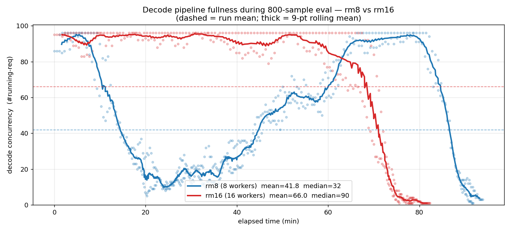
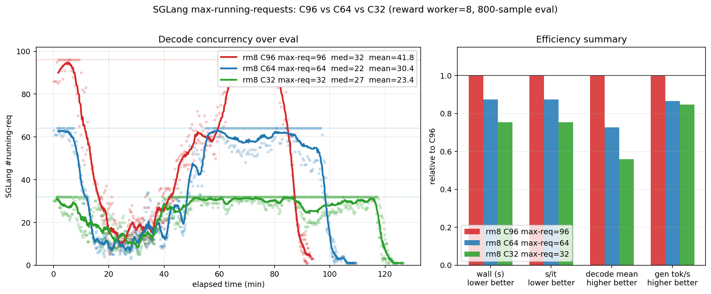

# Reward 阶段耗时与并发

## 结论

TVM-FFI reward 的主要可见长尾来自 correct 样本的 performance 测量，而不是 correctness 校验：

- **Level 1 correct 样本**：整次 reward `18.84s` mean，其中 candidate worker `14.28s`；worker 内 correctness trials 只有 `0.61s`，100 次正式计时的 candidate CUDA 执行为 `5.32s`，另有 `8.36s` 无法由旧 dump 继续拆分
- **Level 2 correct 样本**：整次 reward `48.07s` mean，其中 candidate worker `29.84s`；worker 内 correctness trials 只有 `1.42s`，100 次正式计时的 candidate CUDA 执行为 **`22.31s`**，未分解 worker 时间为 `6.11s`
- candidate worker 之外还有 reference timing、服务端排队、workflow/API 和轮询。这个部分在 Level 2 correct 样本中为 `18.23s` mean，不能简单称为“排队时间”

现有 dump 可以证明 Level 2 应优先优化 performance，但不能支持“其余时间主要是编译”的结论。后续必须用精确 stage timer 重新回放固定 response，才能继续判断 compile、load、warmup 和 profiling 各自的收益

## 统计口径

数据来自同配置的 2026-06-21 TVM-FFI Qwen3.6-27B Level 1 / Level 2 评测，correctness 使用 TF32-off、5 trials，performance 使用 100 trials

字段含义：

- `env_time`：客户端看到的整次 reward 墙钟，包括本地 precheck、服务端 workflow、candidate kernel task、必要时单独执行的 reference timing、排队和轮询
- `kg_kernel_total_s`：candidate kernel task 的 worker 内时间。它不包含后续独立的 reference timing task
- correctness trials：`sum(correctness_trial_s)`，是 5 次数值正确性校验的实测墙钟
- 100 次正式计时的 candidate CUDA 执行：`num_perf_trials × kernel_runtime`。`kernel_runtime` 是单次 candidate forward 的 CUDA-event 均值；这里不能加 `reference_runtime`，因为 reference timing 是独立 task
- worker 外时间：`env_time - kg_kernel_total_s`。它包含 reference timing、queue、workflow/API 和轮询，现有 dump 无法在这几项之间精确拆分

上述 CUDA 执行时间只是完整 performance 阶段的下界。完整阶段还包含 performance 输入准备、3 次 warmup、每次 trial 的 Python 循环、CUDA event 创建/record、kernel launch、`torch.cuda.synchronize`，以及额外最多 10 次 profiler iteration 和 profiler 处理。旧 dump 只保留了 `kernel_runtime`，没有保留完整 performance wall timer

## “未分解 candidate-worker 时间”是什么

它不是 KernelGym 输出的阶段指标，而是为了让 candidate worker 时间对账而计算的减法项：

```text
未分解 candidate-worker 时间
  = kg_kernel_total_s
  - sum(correctness_trial_s)
  - num_perf_trials × kernel_runtime
```

按评测 pipeline 的执行路径，它混合了：

1. reference 源码加载、初始化输入生成与 reference model 构造；这些用于 correctness，但不是独立 reference performance task
2. TVM-FFI candidate 编译、动态库加载、session 打开和 candidate model 构造
3. correctness trial 计时窗口之外的 seed、输入和 CUDA 同步开销，以及 decoy/coverage 检查
4. performance 前的输入准备和 CUDA 同步、3 次 warmup
5. 100 次计时循环中的 Python/CUDA event 创建、kernel launch 和 synchronize 墙钟开销；`kernel_runtime` 只覆盖 CUDA-event 区间
6. 额外最多 10 次 profiler iteration、torch profiler 本身以及 coverage 计算

因此这个值只能叫“未分解 worker 时间”，不能叫编译时间，也不能据此直接选择编译优化方案。本次历史 dump 没有保存这些子阶段的 exact timer；需要重新做 reward-only 回放才能拆开

## Level 1

### Compiled 样本的 candidate worker

| 指标 | mean / median / p90 |
|---|---:|
| candidate worker 总时间 | 9.15 / 3.72 / 17.07s |
| correctness trials | 0.69 / 0.43 / 0.95s |
| 100 次正式计时的 candidate CUDA 执行 | 3.26 / 0.55 / 4.36s |
| 未分解 candidate-worker 时间 | 5.19 / 2.32 / 13.80s |

按 worker 时间占比，correctness 为 `7.6%`，已观测的正式计时 CUDA 执行部分为 `35.7%`，未分解部分为 `56.8%`。真实 performance 占比高于 `35.7%`，因为 warmup、profiling 和计时循环开销仍在未分解部分。各占比是跨样本求和后得到的，不应从 mean/median 直接相除

### Correct 样本的端到端分解

| 指标 | mean / median / p90 |
|---|---:|
| 客户端整次 reward | **18.84 / 15.15 / 33.14s** |
| worker 外：reference timing + queue/workflow/API | 4.55 / 2.63 / 11.29s |
| candidate worker 总时间 | 14.28 / 12.04 / 19.98s |
| ├─ correctness trials | 0.61 / 0.47 / 0.92s |
| ├─ 100 次正式计时的 candidate CUDA 执行 | 5.32 / 0.99 / 9.48s |
| └─ 未分解 candidate-worker 时间 | 8.36 / 8.00 / 14.97s |

Mean 可以对账为 `18.84 ≈ 4.55 + 14.28`，以及 `14.28 ≈ 0.61 + 5.32 + 8.36`。Median 和 p90 对应的未必是同一个样本，不能逐列相加

## Level 2

### Compiled 样本的 candidate worker

| 指标 | mean / median / p90 |
|---|---:|
| candidate worker 总时间 | 8.28 / 1.24 / 15.72s |
| correctness trials | 0.85 / 0.48 / 1.50s |
| 100 次正式计时的 candidate CUDA 执行 | 5.29 / 0.00 / 8.24s |
| 未分解 candidate-worker 时间 | 2.14 / 0.86 / 5.29s |

正式计时 CUDA 执行的中位数为 0，是因为 incorrect 样本不进入 performance。按 worker 时间占比，correctness 为 `10.2%`，已观测的正式计时 CUDA 执行部分为 **`63.9%`**，未分解部分为 `25.8%`。因此真实 performance 占比至少为 `63.9%`

### Correct 样本的端到端分解

| 指标 | mean / median / p90 |
|---|---:|
| 客户端整次 reward | **48.07 / 14.91 / 128.76s** |
| worker 外：reference timing + queue/workflow/API | 18.23 / 2.87 / 20.80s |
| candidate worker 总时间 | 29.84 / 10.02 / 69.55s |
| ├─ correctness trials | **1.42 / 0.62 / 3.06s** |
| ├─ 100 次正式计时的 candidate CUDA 执行 | **22.31 / 5.42 / 56.51s** |
| └─ 未分解 candidate-worker 时间 | 6.11 / 3.43 / 12.79s |

Mean 可以对账为 `48.07 ≈ 18.23 + 29.84`，以及 `29.84 ≈ 1.42 + 22.31 + 6.11`。这正是“correct 样本整次调用 48.07s”和“correctness 阶段 1.42s”差距悬殊的原因：两者分别是端到端时间和其中一个很小的阶段

Reference cache 也明显影响 worker 外时间：

| correct 样本的 worker 外时间 | Level 1 mean / median / p90 | Level 2 mean / median / p90 |
|---|---:|---:|
| reference cache hit | 3.30 / 2.57 / 4.68s | 8.13 / 2.53 / 4.88s |
| reference cache miss | 11.71 / 12.03 / 19.83s | **41.86 / 4.92 / 190.67s** |

所以 `env_time - kg_kernel_total_s` 不能全部归因于 queue；cache miss 时独立 reference timing 是重要组成部分

## 由旧 dump 支持的验证方向

1. **P0：用现有精确 timer 做 reward-only 回放。** 固定 L1/L2 response，直接记录 reference timing、compile、load/session、model/input setup、correctness、warmup、100 trials、profiling 和 queue。旧 dump 的减法项只用于确定边界，不再用于猜根因
2. **P0（Level 2）：验证 performance trials 100→25 或自适应 early-stop。** 只按已观测的 100 次 CUDA 执行部分线性下降推演，worker 容量约提高 L1 `1.37×`、L2 `1.92×`；这是不计 Python/event 循环随 trials 一起减少的保守估计。实验必须同时比较 runtime 方差、reward 和 fast@ 阈值判定
3. **P1：保证 reference cache 命中。** 对同一题的多 sample / 多 turn 复用 reference runtime，避免 cache miss 的独立 reference timing 长尾
4. **P1：再决定是否拆 worker 池或增加 worker。** 先用精确 queue timer 证明 head-of-line blocking，不能再用 `env_time - kg_kernel_total_s` 直接代替 queue

## 证据与复现

- 统计脚本：`tools/analyze_reward_timing.py`
- L1 dump：`experiments/Eval.TVMFFI.Qwen3.6-27B.Qwen3.6-27B.ctx32768.resp32768.turn3.n8/Qwen3.6-27B.level1.kg21_tf32off_correctness.20260621.093912/dumps/rollout_data/eval_0.pt`
- L2 dump：同目录下 `Qwen3.6-27B.level2.kg21_tf32off_correctness.20260621.093912/dumps/rollout_data/eval_0.pt`

以下命令记录原始分析入口；复算需要对应 dump 和兼容环境：

```bash
base=$PWD/experiments/Eval.TVMFFI.Qwen3.6-27B.Qwen3.6-27B.ctx32768.resp32768.turn3.n8
python3 tools/analyze_reward_timing.py \
  --run "Level-1=$base/Qwen3.6-27B.level1.kg21_tf32off_correctness.20260621.093912/dumps/rollout_data/eval_0.pt" \
  --run "Level-2=$base/Qwen3.6-27B.level2.kg21_tf32off_correctness.20260621.093912/dumps/rollout_data/eval_0.pt"
```


## Reward worker 与 decode 并发

该 Qwen3.6 BF16+EAGLE 对照中，reward GPU worker 从 8 增至 16，wall 从 1:36:09 降至 1:24:37，约 1.14×；收益小于资源增幅，不能据此断言没有收益或已达到所有 workload 的上限

| Run | Worker | Wall | s/it |
|-----|-------:|-----:|-----:|
| baseline（8 worker） | 8 | 1:36:09 | 7.21 |
| 16 worker | 16 | **1:24:37** | **6.35** |


**为什么 2× worker 只换来 1.14× wall？**

worker 翻倍后 decode 并发增加，说明 reward-side 等待有所缓解；更高并发的边际收益仍需按相同 workload 测量

---

### Decode 并发




| 指标 | 8 Worker | 16 Worker |
|------|--------:|---------:|
| Decode 并发中位数 | 32 | **90** |
| Decode 并发均值 | 41.8 | 66.0 |
| Gen throughput 均值 | 2033 tok/s | 2316 tok/s |

**8 worker** 中段长时间饿到 ~20–40 并发；**16 worker** 全程钉在 ~90/96（近满载）
decode 并发中位数从 32 增至 90，而平均 throughput 从 2033 增至 2316 tok/s，吞吐没有同比增长；这些观测不能单独区分算力、带宽、长度分布和 tail 的贡献


---

### Request cap 对照：96 / 64 / 32

**动机**：§2 中 8 worker（C96）的并发曲线存在部分时间段 rollout 并发数降到 10 以下的波谷（见上图 rm8 曲线中段）。猜测是高并发上限导致 burst 式资源争抢，尝试降低 `--sglang-max-running-requests` 来平滑并发、消除波谷

固定 **reward worker=8**、TP=4、EAGLE、800-sample eval，比较 max running requests 从 96 降到 64 / 32

在这三次 run 中，降低 request cap 后峰值 decode throughput 与端到端速度均下降，仍存在并发波谷；结论限于该 workload





#### 核心指标

| Run | SGLang max req | Wall | s/it | 相对 C96 |
|-----|---------------:|-----:|-----:|---------:|
| C96（baseline） | 96 | **1:36:09** | **7.21** | **1.00×** |
| C64 | 64 | 1:50:08 | 8.26 | 0.87× |
| C32 | 32 | 2:07:26 | 9.56 | 0.75× |

#### 饱和度指标

| 指标 | C96 | C64 | C32 |
|------|----:|----:|----:|
| 并发中位数 | **32** | 22 | 27 |
| 并发均值 | **41.8** | 30.4 | 23.4 |
| 并发 P90 | **92.1** | 64 | 32 |
| 达到 ≥90% 上限占比 | 15.2% | 22.5% | **44.9%** |
| Gen throughput 均值 | **2033** | 1759 | 1722 |
| Gen throughput P90 | **3003** | 2771 | 2177 |


C96 的 decode 并发均值和 throughput 上界均高于 C64/C32。降低 max req 使引擎更频繁贴近自身较低的上限，整体吞吐下滑

---


### 并发对照的 run identity

| 标签 | 路径 |
|------|------|
| 8 Worker（baseline） | `checkpoints/Qwen3.6-27B/20260529_075505_newSlimeKG.tp4.eagle_ctx65536_n8_summ1600/` |
| 16 Worker | `checkpoints/Qwen3.6-27B/20260529_132454_newSlimeKG.tp4.eagle.rm16_ctx65536_n8_summ1600/` |
| C64 | `checkpoints/Qwen3.6-27B/20260531_051603_newSlimeKG.tp4.eagle.rm16.C64_ctx65536_n8_summ1600/` |
| C32 | `checkpoints/Qwen3.6-27B/20260531_073240_newSlimeKG.tp4.eagle.rm16.C32_ctx65536_n8_summ1600/` |


## 独立 4090 reward 池的 stage-timer 对照

下面来自 A800/H20 rollout 对照所共用的 4090 reward 池，使用 30 warmup、50 次正式计时；与前面的 100-trial 数据分开。rollout 设备没有改变 reward worker 硬件，但生成的候选分布不同，stage 时间差不能归因为 reward 设备速度

| reward 阶段                       | A800 (C96) mean / median | H20 (C96) mean / median | 口径 |
| -------------------------------- | -----------------------: | ----------------------: | ---- |
| compile_and_load                 |            0.171 / 0.164 |           0.161 / 0.157 | 所有评测 turn |
| correctness                      |            0.656 / 0.327 |           0.688 / 0.326 | 编译成功的 turn |
| **performance(性能测量)**        |          **7.63 / 3.90** |             6.43 / 2.45 | 仅正确 kernel |
| setup(load/prepare/build/detect) |            0.006 / 0.004 |           0.005 / 0.004 | 所有评测 turn |
| **每 turn 总 reward**            |          **4.78 / 0.31** |             4.59 / 0.37 | 所有 turn |

注:compile / correctness / 每 turn 总 reward 两边几乎相同(同一 4090 池)。performance 的 A800 7.63 vs H20 6.43
(median 3.90 vs 2.45)差异来自**被测 kernel 分布不同**(A800 这批正确 kernel 平均更慢、profiling 更久),不是 4090
reward 速度差。reward 与 decode 在 16 个 worker 上**并发**,此处是单 turn 的 reward 计算耗时,不直接等于 wall
